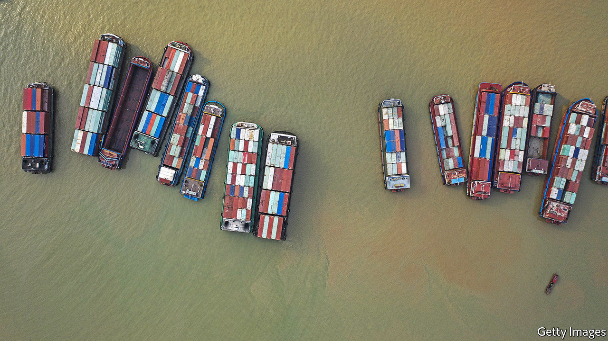

###### Snarl-up

# Supply bottlenecks are pushing up costs for manufacturers 

##### The effect on inflation should be temporary 

 

> Jan 21st 2021 


LOGISTICS MANAGERS have gained a few grey hairs over the past year. When the virus first spread, they faced a collapse in demand. Now they are scrambling to fill a surge in orders. One in five purchasing managers report “port” or “shipping” delays, the most since 2004, says IHS Markit, a data provider. Such is the shortage of container space that the Freightos Baltic Index, a measure of container prices, rose to over $4,000 on January 15th, compared with $1,200-1,600 in 2019.


For most goods shipping makes up a tiny share of a product’s total cost, says Florian Frese of Container xChange, an online platform. But other prices are rising too. Commodities are on a tear. A survey by IHS Markit found that manufacturing-input prices last month rose at the fastest pace in nearly ten years.


Some sectors are also experiencing a dearth of components. Jonathan Smoke of Cox Automotive, a consultancy, describes how production problems related to the winter wave of covid-19 and chip shortages are tightening the supply of new cars in America. Mr Smoke expects prices of used vehicles to be 30% higher in April than they were a year earlier (admittedly, relative to a low base). According to a survey of small and midsize importers using the Freightos platform, a third of the 77% encountering supply-chain disruption in the past six months raised product prices as a result.


So far, these pressures have not translated into wider consumer-price inflation. That is partly because demand, although recovering, is still subdued. It is also because the products affected by snarled supply chains make up a relatively small share of consumption; meanwhile price growth in other areas, such as travel and tourism, is tepid. Once supply-chain disruptions are resolved, elevated input prices should sink back.


If annual inflation does rise over the coming months, that will be because prices will soon be compared with a much lower base, owing to the oil-price falls of last spring. Analysts at Capital Economics, a consultancy, reckon that energy prices depressed headline inflation in OECD countries by an average of around 0.6 percentage points in November—but by April will buoy them by a whole percentage point.

