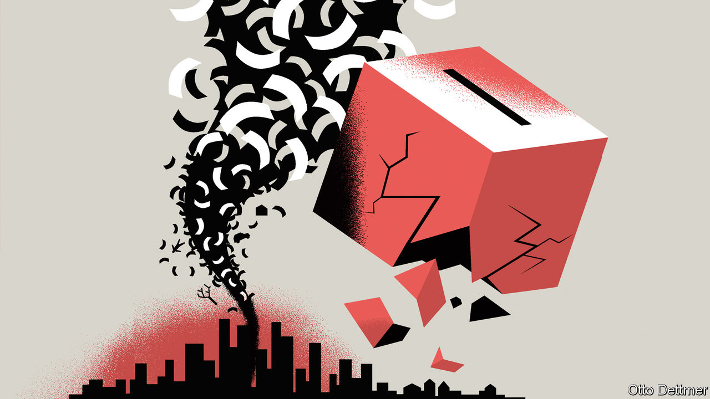

###### Free exchange

# What is the link between economic crises and political ruptures? 

##### New research uncovers the subtle interaction between economic and social forces 

 

> Jan 21st 2021 


WHEN DO ECONOMIC crises have destabilising political effects? Economic anxiety in the aftermath of the global financial crisis of 2007-09 sparked a political backlash—fuelling, for instance, the Brexit campaign in Britain. President Donald Trump drew support from America’s neglected rust belt. The Depression of the 1930s wrought much more devastating political consequences in Europe. The question seems pertinent again, given the economic and social trauma caused by the covid-19 pandemic.


Over the past decade many economists have taken an interest in the political effects of economic shocks. A study of European regions after the financial crisis found that a one percentage point increase in the unemployment rate was associated with a 2-3 percentage point rise in the share of votes captured by fringe parties, for instance. Establishing how one factor causes another is tricky work, however, and often means taking account of subtle social forces. Three new studies use the collapse of democracy in Europe in the 1930s and the 1940s to consider the interaction between economic and social factors. The research suggests that crises most threaten democratic institutions when they aggravate underlying social vulnerabilities.


A new paper by Sebastian Doerr of the Bank for International Settlements, Stefan Gissler of the Federal Reserve, José-Luis Peydró of Imperial College London and Hans-Joachim Voth of the University of Zurich examines one of history’s darkest chapters. The Depression enabled the Nazis’ rise to power; the party went from receiving just 2.6% of the vote in 1928 to 37.3% in 1932. But economic pain was not the only factor that sent voters into the Nazis’ arms. The authors note the critical historical importance of the banking crisis that erupted in 1931 and felled two of Germany’s largest lenders, Danatbank and Dresdner Bank. Cities dependent on the banks experienced sharp declines in income as a result of the failures—of more than 20% over the course of the crisis, or about eight percentage points more than the German average. But while the crisis boosted support for the Nazis in places with deep ties to Danatbank, it had little effect on Nazi voting in those with closer links to Dresdner.


The reason, the authors reckon, is that the head of Danatbank, a Jewish man named Jakob Goldschmidt, was a principal target of a Nazi propaganda campaign blaming Jews for Germany’s economic problems, while Dresdner’s manager was not. Danatbank’s collapse translated into the biggest gains for the Nazis in cities with a history of persecution of Jewish minorities or support for anti-Semitic political parties, where the propaganda message was most eagerly received. The Depression created an opportunity for extremists, but it was the complementarity between hardship, the Nazis’ narrative about it, and communities’ underlying bigotry that raised Adolf Hitler to power.


The wartime collapse of French democracy, too, was owed in part to existing social faultlines. In 1940 France was recovering from economic depression and besieged by German troops. In July that year the French parliament voted to give dictatorial powers to Marshal Philippe Pétain, a hero of the first world war, who led an authoritarian and collaborationist regime. But support for Pétain was not uniform, argues new work by Julia Cagé of Sciences Po, Anna Dagorret and Saumitra Jha of Stanford University and Pauline Grosjean of the University of New South Wales. Instead, their research suggests, familiarity with Pétain and his role in the Great War seems to have increased some communities’ susceptibility to authoritarian values.


The authors note that roughly half of the French infantry served in the battle of Verdun between February and April 1916, when Pétain led the French forces there (other generals took over until the battle’s end in December). At the time, French regiments were typically made up of men drawn from the same region. The experience at Verdun thus exposed a large share of the population of some communities but not others to Pétain’s leadership. The authors reckon that those who fought under Pétain developed personal and reputational connections to him that shaped their ideological evolution. Communities with soldiers who had served at Verdun under Pétain contributed 7-10% more collaborators per capita (and 8% fewer people to the French resistance) than other regions. By contrast, areas with troops that fought at Verdun, but under other generals, showed no significant increase in collaboration.


Networks of influential individuals seem also to have contributed to Italy’s descent into fascism, according to recent research by Daron Acemoglu of the Massachusetts Institute of Technology, Giuseppe De Feo of the University of Leicester, Giacomo De Luca of the University of York and Gianluca Russo of the Pompeu Fabra University in Barcelona. Support for the socialists in Italy rose sharply after the first world war. In response to this, the centre-right establishment, fearful of the socialists, threw its support behind Benito Mussolini’s fascists. Economic elites played an important role in financing and encouraging this shift, the authors argue; the biggest gains in support for the fascists occurred in places where entrepreneurs and rentiers accounted for a larger share of the local population.

Of red scares and pills


Results like these suggest that whether economic crises prove destructive of democratic institutions depends in large part on social forces that can be slow-moving. Plausible authoritarian explanations for what went wrong can influence voters’ willingness to tear down political systems. So, too, can the extent to which influential people hew to or defect from prevailing norms. Fixing what’s broken ought to be governments’ priority when a nasty shock hits, but the work does not end there. A full recovery may also require clear communication about what went wrong and why—and vigilance in the face of efforts to undermine democracy. ■

