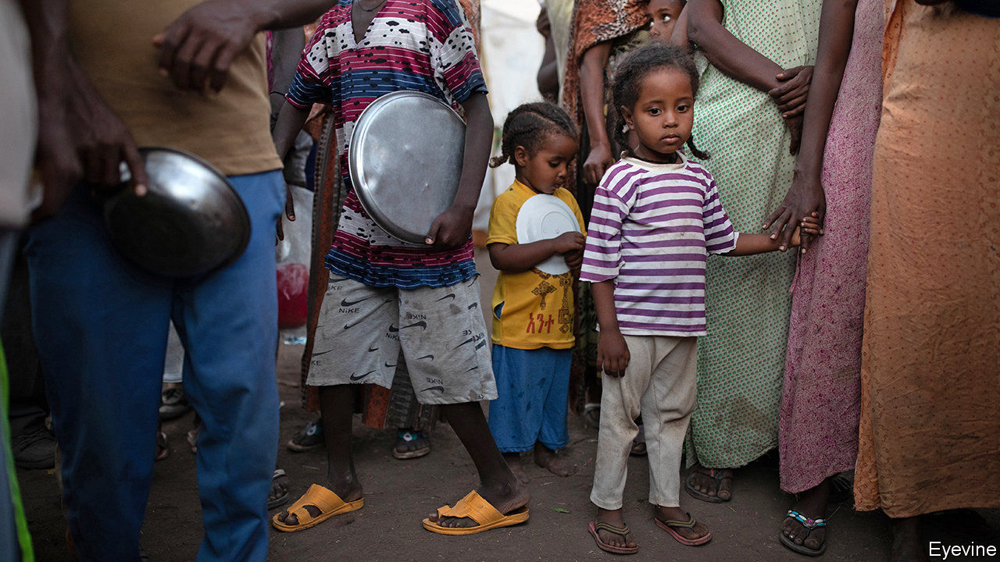
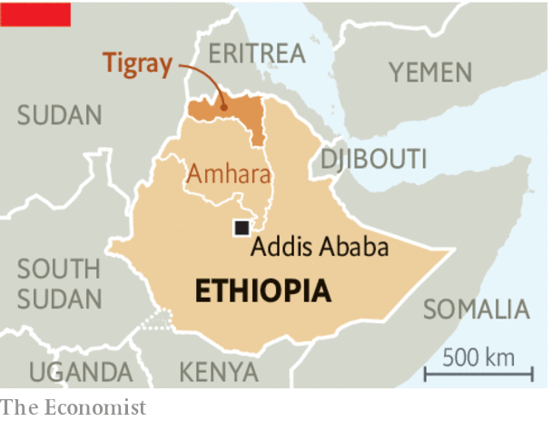

###### Famine crimes

# Ethiopia’s government appears to be wielding hunger as a weapon 

##### A rebel region is being starved into submission 

 

> Jan 23rd 2021 


ETHIOPIA HAS suffered famines in the past. Many foreigners know this; in 1985 about one-third of the world’s population watched a pop concert to raise money for starving Ethiopians. What is less well understood is that poor harvests lead to famine only when malign rulers allow it. It was not the weather that killed perhaps 1m people in 1983-85. It was the policies of a Marxist dictator, Mengistu Haile Mariam, who forced peasants at gunpoint onto collective farms. Mengistu also tried to crush an insurgency in the northern region of Tigray by burning crops, destroying grain stores and slaughtering livestock. When the head of his own government’s humanitarian agency begged him for cash to feed the starving, he dismissed him with a memorably callous phrase: “Don’t let these petty human problems...consume you.”


Things were supposed to be different under Abiy Ahmed, the Ethiopian prime minister who was hailed as a reformer when he took charge in 2018, and who won the Nobel peace prize the following year. Yet once again it looks as if hunger is being used as a weapon in Africa’s second-most-populous nation. And once again the scene of the horror is Tigray. Since fighting broke out in November between federal forces and those of Tigray’s rebellious former ruling party, perhaps 2m out of 6m Tigrayans are thought to have fled their homes. Many could now starve because the government has let so little food into the region (see ).


Aid agencies guess that between 2m and 4.5m people need urgent assistance. They cannot be more precise because the phone networks are down and the government has barred reporters from entering Tigray. The few who make it in return with horrifying accounts of ethnic killings, mass rapes—and starvation.

 


Plenty of food is available. Charities and UN agencies have been trying to get supplies through for months. But Ethiopia’s Orwellian Ministry of Peace has sent them on a paperchase for permits. “For more than two months there has been essentially no access to Tigray,” says Mark Lowcock, the UN’s humanitarian chief. “There are 450 tonnes of supplies we’ve been trying to get in that are stuck.” On those occasions when the federal government grants permission for an aid lorry to pass, it is typically stopped en route by regional governments, which insist that they, too, need to give permission, or halted by troops inside Tigray. Meanwhile there are credible reports of government forces or their allies killing livestock and burning crops. If true, both the perpetrators and those who gave the orders are guilty of war crimes.


Abiy insists that his troops are respecting humanitarian law. The conflict is not a civil war, but a mere police action, he claims. His government claims that restrictions on aid workers are for their own safety. Few believe him. Moreover, many observers fear that the fighting has grown too complex for the government to control. Troops from neighbouring Eritrea have joined the fray, as have militias from a rival ethnic group, the Amharas.


Outsiders should press all parties to let civilians eat. Josep Borrell, the EU’s foreign-policy chief, has suspended €88m ($107m) of budget support until aid agencies are given access to Tigray. This is a good first step. Others, such as America and Britain, should add financial pressure. Ethiopia is desperately short of foreign currency, and depends on loans and grants from the IMF and World Bank. Until its government allows food into Tigray, donors should not give it another dollar.■

