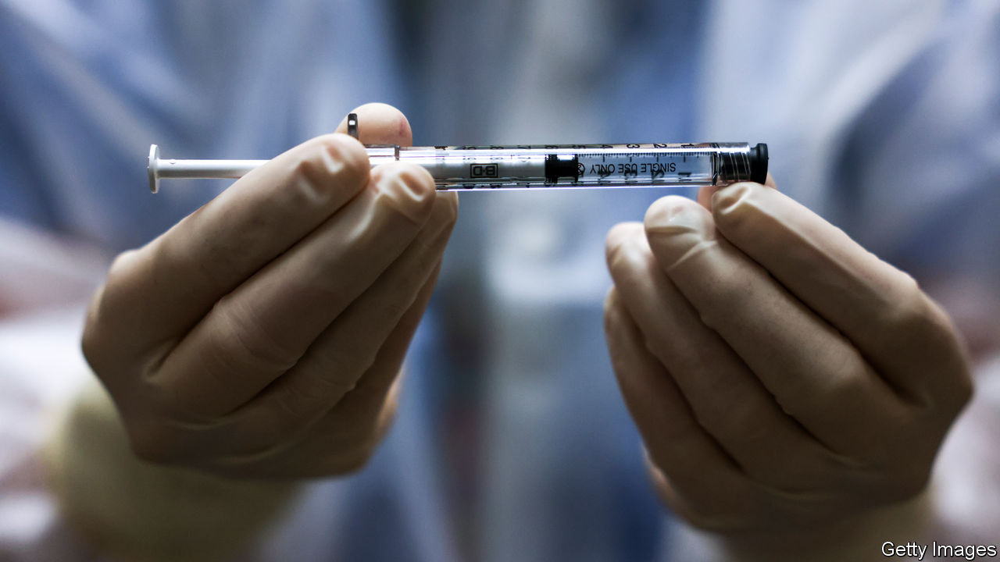
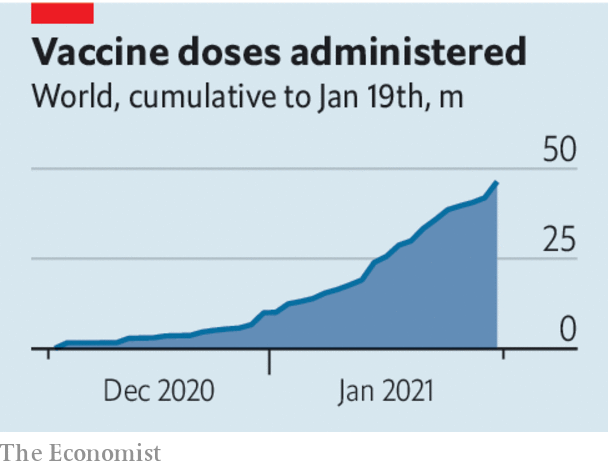

###### Infections v injections

# The marathon of covid-19 vaccination 

##### Even as governments sprint to get inoculate programmes going, they need to keep an eye on what comes next 

 

> Jan 20th 2021 


IT HAS BEEN described as a race between infections and injections. If so, infections are still winning. About 5m new cases of covid-19 a week are being recorded around the world. As we went to press, some 51 countries had begun to administer vaccines, according to Our World in Data, a website; over the previous week 17m people had been vaccinated, but the global total of doses was still below 50m. Only five countries had given the first dose to more than 5% of its population.


The inoculation effort is generating frustration in countries like France, which got off to a slow start, and rejoicing in Britain, which has so far done well (see ). Both the despair and the joy are premature. Plenty will happen in the months before most countries create enough immunity to suppress the spread of the virus. In the interim, much will depend on how successfully their governments manage lockdowns.


At the moment most of their energy is going into sorting out the logistics of vaccine distribution, which they can directly control. However, as Britain may be discovering, vaccine supply is what matters most. The good news is that more doses will become available, as manufacture scales up and new vaccines win regulatory approval. One from Johnson &amp; Johnson, expected to report trial results late this month, could inoculate 1bn people during 2021.


While countries wait for supplies, the central role in keeping the virus at bay will be played by non-pharmaceutical interventions (NPI), including masks and lockdowns. Modelling from Britain suggests vaccination’s benefits will take time to show up in intensive-care wards. These are full of people in their 50s and 60s because those older than this are often too frail for ventilators and other interventions. When intensive-care wards are full, mortality is a quarter higher than expected. If highly infectious new variants of the virus take hold, NPI regimes may even need to be tightened, as Germany’s was this week.

 


Lockdowns impose a burden on freedom and a heavy financial cost. Pressure will therefore mount for vaccinated people to be able to move around freely, even if at first they will be too few in number to make much difference to the economy. If governments ignore calls for “vaccine passports” to permit this, the vaccinated are likely to change their behaviour regardless. Some businesses may introduce informal systems.


For vaccine passports to make practical sense, epidemiologists need to understand how well vaccination stops people spreading the disease—because it would be harmful if those who were safe infected others yet to receive a jab. Early work from Israel, which has inoculated a greater share of its population than any other country, suggests that the Pfizer-BioNTech vaccine does indeed slow transmission a bit, but more research is needed to inform an effective passport regime (see ).


Vaccine passports also raise ethical questions. When so much rides on having one, the question of who gets a jab when will matter even more than it does today. If groups are arbitrarily pushed back in the queue, programmes will become mired in controversy. Vaccination must be free to rich and poor alike, and allocated by efficacy and clinical need. That can be hard to reconcile with the requirement not to waste scarce supplies, which argues for convenience.


There are complications, too. If vaccinated people can roam, those with acquired immunity will clamour for the same freedom: they are no more infectious, after all. Yet antibody tests are unreliable. It is not clear how long such immunity lasts or, in individuals, when they actually caught the disease and the clock started ticking. Some fear the implications for privacy if the state can check on citizens’ health. In principle, vaccine passports are a good idea. In practice, governments face a host of questions—some of which can be answered only through more epidemiological research. They need to start work on it today. ■


Editor’s note: Some of our covid-19 coverage is free for readers of The Economist Today, our daily . For more stories and our pandemic tracker, see our 

