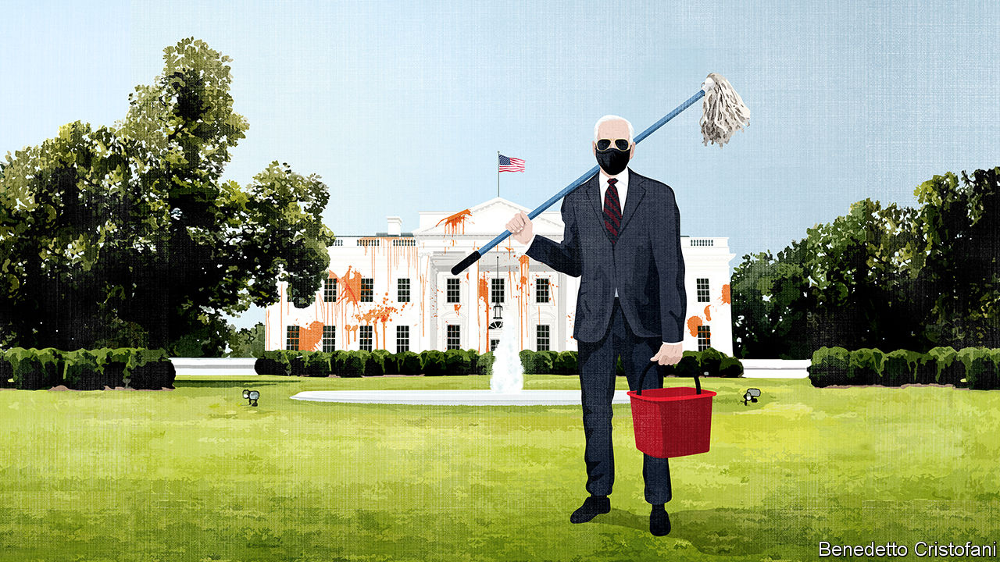

###### Morning after in America

# The outlook for America looks grim, but that could quickly change 

##### What to expect from a Biden presidency 

 

> Jan 23rd 2021 


JOE BIDEN has been dreaming of moving into the White House since at least 1987, when he first ran for president. How those dreams must have differed from the reality this week. The official toll of American deaths from covid-19 has passed 400,000. By the end of his first 100 days it may have passed 500,000. Millions of Americans have lost their jobs. Instead of observing the triumph of democracy in eastern Europe from the Oval Office, as the victor of the election in 1988 did, Mr Biden must contend with democratic decay at home. It is not an auspicious start. Yet, unlikely as it sounds, in the next few months the view from 1600 Pennsylvania Avenue could improve dramatically.


Mending America starts with getting the virus under control. Vaccinating the population will be a formidable operation that will test the ability of federal, state and local bureaucracies to co-operate. A slick campaign of the type the federal government masterminded to eradicate polio would save many lives. Yet even an imperfect vaccination programme will make a huge difference by the time spring turns into summer. Warmer weather, and hence longer spent outdoors, will help too. Covid-19 spreads exponentially. But once the number of people each person infects falls below one, it also dissipates exponentially.


This in turn will help America’s economic recovery. Though the labour market is about as depressed as it was when Mr Biden was sworn in as Barack Obama’s vice-president in the teeth of the financial crisis, this downturn is very different. Real disposable income probably rose at its fastest rate for two decades in 2020, a measure of the huge stimulus pumped into the economy by the federal government. The banking system looks sound. And the economic pain is not widespread, but concentrated among workers in businesses that depend on cramming lots of people into confined spaces. Many of them will find their services in demand again from Americans once they emerge from a year of hibernation.


Taking advantage of how the federal government can borrow at virtually no cost, Mr Biden’s team is set on another $1.9trn fiscal stimulus, bringing the total budget support since the pandemic hit to 27% of pre-crisis GDP. He may not be able to get that past the Senate, nor is it clear the economy needs all of it (see ). But even a trimmed-down version of the Biden opening bid—more money for vaccine distribution, extending unemployment insurance and expanding child tax credits—would have big effects. The tax-credit change alone could halve child poverty (see ).


As for the political crisis that required 25,000 troops on the street at Mr Biden’s inauguration, its causes will not soon fade. The Republican Party that became organised around a principle of loyalty to a man who has no loyalty to anything apart from himself, a dangerous coddling of racist factions and the rise of alternative facts: all were decades in the making. But the FBI is watching threats from domestic terrorism. The former president is just a citizen who might run for office again in 2024, assuming Congress does not bar him from doing so after his impeachment trial. And Mr Biden at his inauguration declared his clear support for the rule of law and racial equality—which at another time might have sounded like platitudes.


This will help lower the temperature of American politics, which could open other possibilities. By working with Republicans eager for Congress to get things done, Mr Biden may yet be able to pass an infrastructure bill and something on climate change, as well as his covid-19 package. In textbooks, democracy involves solving problems through compromise and managing conflict in elections. With a president inclined to build a coalition, a little of that spirit might return to Washington. Voters may even prefer it to 24-hour partisan warfare.


That is what needs to happen. America faces challenges that require the government to help, not just get out of the way. America has done a worse job of keeping schools open in the past year than any other rich country (see ). Enrolments have fallen, suggesting that many children have dropped out of education. Higher death rates for African-Americans and Hispanics are a reminder that health is linked to skin colour. Four years of Donald Trump have hollowed out institutions and weakened constraints on malfeasance. His parting act was to pardon a doctor convicted of profiting from carrying out unnecessary eye treatment on hundreds of elderly patients. He rescinded his own executive order which would have stopped his administration’s officials working as lobbyists.


The past four years have also created a problem for America abroad. At the back of their minds, foreign leaders know that the forces which brought Mr Trump to office could return with a future president, so any agreements American diplomats make risk seeming temporary. Mr Biden’s foreign policy will also require a series of impossibly hard trade-offs. His team needs the co-operation of the Russian government to sign an extension of the New START treaty on nuclear weapons, which expires on February 5th. Yet that same government has just locked up Russia’s most prominent opposition politician, Alexei Navalny, after first attempting to kill him (see ). They need China’s co-operation on climate change, even though China is engaged in what the outgoing administration has just labelled as “genocide” against the Uyghurs in Xinjiang.

Tricky corners in the Oval Office


A lot could go wrong. Senate Republicans may oppose everything Mr Biden suggests simply because he is a Democrat. The left of his party may turn sour on him for trying to make deals with Republicans. Politics has been simple during the Trump administration, which more often governed by inflaming partisan fights than fixing America’s problems. Engaging with reality is much harder—especially when you are buffeted by events.


To have the best chance of success, Mr Biden should stick to his folksy brand of dogged centrism which is so well suited to the moment. Western allies should be patient and not expect a miraculous overnight transformation. The return of restraint to the White House will be only the first step in a long journey, but it is a necessary one for America’s renewal.■


Dig deeper:

Read the best of our coverage of , then sign up for Checks and Balance, our  and  on American politics.

