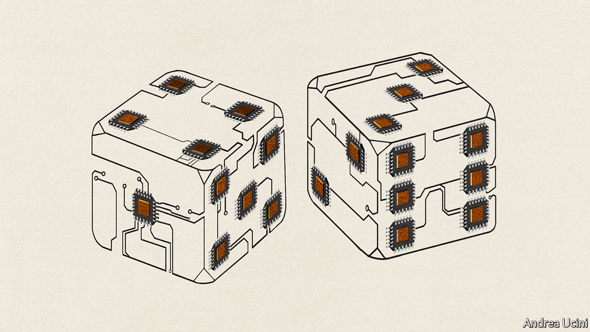

###### Technology and geopolitics

# The struggle over chips enters a new phase 

##### The age of their manufacture in China could be beginning 

 

> Jan 23rd 2021 


WHEN MICROCHIPS were invented in 1958, the first significant market for them was inside nuclear missiles. Today about a trillion chips are made a year, or 128 for every person on the planet. Ever more devices and machines contain ever more semiconductors: an electric car can have over 3,000 of them. New types of computation are booming, including artificial intelligence and data-crunching. Demand will soar further as more industrial machines are connected and fitted with sensors.


For decades a vast network of chip firms has co-operated and competed to meet this growing demand; today they crank out $450bn of annual sales. No other industry has the same mix of hard science, brutal capital intensity and complexity. Its broader impact is huge, too. When the supply chain misfires, economic activity can grind to a halt. This month a temporary shortage of chips has stopped car production-lines around the world.


And no other industry is as explosive. For several years America has enforced an intensifying embargo on China, which imports over $300bn-worth of chips a year because it lacks the manufacturing capability to meet its own needs. Fresh strains in the chip industry are forcing the geopolitical fault-lines further apart. America is falling behind in manufacturing, production is being concentrated in East Asia, and China is seeking self-sufficiency (see ). In the 20th century the world’s biggest economic choke-point involved oil being shipped through the Strait of Hormuz. Soon it will be silicon etched in a few technology parks in South Korea and Taiwan.


Start with the shifts in the industry. A surge in demand and those novel kinds of computation have led to a golden age in chip design. Nvidia, which creates chips for gaming and artificial intelligence, is now America’s most valuable chip firm, worth over $320bn. The quest to create bespoke chips in order to eke out more performance—think less heat, or more speed or battery life—is also drawing outsiders into the design game. In November Apple unveiled Mac computers powered by its own chip (it already uses its own in the iPhone), and Amazon is developing chips for its data centres. The design boom has also fired up dealmaking. Nvidia, for instance, is bidding $40bn for Arm, which makes design blueprints. In the future a new open-source approach to designing chips, called RISC-V, could lead to more innovation.


Contrast this effervescence with the consolidation in chipmaking. A gruelling 60-year struggle for supremacy is nearing its end. Moore’s law, which holds that the cost of computer power will fall by half every 18 months to two years, is beginning to fail. Each generation of chips is technically harder to make than the last and, owing to the surging cost of building factories, the stakes have got bigger. The number of manufacturers at the industry’s cutting-edge has fallen from over 25 in 2000 to three.


The most famous of that trio, Intel, is in trouble. It has fired its boss, an admission that it has fallen behind. It may retreat from making the most advanced chips, known as the three-nanometre generation, and outsource more production, like almost everyone else. That would leave two firms with the stomach for it: Samsung in South Korea and TSMC in Taiwan. TSMC has just announced one of the largest investment budgets of any private firm on the planet. An array of corporate A-listers from Apple and Amazon to Toyota and Tesla rely on this duo of chipmakers.


The other big industry rupture is taking place in China. As America has lost ground in making chips, it has sought to ensure that China lags behind, too. The American tech embargo began as a narrow effort against Huawei over national security, but bans and restrictions now affect at least 60 firms, including many involved in chips. SMIC, China’s chip champion, has just been put on a blacklist, as has Xiaomi, a smartphone firm. The cumulative effect of these measures is starting to bite. In the last quarter of 2020 TSMC’s sales to Chinese clients dropped by 72%.


In response, China is shifting its state-capitalist machine into its highest gear in order to become self-sufficient in chips faster. Although chips have featured in government plans since the 1950s it is still five to ten years behind. A $100bn-plus subsidy kitty is being spent freely: last year over 50,000 firms registered that their business was related to chips—and thus eligible. Top universities have beefed up their chip programmes. If the era of advanced chips being made in America may be drawing to a close, the age of their manufacture in China could be beginning.


How worried should you be? It is hard to ignore the dangers. If America withdraws from cutting-edge manufacturing and China continues to hurl resources at it, the White House will be tempted to tighten the embargo further in order to stymie China’s development. That could have explosive consequences. And the inexorable logic of scale is set to lead to an alarming concentration of production. The manufacturing duopoly could start to use their pricing power. Already a fifth of all chip manufacturing, and perhaps half of cutting-edge capacity, is in Taiwan, which China claims as its own territory and threatens to invade. The chip industry is poised for mutually assured disruption, in which America and China each have the ability to short-circuit the other’s economy.

Chips and old blocs


Some hawks in America and Europe want to respond with a subsidy bonanza of their own: socialism for semiconductors. But that would dampen the free-market renaissance in chip design and is, anyway, likely to fail. Instead, chip-users such as Apple should press TSMC and Samsung to diversify where factories are. America must urge Taiwan and South Korea to cut their soft subsidies for chip plants, so their firms have more incentive to build factories around the world. Last, President Joe Biden needs to create a predictable framework for trade with China in sensitive sectors, including chips, that allows it to participate in global supply chains while safeguarding Western interests. His predecessor oversaw a chaotic array of controls aimed at impeding China’s development, in chips as well as finance. These gave it an incentive to develop its own alternatives faster. The first chips may have been used in missiles, but it would be wise to avoid them becoming a flashpoint in a 21st-century cold war. ■

