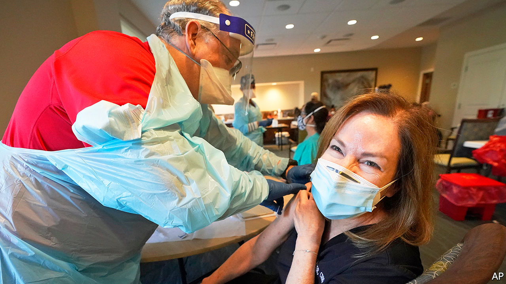
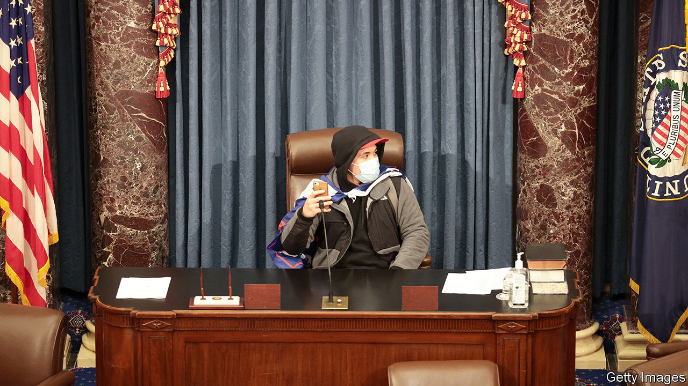
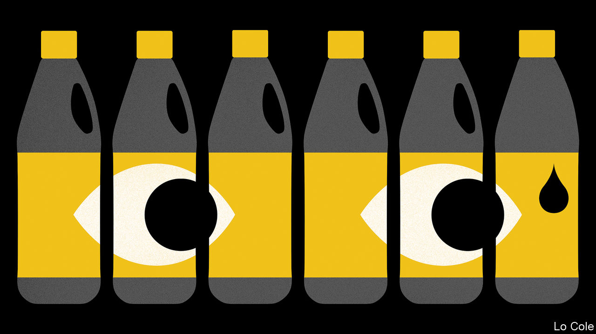
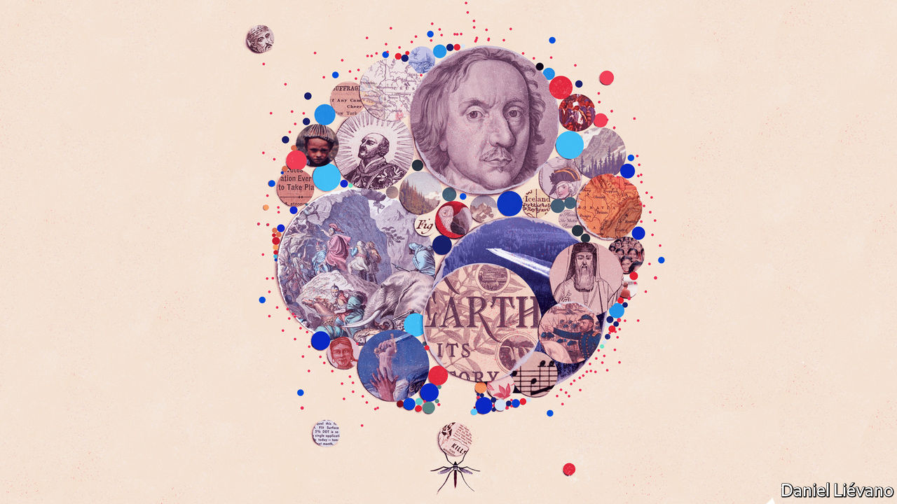
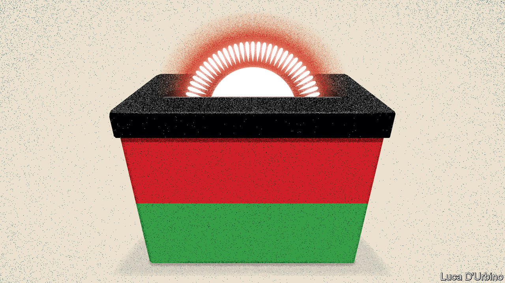

###### On vaccination, primaries, bannock, malaria, Malawi, conversation, potatoes

# Letters to the editor 

##### A selection of correspondence 

> Jan 23rd 2021 


Letters are welcome via e-mail to  

 


Nudging people to vaccinate


“” (January 9th) touched on the dangers from people who refuse to take the covid-19 jab in countries such as France. This is no small piece of the puzzle. In tandem with supply and distribution, tackling people’s fears about the vaccines must be a priority for public-health officials.


We have seen this before. The reason it took decades to eliminate wild polio from Nigeria was that communities in the north of the country believed the vaccine was designed to harm, not help, them. Nigeria’s experience with polio has given it an advantage in overcoming vaccine hesitancy. It can be done. Most important, we listened and learned to understand people’s fears and scepticisms. We offered the vaccine free and trained an army of workers to knock on doors advocating for it. We packaged it with other public-health services people wanted, such as malaria treatments and access to clean water.


Dismissing people and communities who are cautious of a vaccine will not work. That is as true in France as it is in Nigeria. And there is no such thing as partial eradication of a virus: covid-19 vaccines need to be rolled out to every country and across every community as fast as possible.


DR FAISAL SHUAIB

Executive director

National Primary Health Care Development Agency

Abuja, Nigeria

 


Ditch party primaries


Another factor that has led to the current state of American politics (“”, January 9th) is the pernicious effect of party primaries. Energetic and well-organised minorities of interests vote in the primaries for ideologues, who are guaranteed almost-certain election in gerrymandered districts dominated by their party. The system produces increasing numbers of rigid partisans in Congress. It also explains why Republican legislators found it so difficult to challenge Donald Trump. They knew that their seats were at risk if they defied the zealous Trump primary base.


The problem of hyper-partisanship would be reduced by the widespread adoption of non-party blanket primaries, in which all candidates, Democrat and Republican, compete on the same primary ballot for a spot on the general election ballot. The top two go through. If both candidates are from the same party they have to compete against each other in the general. They would therefore have to appeal for votes across the political spectrum; those pandering to a narrow base, no matter how energised, are less likely to win.


WILLIAM HORNS

Fitchburg, Wisconsin

 


A Scottish import


You described bannock as an indigenous fried bread in Canada (“”, January 2nd). It is not of indigenous origin. The word and the food came to Canada with Gaelic-speaking traders and explorers. Variations include baked and fried versions of oatcake, and other breads well-known in Scottish cuisine. Lest one forget, the Scots did rather nicely at the Battle of Bannockburn, centuries before their descendants brought bannock to North America.


EILEEN HEASLIP

Liverpool, Canada

 


Defeating malaria


The world’s response to a novel disease, covid-19, gives us renewed hope that we can edit history and end humanity’s oldest scourge: malaria (“”, December 19th). Malaria deaths globally have nearly halved since 2000, but the advances resulting from effective bed nets, insecticides and treatments have now stalled, and renewed investment in localised, data-driven strategies and in new tools is necessary to achieve the feasible goal of eliminating malaria within a generation.


Just as covid-19 vaccines will transform health, economies, and the way of life for us all, an effective malaria vaccine will do so for those at risk of malaria—nearly half the world’s population. We urge investment in the acceleration of the final stages of a game-changing malaria vaccine, such as that developed by Oxford’s Jenner Institute, with the same vigour that has delivered covid-19 vaccines in less than a year.


J. CHRISTOPHER FLOWERSE. NEVILLE ISDELL

Co-founders

Isdell: Flowers Malaria Initiative

New York


You didn’t mention tonic water, as used in gin and tonic. Developed in the early 19th century a key ingredient was quinine, a medication used to treat malaria. Hence its popularity in British India.


CAROLINE CRACRAFT

Chicago

 


Defending democracy


Further to your country of the year (), could I add a special word on behalf of the Malawi Defence Force. In December 1993, as Kamuzu Banda, the long-term dictator, was dragging his heels over elections, a bar-room brawl with the Malawi Young Pioneers, his personal paramilitary force, resulted in the death of two army soldiers. Seething in the ranks led junior officers to lock up their superiors. Over the next two weeks the defence force systematically destroyed the paramilitaries, killing 25 but allowing the rest of them to return to civilian life.


The army then returned to base. The property of expatriates, Indians, rich Malawians and other likely scapegoats was left untouched. Banda and his party were left in power, though without any. No other officials were removed, no other political demands were made. There were no riots or lynchings or even imprisonments. Although bent slightly, the constitution was respected.


The consequence of this non-coup was a sudden blossoming of political parties and newspapers, and the birth of a vibrant democracy. The attempted succession in 2012 of Peter Mutharika that you discussed was foiled by the army protecting Joyce Banda, the rightful next president. In the mess following the 2019 election, when the police attempted to suppress demonstrations, the army stepped in to defend the protesters. There is more to Malawi’s democracy than the army, but its ever-present promise of strong (non) involvement in Malawi’s politics means that opposition activists, demonstrators, whistle-blowers and judges know that it has their back.


GEOFF WILLIS

Banbury, Oxfordshire

 


We’re all just naked apes


As rightly notes, we humans need regular undemanding social interactions such as small talk to support our well-being (January 2nd). As a primate species that is relatively hairless we are unable to use grooming rituals to establish and maintain social bonds. Chatting about the weather and stock performances is our equivalent of removing salt crystals and lice from each other.


ALLAN MILNE LEES

Bath

Sweet potatoes


Rather than heading to Ireland to visit a potato theme park, Alan Finlayson (, December 19th) should consider going to Munich to visit the Potato Museum, the Kartoffelmuseum. It describes itself as “one of only a handful of museums worldwide devoted to the humble spud”.


MALCOLM MACDONALD

Kidwelly, Carmarthenshire

