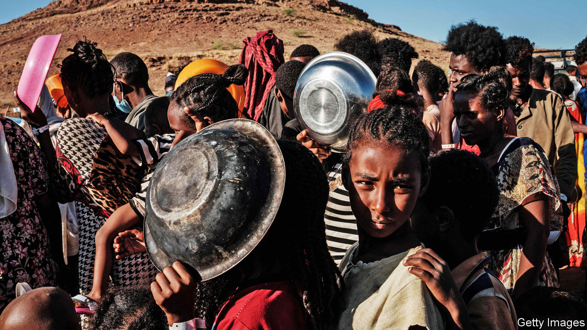
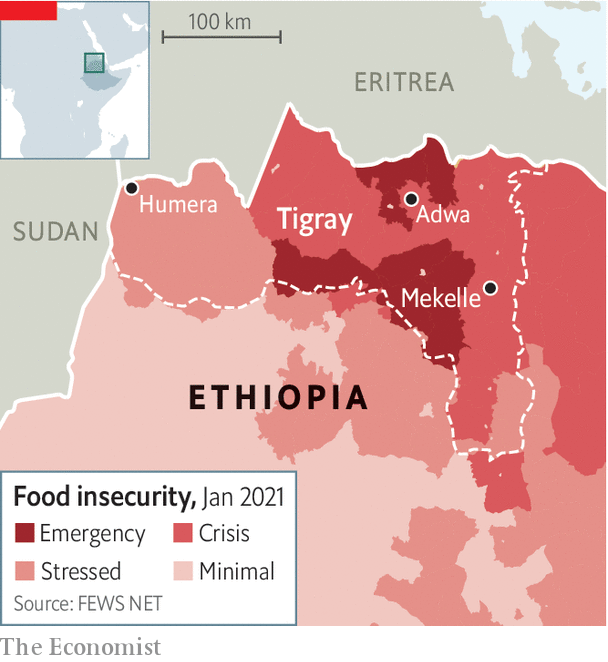

###### Fear and famine

# After two months of war, Tigray faces starvation 

##### Ethiopia’s government appears to be blocking food deliveries to the region 

 

> Jan 23rd 2021 


NO IMAGE BETTER symbolises the fall from power of the Tigrayan People’s Liberation Front (TPLF), the party that had called the shots in Ethiopia for almost three decades. Sebhat Nega, one of its founders, was pictured this month in handcuffs, wearing a rumpled tracksuit and a single sock. The 86-year-old, long one of Ethiopia’s most powerful men, had been captured by the army. His party, which was pushed out of power amid massive protests in 2018, has been fighting the government led by Abiy Ahmed for the past two months. It is not going well.


Several other senior TPLF figures have been killed by the army. Among them was Seyoum Mesfin, Ethiopia’s longest-serving foreign minister. The killings and arrests appear to have left the TPLF in disarray. Its leaders, including the ousted president of the Tigray region, Debretsion Gebremichael, have been in hiding for over a month. Although the TPLF still controls sizeable swathes of rural Tigray, it holds no towns or cities. Allies of Abiy, who has already declared victory, believe it is only a matter of time before the rest of what he calls the “junta” are captured or killed.


But time is not a luxury Tigrayans can afford. For weeks the vast majority of the region’s roughly 6m people have been without adequate food, water or medicine. According to the interim administration of Tigray, which Abiy appointed last month, more than 2m civilians have been driven from their homes. The state-appointed human-rights commission has warned of a “humanitarian crisis”. According to the Famine Early Warning Systems Network, run by the American government, parts of central and eastern Tigray are probably one step from famine. “We could have a million dead there in a couple of months,” frets a Western diplomat.

 


It is impossible to know how bad the crisis is because phone lines are down and the government has barred journalists from going to most of Tigray. It also restricts the movement of aid workers. But accounts are trickling out. In some places, especially in the north, crops have been burnt. In others, farmers abandoned their fields before the harvest.


Even where food is still available, many people have no means of getting it. Banks are closed across Tigray (apart from in Mekelle, the region’s capital). So are markets and shops. In many places fuel has run out. Inflation is rampant. “Even if you have the money, you don’t have a bank,” says Kibrom, who fled from Tigray to Addis Ababa, the Ethiopian capital, last month. “If you have grain, you don’t have a mill. If you have a mill, you don’t have power.”


Listen on:  |  |  |  | 


Hospitals are also running out of supplies. In most, such as the one in Humera, a town close to Sudan and Eritrea, staff have not been paid since October. A lack of electricity means medicines are spoiling—if there are any left at all. When Médecins Sans Frontières (MSF), an international charity, arrived at the hospital in Adwa earlier this month, its staff found that it had been almost completely looted. “How are we going to do blood transfusions that save lives if we don’t have a refrigerator?” asks Mari Carmen Viñoles, the head of MSF’s emergency unit.


The federal government disputes such accounts. “There is no starvation in Ethiopia,” said a spokesman for the federal disaster management agency on January 19th. It claims to have distributed aid to nearly 2m people in northern Ethiopia (though it is unclear how many of those were actually in Tigray).


Muferiat Kamil, the minister of peace, says her ministry is reaching citizens even in the central areas of Tigray, which are largely under the control of the TPLF. This is implausible. A senior humanitarian official notes that civilians in these places are “effectively trapped”. TPLF forces regularly attack military convoys, which makes it impossible for the government to deliver supplies safely. An agreement signed with the UN last month to allow aid groups to travel unhindered throughout the region is not being honoured. This is probably because officials do not want them to expose war crimes or the presence of thousands of troops from neighbouring Eritrea (who are helping the government). Four UN staff were shot at and detained last month for entering areas where a government official said “they were not supposed to go”.


Lorries carrying emergency supplies are also being stopped. Despite some recent improvements, the system for getting permits to let them into Tigray is slow and complex. Even when permission is granted by the central government, local authorities in neighbouring regions halt shipments, saying that they too have to give permission. Once the lorries arrive in Tigray, local army commanders stop them, citing security or perhaps because they think the food will end up in rebel hands.


It is possible that Ethiopia’s government is too incompetent to realise that its actions are likely to cause starvation. But it seems more likely that the authorities are deliberately holding back food in an effort to starve the rebels out. “The lack of humanitarian access is part and parcel of the war campaign,” says a UN diplomat. Even before the war began there was an effort to blockade Tigray to weaken its leaders. In October the federal government stopped welfare payments to poor farmers.


For decades Ethiopian governments have been guilty of putting politics before people. A famine in 1973 was covered up to avoid embarrassing the government of Emperor Haile Selassie. A decade later a Marxist military dictatorship burned crops and restricted aid to Tigray in an attempt to defeat the TPLF, then a ragtag band of guerrillas. There is not yet a fully-fledged famine in Tigray. But there is a real danger that history will repeat itself. ■

