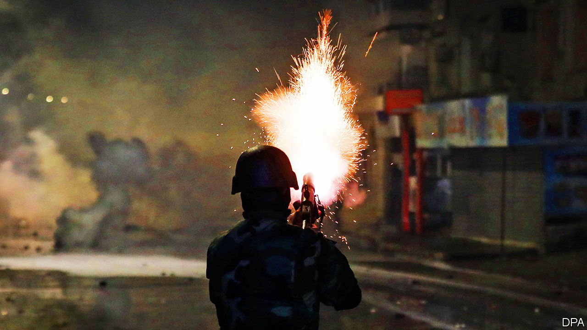

###### Free but fed up

# Despite democracy, Tunisians riot 

##### Ten years after the Arab spring, jobs are still scarce 

 

> Jan 21st 2021 


BY DAY THE streets are quiet, the cafés full of unemployed men. At night, though, groups of young people have fought running battles with police during a week of protests and riots in several Tunisian cities that started on January 15th. Local media portray them as looters and vandals; more than 600 have been arrested, and the army has been deployed to restore order. But other Tunisians are more sympathetic. In Ettadhamen, a working-class suburb of the capital, Tunis, residents decry the joblessness and despair that periodically cause eruptions of anger. “They always want to depict protesters as troublemakers,” says 37-year-old Ahmed (who declined to give his full name). “They never want to say they’re protesting over living conditions.”


This month’s unrest began almost ten years to the day after Zine El Abidine Ben Ali, Tunisia’s dictator from 1987 to 2011, stepped down amid a popular uprising. Since then Tunisia has become a democracy, with fair elections and political freedoms. In economic terms, though, it has been a disappointing decade. Annual growth averaged just 1.8% from 2011 to 2019. Last year the economy shrank by between 7% and 9% as covid-19 forced long lockdowns and clobbered the vital tourism sector. Unemployment is stubbornly high at 16% overall, and 36% for young people. The Tunisian dinar has lost 47% of its value.


Successive governments—there have been nine prime ministers since the revolution—have seemed powerless to jump-start the economy. In part that reflects the messy nature of politics in a fragile democracy. Long-running disputes between Islamist and secularist factions make it hard to get much done. Powerful labour unions fought efforts to trim a bloated public sector. And, in contrast to decades past, public opinion now matters. In 2018 a string of tax increases sparked a week of protests, some violent. “The people want the fall of the regime,” chant some of the protesters today, echoing calls made ten years ago.


Small in size, bordered by war-torn Libya and stagnant Algeria, Tunisia has struggled to find avenues for growth. The cash-strapped government cannot afford much spending on development or welfare. Public debt has soared from 43% of GDP in 2011 to a projected 89% this year. The IMF estimates that Tunisia budgeted just 1.8% of GDP to support individuals and firms during the pandemic (the global average is 5.9%). To cover a widening deficit, the government may have to seek another loan from the IMF, which could necessitate painful austerity measures. It received a $745m loan from the IMF in April to deal with the pandemic, but that has run out.


Some young people see no choice but to leave. The country’s economic malaise has fuelled a rise in risky forms of emigration. Last year 12,776 Tunisians crossed the Mediterranean to Europe, up from 3,900 in 2019. They made up the largest single group of migrants crossing the sea, about 20% of the total. For many, the hopes of ten years ago have given way to a depressing present: proud they may be of their country’s political progress, but pride alone is not enough to persuade them to stay at home. ■

