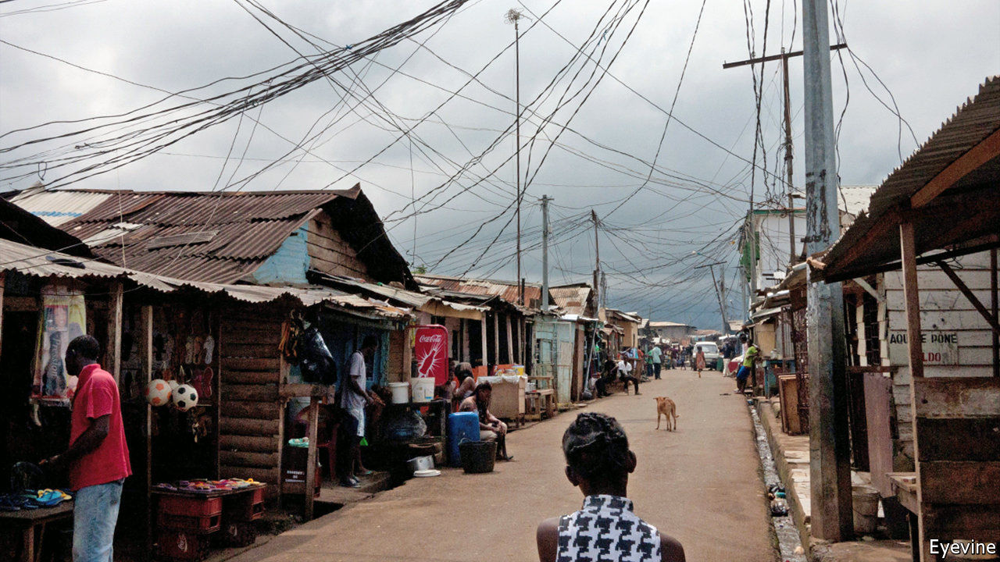
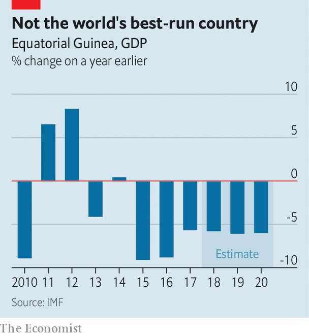

###### Who will blink first?

# Equatorial Guinea is still waiting for its IMF bail-out 

##### It might come faster if the government did something about corruption 

 

> Jan 23rd 2021 


MORE THAN a year after being promised an IMF bail-out, the tiny petrostate of Equatorial Guinea has yet to see most of the money it hoped would revive its economy. Before oil prices slumped in 2014 the country was, on paper, one of Africa’s richest per person. But since the slump it has been weighed down by budget and current-account deficits. Its economy shrank in each of the past six years (see chart).


In late 2019 the IMF reluctantly agreed to lend Equatorial Guinea $280m over three years, despite objections from NGOs and human-rights groups that the central African country was a bottomless pit of corruption. They have a point. The government’s management of its oil and gas revenues is opaque. It publishes few statistics on the economy and there are almost none of the usual checks and balances that hold governments to account: political opponents are routinely arrested and tortured, and there is no independent press to scrutinise the government or its spending.

 


As a result, little of the oil wealth that flowed into the country in the years before 2014 made its way to ordinary people. In Malabo, the capital, slums run almost up to the foot of the large presidential palace occupied by Teodoro Obiang Nguema Mbasogo, who seized power in a military coup in 1979. Just a few miles from the palace people queue up with barrels to collect water from the single tap in their village.


Much of what we know of the spending habits of Mr Obiang is from court actions abroad, where he and members of his family and government (often there is no distinction) have been mired in controversy. In 2019 authorities in Switzerland auctioned off a collection of 25 sports cars that they had confiscated from Mr Obiang’s eldest son—and vice-president—Teodorin. The cars, which included Bentleys, Rolls-Royces and Ferraris, fetched the equivalent of $27m. Last year an appeals court in France upheld an earlier conviction of Teodorin on charges of embezzlement.


Despite these warning signs, Equatorial Guinea was seemingly able to allay the IMF’s concerns. An initial $40m was released at the start of the programme.


But the honeymoon did not last long. As part of its programme, the IMF had insisted that Equatorial Guinea meet a number of conditions aimed at increasing transparency and reducing theft. One was that it join the Norway-based Extractive Industries Transparency Initiative (EITI), which sets standards for good governance of oil, gas and mineral resources. In February 2020, shortly after the IMF deal was signed, the EITI’s board rejected an application from Equatorial Guinea, saying that it had not met the requirements. Since then the IMF has held firm and not released any more money. Despite his country’s deepening economic crisis, Mr Obiang seems strangely reluctant to blink first. ■

