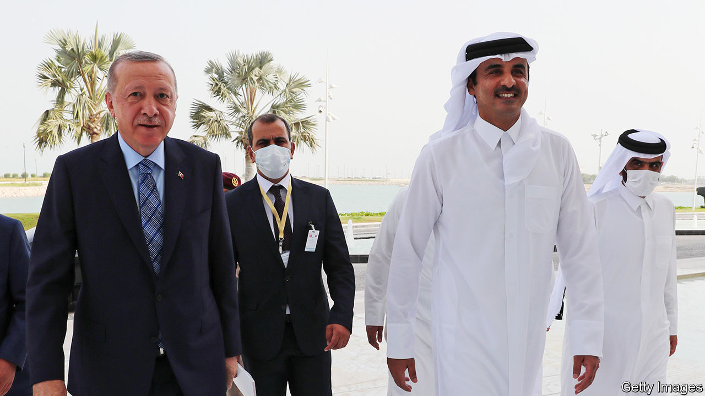

###### A special relationship

# How Qatar and Turkey came together 

##### Ideology, economics and angry neighbours have pushed them closer 

 

> Jan 23rd 2021 


WHEN TURKEY looks around its region, it sees angry faces. Many Arab states view the Islamism of its president, Recep Tayyip Erdogan, as a threat. The European Union is unhappy with Turkey for instigating a row over drilling rights in the Mediterranean. America, a NATO ally with troops in Turkey, has imposed sanctions on it, most recently for buying a Russian air-defence system. Yet Turkey doesn’t even get on that well with Russia, which has bombed its allies in Libya and Syria.


At least Turkey has Qatar. The seeds of their friendship were planted in the early 2000s, when Turkish contractors poured into Doha, Qatar’s capital, to help with a building boom. Since then the countries have drawn closer, spurred on by ideology, business and isolation. Turkey, which is big and cash-strapped, counts on Qatar for financial support; Qatar, which is small and rich, relies on Turkey for protection.


Both countries angered Middle Eastern despots a decade ago by backing the Arab-spring uprisings, which empowered Islamists in several countries. When the tide turned against the Islamists, many found refuge in Turkey and Qatar. Qatar’s support for Islamist groups such as the Muslim Brotherhood and Hamas was one reason why Bahrain, Egypt, Saudi Arabia and the United Arab Emirates (UAE) severed ties with it in 2017. They also wanted Qatar to shut a Turkish military base in Doha.


Instead Qatar deepened its ties with Turkey, which sent more troops and food to the emirate. The military base in Doha, completed in 2019, can now host 5,000 Turkish soldiers. Mr Erdogan dubbed it a “symbol of brotherhood”. The countries have conducted joint military exercises and Turkey has provided Qatar with arms. Qatar, for its part, has backed Turkey’s interventions in Libya and Syria.


More importantly, Qatar has propped up Turkey’s finances. In 2018, as Turkey was running out of cash, Qatar pledged to invest $15bn in the country and agreed to a $3bn currency swap with Turkey’s central bank. As the bank’s dollar reserves continued to fall, Qatar boosted the swap agreement to $15bn. In November, with Turkey facing another currency crisis, Qatar bought a 10% stake in its main stock exchange and a 42% share in a struggling shopping mall. It also pledged to invest in a port development in Istanbul. The deals are worth billions of dollars. Qatar is now Turkey’s third-biggest foreign investor.


Opposition politicians accuse Mr Erdogan (pictured, left) of cutting shady deals. In 2018 they criticised him for shopping for a new presidential jet—so Sheikh Tamim bin Hamad al-Thani, Qatar’s emir (pictured, right), gave him one worth $500m. A firm linked to the emir’s mother has purchased land near Mr Erdogan’s pet project, a canal that would connect the Black and Marmara Seas. In 2019 Mr Erdogan personally approved the awarding of a 25-year lease on Turkey’s national tank factory to a joint Turkish-Qatari venture involving one of his closest confidants. “Qatar has acquired almost unlimited access to lucrative investment deals in Turkey,” says Birol Baskan of the Middle East Institute, a Washington-based think-tank. “Qatar seems to be subject to no formal procedures.”


Some wonder whether the relationship will become less special, since Qatar and its neighbours restored diplomatic ties earlier this year. But the atmosphere remains frosty (not literally—it’s the Gulf). And Turkey is still feuding with some of them. It accuses the UAE, which is fiercely anti-Islamist, of having backed a coup attempt against Mr Erdogan in 2016. The countries support opposing sides in Libya’s civil war. Turkey fell out with Saudi Arabia after Saudi hitmen killed Jamal Khashoggi, a Saudi journalist, inside the kingdom’s consulate in Istanbul in 2018. (Qatar has offered to mediate between the two countries.)


The circumstances that brought Turkey and Qatar together have not fundamentally changed, so they are likely to stay close. The alliance “is one of the most stable relationships Erdogan has established since he came to power,” says Galip Dalay of the Brookings Doha Centre, a think-tank. Whether it makes the region more stable is still keenly debated in Gulf capitals. ■

