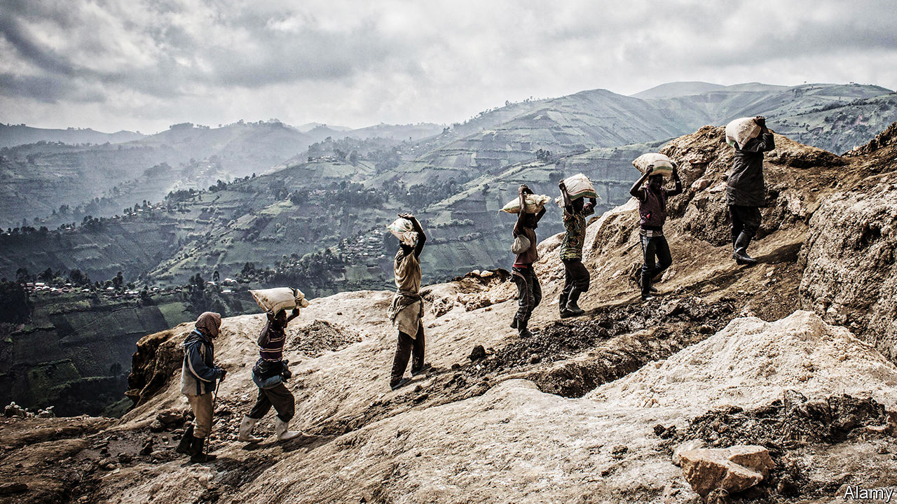

###### Smugglers’ paradise

# Why it’s hard for Congo’s coltan miners to abide by the law 

##### American rules against conflict minerals have unintended consequences 

 

> Jan 23rd 2021 


MARTIN IS A Congolese pastor with a sideline in coltan smuggling. “You can hide it in the petrol tank of a motorbike,” he says, “or in a secret compartment under a lorry.” He smuggles coltan into neighbouring Rwanda, where it costs about half as much to export the stuff. The border police know which vehicles are smugglers’, says Martin (not his real name), but they look away in exchange for a cut.


Tantalum, a metal used in smartphone and laptop batteries, is extracted from coltan ore. In 2019 40% of the world’s coltan was produced in the Democratic Republic of Congo, according to official data. More was sneaked into Rwanda and exported from there. Locals dig for the ore by hand in Congo’s eastern provinces, where more than 100 armed groups hide in the bush. Some mines are run by warlords who work with rogue members of the Congolese army to smuggle the coltan out.


When demand for electronics soared in the early 2000s, coltan went from being an obscure, semi-valuable ore to one of the world’s most sought-after minerals. Rebels fought over mines and hunted for new deposits. Soldiers forced locals to dig for it at gunpoint. Foreign money poured into Congo. Armed groups multiplied, eager for a share. Then, in 2010, a clause in America’s Dodd-Frank Act (a reform of financial regulations) forced American firms to audit their supply chains. The aim was to ensure they were not using minerals such as coltan, gold and tin that were funding Congo’s protracted war. For six months mines in eastern Congo were closed, as the authorities grappled with the new rules. Even when they reopened, big companies, such as Intel and Apple, shied away from Congo’s coltan, fearing a bad press.


The “Obama law”, as the Congolese nickname Dodd-Frank, did reduce cash flows to armed groups. But it also put thousands of innocent people out of work. A scheme to trace supply chains known as ITSCI run by the International Tin Association based in London and an American charity, Pact, helped bring tentative buyers back to Congo. It promised to trace each sack of coltan back to the mine it was dug from, and thus to prevent conflict minerals from entering the global supply chain.


ITSCI staff turn up at mining sites to see if armed men are hanging about, pocketing profits. They check that no children are working in the pits. If a mine is considered safe and conflict-free, government agents at the sites put tags onto the sacks of minerals. However, some unscrupulous agents sell tags on the black market, to stick on coltan from other mines. “The agents are our brothers,” Martin says. It is hard to police such a violent, hilly region with so few roads. Mines are reached by foot or motorbike along winding, muddy paths.


For a long time those who preferred to export their coltan legally had to work with ITSCI, which held the only key to the international market. Miners groaned that ITSCI charged too much: roughly 5% of the value of tagged coltan. When another scheme called “Better Sourcing” emerged, Congo’s biggest coltan exporter, Société Minière de Bisunzu, signed up to it instead.


Tantalus, a figure in Greek mythology who lends his name to the metal, was condemned to spend eternity in a pool of water under a low-hanging fruit tree. When he tried to drink the water, it receded. When he tried to eat the fruit, it slipped out of his grasp. Coltan is similarly tantalising: the riches it promises remain out of reach for most Congolese. Until the state takes back control of the lawless east, it will be hard to prove that minerals from the region are untainted by conflict. But shunning them is not the answer, say campaigners; better to improve traceability schemes.■

