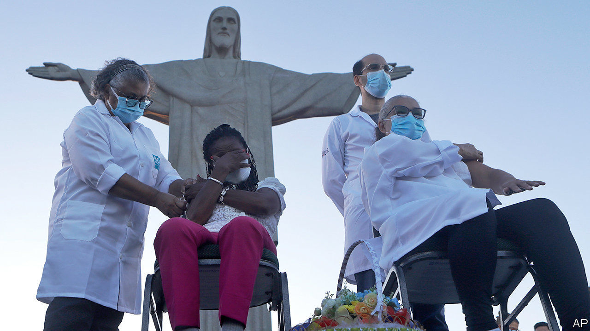

###### Chinese covid vaccines

# China’s jabs may have an important role 

##### But there is uncertainty over their efficacy 

 

> Jan 23rd 2021 


IN MEDICAL SCIENCE, fortune rarely favours endeavours that begin by skirting phase-three trials—those that test a new drug or vaccine on lots of people in a rigorously controlled way. Yet this is exactly how a number of Chinese covid-19 vaccines arrived in the world last year.


Rumours started in June that workers at Beijing airport were being given untested vaccines. As the year progressed, health officials confirmed that China had started mass inoculations—even though vaccines against SARS-CoV-2, the virus that causes covid-19, had not been through phase-three trials in the country. By November, one of these vaccines had been given to nearly 1m people. Scientists abroad fretted over the safety of such a huge, uncontrolled experiment.


Despite their aberrant start in life, however, vaccines from three Chinese firms, Sinopharm, Sinovac and CanSino, are now making their way through what look more like proper trials, if of varying quality, in different parts of the world including Bahrain, Brazil, Chile, Indonesia, Mexico, Turkey and the UAE. Yet recent results from those of these trials that concern Sinovac’s vaccine have caused much confusion. A trial in Brazil reported an efficacy of 50% or, depending how the data are interpreted, 78%. Earlier trials of this vaccine, in Turkey and Indonesia, had reported efficacies of 91% and 65% respectively. But data to back those numbers up are scarce.


One probable reason why the efficacies recorded by these trials vary so much is that the results from Turkey and Indonesia were based on far fewer participants and fewer recorded cases of covid-19 than those from Brazil. This makes it hard to work out accurate figures for them. Trials in different countries also differ in the way they are run—another possible source of inconsistent findings.


The Brazilian trial is the largest, and probably the best run, of the bunch. It involved more that 10,000 volunteers who were health-care workers. Maurício Nogueira, a professor of virology at a state medical school in São Paulo, who is one of the principal investigators involved in this trial, points out that 50% is a conservative estimate of the vaccine’s efficacy. He offers three reasons.


One is that, because of the trial participants’ professions, they were more frequently exposed to high concentrations of virus than was the average Brazilian. A second is that health-care workers are more likely than others to notice that they have a symptom of covid-19. The third is that the trial used a particularly sensitive definition of what constituted a potential case of the disease that should therefore be put forward for testing. This was that participants should be tested after reporting only one symptom, rather than three, as demanded by some other trials. The trial’s organisers say that if these “very mild” cases of covid-19 are ignored, and only “mild”, “severe” and “fatal” cases considered, then the vaccine’s efficacy reaches 78%.


This sort of after-the-fact tinkering is frowned on by statisticians. Brazil’s medical regulator has nevertheless decided that, though Sinovac’s vaccine may not be the best in the world, it is still useful. The country will now roll out millions of doses under an emergency authorisation.


For many other countries, though—namely those without some independent way of reviewing the data—it is more difficult to have confidence in the Sinovac vaccine, even though it has the potential to be quite useful. Even a vaccine that is only 50% effective meets international thresholds for vaccine efficacy laid down before the pandemic began. And Sinovac has said it could make 600m doses this year—a helpful contribution to the general weal.

And yet


Deployed globally, this and other Chinese vaccines could offer enormous potential. Doubts, though, continue about them because of the scarcity of data provided by the firms, the lack of transparency over their development, and conflicting reports from trials. Reports that Chinese commentators feel the need to snipe about Western vaccines seem to suggest a lack of confidence in home-grown products. In Indonesia there are already signs of wariness over the Sinovac vaccine, although the Sinopharm vaccine has been more warmly received in the UAE and Bahrain.


For vaccines from China to be widely accepted, the trial and manufacturing data surrounding them need more independent evaluation. Lawrence Gostin, head of the O’Neill Institute for National and Global Health Law at Georgetown University, in Washington, DC, says scrutiny, and then authorisation, by the World Health Organisation (WHO) would bring a huge boost to the legitimacy and profile of Chinese vaccines around the world.


Experts from the WHO are currently in China to assess whether Sinovac’s and Sinopharm’s manufacturing processes comply with international standards. Next, they will need to look at data on quality, safety and efficacy. Despite their inauspicious start in life, it is possible these vaccines could prove their worth. ■


Editor’s note: Some of our covid-19 coverage is free for readers of The Economist Today, our daily . For more stories and our pandemic tracker, see our 

