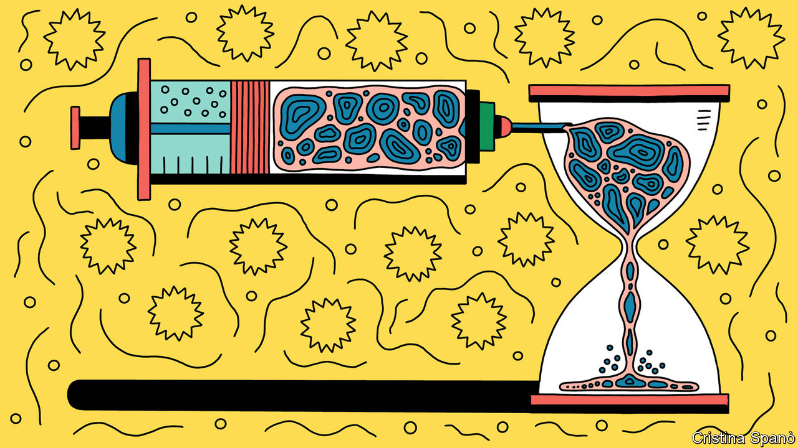
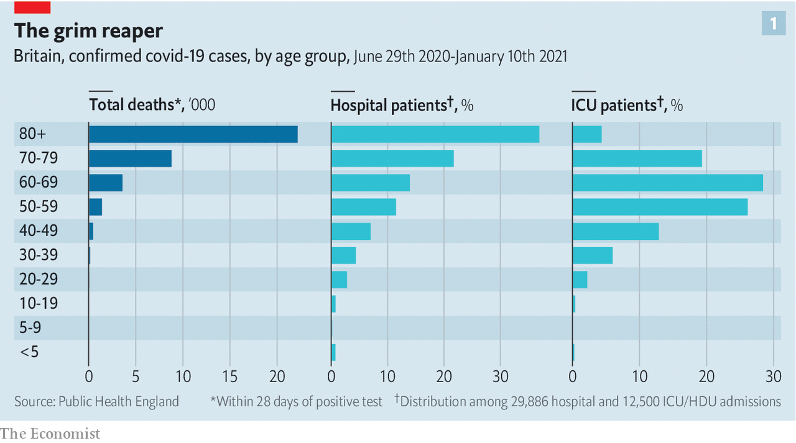
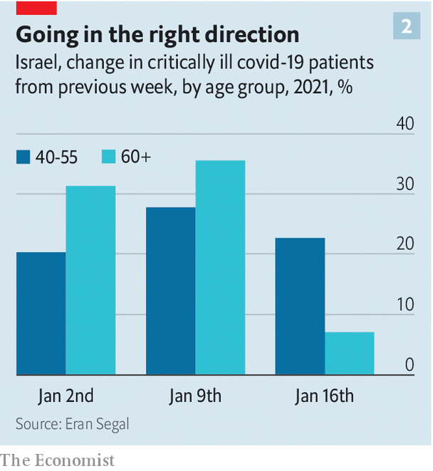

###### Covid-19 vaccines

# How fast can vaccination against covid-19 make a difference? 

##### Israel has some answers 

 

> Jan 23rd 2021 


HOSPITALS AROUND the world are, once again, buckling under a torrent of covid-19 patients. In places as far apart as London, Cape Town and Los Angeles ambulances wait for hours to unload the sick, and refrigerated lorries have been brought in to hold the dead. Vaccines are the only way out of this. The question is, how quickly can they turn things around?


Vaccines reduce deaths and hospital admissions in two ways: they protect the vaccinated directly, stopping them becoming ill; and they offer indirect protection to the unvaccinated, because those already jabbed will be less likely to infect them. Measuring the combined effect—and how quickly it kicks in—is possible only where mass vaccination is well under way. But early results are starting to arrive.


Most countries are vaccinating their elderly first, along with health-care workers. The preponderance of covid-19 deaths—around 85% in England, for example—are of people aged 70 or over (see chart 1). People on covid-19 hospital wards are often that age, too. Hospital admission rates and deaths should both, therefore, fall sharply a few weeks after a large share of the elderly get their first jab. Hospitals will nevertheless struggle until lots of middle-aged people are also vaccinated. This is because, at the moment, the worst pressure is on intensive-care units (ICUs), and most patients in these are in their 50s and 60s. That may seem odd, given the higher death rates among the elderly. But ventilators and other organ-support machines impose a lot of stress on the body, and older people are often too frail to be put on them. Covid ICUs at English hospitals, for example, currently treat about as many patients aged 20-49 as patients aged 70 or more.

 


This pattern means that where vaccination is slow, the number of covid-related deaths of middle-aged people may increase in coming weeks and months, as ICUs fill up. Normally, these units have one nurse per patient. Increasingly, however, ICU nurses are having to care for several patients each. Two recent studies, one from England and one from Israel, have concluded that when the covid ICUs they looked at were filled to maximum capacity, mortality in them was some 20-25% higher than would have been expected given the characteristics of the patients involved.

Mass observation


With this in store for many countries, Israel is the place to watch for the first evidence about how mass vaccination may change things, for it has vaccinated its citizens faster than anywhere else. By January 19th, a month after the campaign had begun, Israel had given 26% of its 9m people at least one dose. As has happened elsewhere, it started with older people. And for them, some results are now emerging.


In a recent analysis, Ran Balicer of the Clalit Research Institute in Tel Aviv and his colleagues compared, day by day, a group of 200,000 over-60s who had been vaccinated with an otherwise-similar group of unvaccinated individuals. They tracked differences in infection rates between the groups by comparing test results for people in them who were tested for covid after reporting pertinent symptoms or close contact with someone who had previously tested positive.


For the study’s first 12 days, positive test rates remained identical between groups. On the 13th, the vaccinated group’s rate fell slightly. Then, on day 14, it dropped by a third. There has been some disappointment that this drop was not greater, but the vaccine in question, the Pfizer-BioNTech offering, is intended to be given in two doses, so the picture will not be clear until the second doses have been administered, and results from younger people have been included, too.


The early effect on hospital admissions of Israel’s mass vaccination campaign has been trickier to measure, because of two confounding variables: the country’s national lockdown, which tends to reduce the rate regardless of the effect of vaccines, and the spread of B.1.1.7, a variant of the virus first found in Britain, which is a lot more contagious and so tends to push the rate up. This combination of factors is, though, also being experienced in many European countries, and in parts of the United States, so what happens in Israeli hospitals now is a harbinger of what those other places can expect in coming weeks and months.

 


A sign that vaccination is starting to give Israeli hospitals some breathing space emerged a fortnight after January 2nd, the day when the proportion of those over 60 who had been vaccinated reached 40%. The number critically ill with covid-19 in that age group grew by about 30% in the week before January 2nd, and also in the following week—but by just 7% in the week after that (see chart 2). By contrast, among those aged between 40 and 55 (who were vaccinated at a much lower rate at the time) the weekly change in the number of critically ill remained constant, with a 20-30% increase in each of those three weeks.


Taking such early results into a model of the epidemic’s trajectory, Eran Segal of the Weizmann Institute and his colleagues reckon that covid-19 deaths in Israel could start tapering off early in March, even if the lockdown ends, as planned, in the last week of January. Their prognosis assumes that the pace of vaccination holds up, and that 80% of adults get their second dose by the end of February. (The other 20% are people who cannot be vaccinated for reasons such as allergies, or who refuse to be vaccinated.)

Suffer the children?


Even a campaign as efficient as Israel’s, though, leaves many unjabbed. Besides refuseniks and adults who cannot be vaccinated, no covid-19 vaccine has yet been approved for use in children. Children rarely suffer badly if infected, but they can still pass the virus on. That may result in future, albeit less widespread, outbreaks.


Usually, vaccine trials in children start with older ones and work their way down. Clinical trials of several covid-19 vaccines in children as young as 12 have started, and results may be available by the summer. Trials in those younger than this will, however, take longer. A covid-19 vaccine for most children is thus unlikely to be approved before 2022. Until then, curbing the pandemic will be hard if many adults refuse to roll up their sleeves for a jab.■


Editor’s note: Some of our covid-19 coverage is free for readers of The Economist Today, our daily . For more stories and our pandemic tracker, see our 

