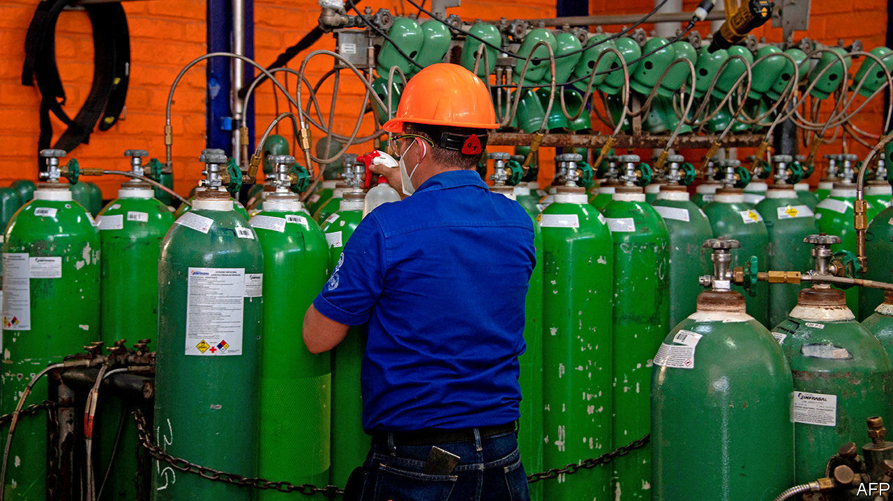

###### Making oxygen

# How to separate oxygen from air using magnets 

##### If it works, this vital gas should become cheaper 

 

> Jan 23rd 2021 


OXYGEN IS VITAL. Literally so for breathing, and thus for many hospital patients. And metaphorically for industries ranging from steelmaking to pharmaceuticals, which use it in their processes. The world market for the gas is therefore large. Various estimates put it as having been between about $28bn and $49bn in 2019.


It could, though, be larger. In a set of reactions that also involve oxygen and steam, fossil fuels such as coal and natural gas can be turned into hydrogen, a source of energy, and carbon dioxide, which can be separated and sequestered underground. That might allow their continued employment in a world of restricted greenhouse-gas emissions. It would, however, require a cheap and abundant supply of oxygen. Which is why America’s Department of Energy is sponsoring a project intended to pull oxygen from the atmosphere with magnets.


Dry air is a mixture of 21% oxygen, 78% nitrogen and 1% argon, with a few other trace gases such as carbon dioxide. At the moment, most of the world’s pure oxygen is made by the liquefaction and subsequent distillation of air, to separate it into its components. This is done in large factories. The other source of oxygen, somewhat less pure, is small, mobile plants called oxygen concentrators. These either absorb the nitrogen into a porous substance called a zeolite, leaving behind a gas that is 90% oxygen, or force air through membranes more permeable to one gas than the other, yielding a somewhat less rich mixture. The alternative of magnetic separation is the brainchild of John Vetrovec, boss of Aqwest, a technology firm in Larkspur, Colorado.


Though oxygen cannot be magnetised permanently in the way that elements like iron can, it is attracted by magnetic fields. As a consequence, when air is pumped through such a field its oxygen gets concentrated in those places where the field is strongest. This concentration-enhancement is small. But if the oxygen-enriched part of the air stream could be separated from the oxygen-impoverished part, and then treated in the same way over and over again, it could be enriched to the point where it was pure enough to be useful. Dr Vetrovec thinks he knows how to do this.


A previous attempt by a different group of engineers used pulsed electromagnets. This, though, required both high pressure, which is expensive to create, and the electromagnets themselves, which are costly to buy and costly to run. Dr Vetrovec intends to perform his version of the trick at atmospheric pressure, and using permanent magnets. Both of these modifications greatly reduce power consumption. In fact, the device’s only moving part is the blower which pushes air through it.

It’s a gas


The magic extra ingredient Aqwest brings to the party is an array of structures called microchannels. These are tubes less than a millimetre in diameter that are intended to carry liquids or gases. Crucially, their narrow bores ensure the laminar flow of any fluid passing through them. Translated from physics-speak, this means they cause no turbulence, and therefore no mixing of their contents. That allows them to act as gas separators in the firm’s device.


On the face of things, the initial results do not look that impressive. Prototypes yield a concentration increase of around 0.1% per passage, though Dr Vetrovec thinks his team can raise this to 0.4%. The key, though, is the repetition. Like the tale about a vizier who asked his king, as a reward for some service, for a grain of rice on the first square of a chess board, two grains on the second, four on the third, and so on, the oxygen concentration rises rapidly with successive iterations. Thirty passages at the higher rate would yield a 90% concentration of oxygen—and that would be commercially useful.


Whether this approach actually will prove cheaper than the established alternatives, and whether, if it does, that will really save fossil fuels’ bacon, remain to be seen. But some versions of a green-energy future involve the use of a lot of hydrogen, so better ways of generating that gas are always welcome. In the meantime, oxygen’s many other users would surely welcome a cheaper source of supply. The idea of doing this with magnets is attractive.■

