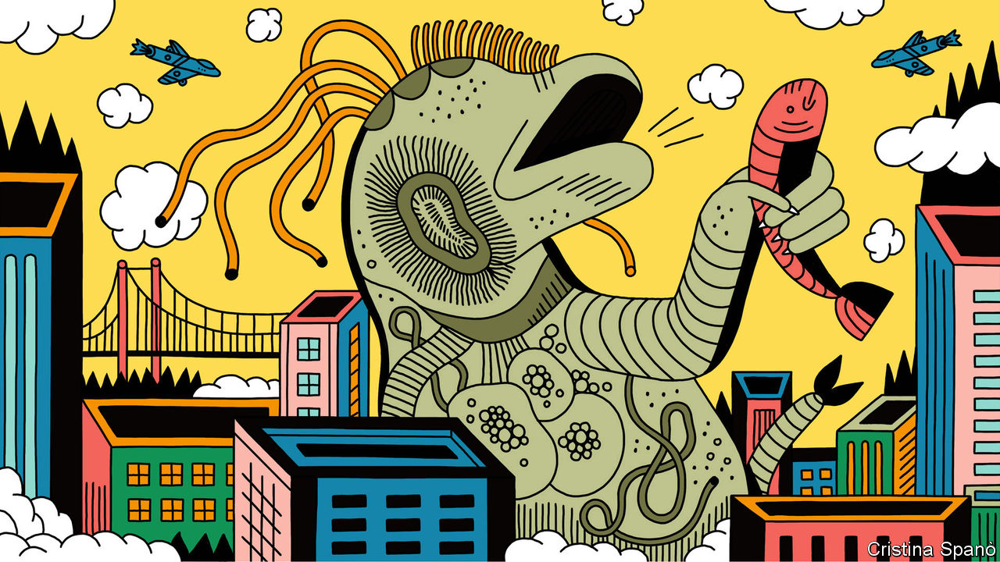

###### Aquaculture

# Irradiating small animals used as fish food makes them bigger 

##### The result is Godzilla the rotifer 

 

> Jan 23rd 2021 


THE WORLD’S fisheries are overexploited. One way to relieve pressure on them is to increase the yield of fish farms. And one way to do that is to improve the quality of the food fed to the livestock in those farms. Abe Tomoko, of the RIKEN Nishina Centre for Accelerator-Based Science, in Wako, Japan, has a novel proposal for doing this. In her role as director of the centre’s beam mutagenesis group, she has overseen the creation of 30 novel cultivars of crops and ornamental plants generated by the selective breeding of promising mutants created using radiation from a particle accelerator called the RI Beam Factory. This time, though, she has applied the technique to animals.


The young of farm-raised fish species such as yellowtails, halibut, bream and bluefin tuna are fed with live prey. For the smallest fry these are often rotifers, a phylum of tiny animals discovered in the late 17th century by early microscopists. In particular, farmers use a complex of 15 species known collectively as Brachionus plicatilis. The members of this complex are, in turn, divided into three groups classified by size: SS, the adults of which are 170-190 microns long; S, with adults 190-240 microns long; and L, with adults 240-320 microns long. Members of these different groups are fed to progressively larger fish larvae.


Above the size of L rotifers, however, farmers switch phylum and feed their charges crustaceans called brine shrimps, the smallest of which clock in at 400 microns. That leaves a size gap which fish do not like. They often develop badly at this stage of their growth, and sometimes resort to cannibalism. Dr Abe and her colleagues therefore wondered, as they describe in Bioscience, Biotechnology &amp; Biochemistry, whether they could plug the gap between the biggest rotifers and the smallest brine shrimps in the way that new plant cultivars are created, by bombarding rotifers with carbon or argon ions spun up to high speed in the beam factory.


Rotifers are famously asexual. The last time members of one group of the animals, the bdelloids, had sex is reckoned by zoologists to have been about 80m years ago. Members of Brachionus plicatilis are not as sex-starved as that, but they still reproduce for the most part by parthenogenesis. Indeed, the variety Dr Abe chose to work with, known as the Notojima strain, is, like the bdelloids, an obligate parthenogen. For this sort of mutagenic work, however, parthenogenesis is an advantage. It means that a successful mutated line of rotifers will not be diluted by the genetic mixing caused by sexual congress.


The Notojima strain is the largest L rotifer used by Japanese fish farmers. In her quest to make it larger still, Dr Abe exposed batches of the animals to ion beams of various strengths and compositions, and then put the survivors through three rounds of proliferation and selection of the largest of their offspring, to try to come up with the Godzillas of the rotifer world.


The upshot, out of more than 3,000 mutant strains that were larger than normal, was three promising lines which, at 350-370 microns long, nicely plug the size gap, and which are also more fecund than their ancestors. Both of these characteristics make the new strains ideal for use as fish food, and three subsequent years of study have shown them to be stable. Godzilla may be fictional. But the idea that radiation, used carefully, can create animals that are giants of their kind, is not.■

