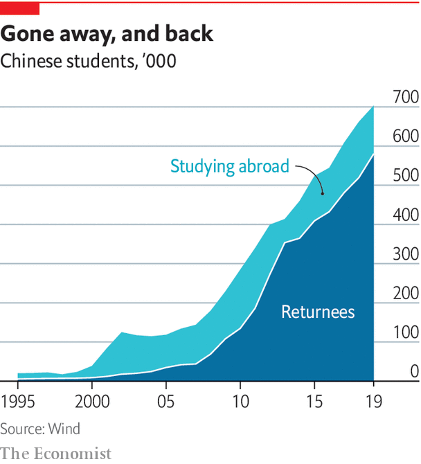

###### Views of the world

# A bale of sea turtles 

##### As attitudes to the West sour, students turn home 

 

> Jan 21st 2021 


BAI SHUANG stayed overseas longer than most. After a degree in Paris, Ms Bai worked for a French company, then went to London for a Master’s and got another job. By 2017 two forces pulled her home. First was her salary, which Ms Bai thought too low; she heard she could earn more in Shanghai’s startup scene. The second was her parents, who were aghast at the terrorist attacks that rocked both her adoptive cities. China was safe, they said, and Ms Bai could “shine” here. “If there is a place where you can have it all, then why not?” Ms Bai reasoned. She bought a ticket home.


Ms Bai is a “sea turtle”, a play on the Chinese homonym haigui, meaning “to return from abroad”. Of the 6.2m Chinese who left to study overseas between 2000 and 2019, more than 4m have returned, says the education ministry. The rate of return has picked up. In 2001 just 14% went home. But in every year since 2013, China has welcomed back at least four in five overseas graduates. Amid the unusual stresses of covid-19, it is thought that 800,000 came home in the first nine months of 2020, up from 580,000 in 2019.


The pandemic has cut short stints abroad. When it is over, educational flows should pick up again. But a new confluence of factors had already been turning well-educated Chinese away from the West, and America in particular. More than just covid-19 and terrorist incidents are making the West seem unsafe and hostile. Trips to America by Chinese students fell by 70% in the first nine months of 2020 over a year earlier. But only 50% fewer Taiwanese and 56% fewer South Korean students went to America, despite the fact that both places beat back covid-19 as effectively as China.


One reason is that America is making it harder for Chinese graduates to stay. In 2018 it cut from five years to one the validity of visas issued to those in sensitive fields of study, including computer science. In September America revoked visas of 1,000 students and researchers whom it deemed security threats. Donald Trump repeatedly accused Chinese students of stealing American technology. In the words of Christopher Wray, his FBI director, China is no longer just a “whole-of-government” threat, but a “whole-of-society” one.


It is little surprise that young Chinese wonder if they are welcome. Last year over half of American youths polled by the Pew Research Centre expressed negative views of China. Across the population this number hit an all-time high of 73%. The feeling seems mutual. In a survey of 20,000 Chinese run by Cary Wu of Toronto University last April, four in five respondents under 30 said that they did not trust Americans.

 


The experiences of covid-19 and Mr Trump have formed views in young Chinese that will linger long after both are gone. Mr Trump threatened to ban Huawei, a national champion; TikTok, a winning export; and WeChat, a lifeline to family back home for those overseas. A popular joke online is that Mr Trump encouraged the Chinese to rally round the flag. In nationalistic circles he was even praised for laying bare America’s hypocrisy on espousing liberal values and openness.


Hate crimes against Asian-Americans in America have risen. Anti-Chinese sentiment can persuade Chinese overseas students—cosmopolitan, politically liberal types—to stick up for China. A study by Jennifer Pan and Yiqing Xu of Stanford University conducted in elite American universities found that students who encountered racist taunts were more likely to back China’s political system. Those who had previously been least nationalistic showed the biggest rise in support for Chinese authoritarianism.


At home and overseas, young Chinese were appalled by how Western democracies botched their response to covid-19, when tough measures in China stopped it in its tracks. A survey last year by researchers at the University of California, San Diego, found that university-educated Chinese youths displayed the largest jump in support for Xi Jinping’s regime. In a post-covid world its competence, public order and efficiency look attractive. This has been manna for propagandists, who have censored news of the early cover-up and suffering in Wuhan, where the virus was first found. One of those who wrote bravely about these themes was Fang Fang, a 65-year-old novelist. Millions rushed to read her online diary before censors took it down. Then news broke that her account was to be translated and published in America. The fiercest backlash came among young, keen readers of her work. After state media attacked Fang Fang, many felt she had “turned her pen into a knife, and handed it to the West”.


The young pit the starry-eyed admiration of Fang Fang’s generation for the West against their own clear-eyed confidence. They think China is best served by picking aspects of Western culture that suit it. “Lots of young people think that America is declining, and that its flaws could be solved with a Chinese political arrangement,” notes Feng Chucheng of Plenum, a think-tank in Beijing. “They are more confident that we do not have to follow the same path—in fact, that our path might be better.”


The thinking was that students abroad might embrace Western values. Now it often goes the other way. A saying popular with Chinese students overseas is: “Pretty mountains, pretty lakes, pretty boring”, expressing their longing for China’s efficient, clean and fast-paced cities. When Dylan Zhou arrived in San Francisco for a PhD in physics in 2017, he thought America was “really fantastic, really liberal”. With time, Mr Zhou liked it less: its courts were too lenient, its policies for minorities too indulgent, and American investors would crack jokes he did not understand. Mr Zhou is returning to China early, to set up a fintech company.


Like Mr Zhou and Ms Bai, who runs an online-learning startup, many are lured by China’s zingy tech sector. Earlier returnees are credited with getting it off the ground, building local versions of Facebook and Twitter. Now Facebook and the rest steal ideas from pioneering Chinese apps, a source of pride for young Chinese. Financing from venture-capital funds is easier to come by. And if returnees have influential parents, their guanxi, or personal connections, can give children a head start.

Feeling territorial


A lack of sympathy for liberal values is becoming evident closer to home. Many of the grievances that drive Hong Kongers to protest, such as graduate unemployment and high house prices, once resonated with mainlanders. Luqiu Luwei, a journalism professor at Hong Kong Baptist University, says her mainland students were “full of curiosity” during the mass sit-ins of the “umbrella movement” in 2014, rushing to observe and even join them. But the protests that roiled Hong Kong in 2019 left them cold. “Why are they allowed to be so disruptive?” her students asked. Police on the mainland called some students’ parents to warn their children to stay clear of the protests. But Ms Luqiu also observes that few seek out news from sources other than Chinese media, which have vilified the protesters as separatists. This is despite the fact that Hong Kong’s internet is open, so they do not need to use unauthorised virtual private networks to access foreign news sites, unlike on the mainland. Powerful domestic platforms such as Weibo, WeChat and Douyin mean few form the habit to read widely, thinks Ms Luqiu.


And what of young views of Taiwan, which China claims as its own? In 2011 China allowed students to study in Taiwan at a time of warmer ties with a China-friendly government. Thousands have thus been able to see democracy up-close in a place with a familiar language and culture. A few, like 27-year-old Anderson Yu, who arrived in 2011 from southern Guangdong province, relish the experience. “I love this place,” says Mr Yu, who hears out pro-independence Taiwanese friends even if he is “sceptical”. Lots of other young Chinese flock to the island for trinkets and pop culture.


But many experience discrimination from locals and barriers that stop them from applying for grants or staying on to work. Taiwanese youths mistrust China more than their elders do. Chinese students also make no effort to mix, says Mr Yu. Attitudes have hardened since Tsai Ing-wen was elected president in 2016 (and re-elected in 2020). Many are “upset that Taiwan is not grateful to China for the freedoms it has granted the region,” says Mr Yu.


Soft power matters in shaping opinion. Older Chinese grew up listening to Cantonese songs and watching Taiwanese films, forming a special admiration for both territories. Youngsters do not have the same bond, says Fang Kecheng of the Chinese University of Hong Kong. They now watch their own shows—and Hong Kong youths tune in. This appreciation for home-grown culture can be a force for good. Many overseas students echo Ms Bai, the startup founder, when she says she returned to China “because if I am here, then I can change something”. Whether on debating shows or through home-grown rap music, young people are creating new identities. The next chapter delves into some of them.■

