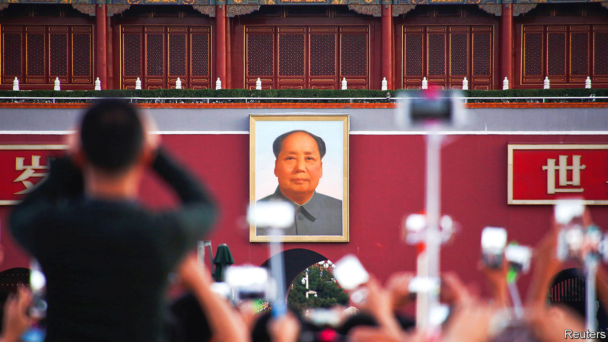
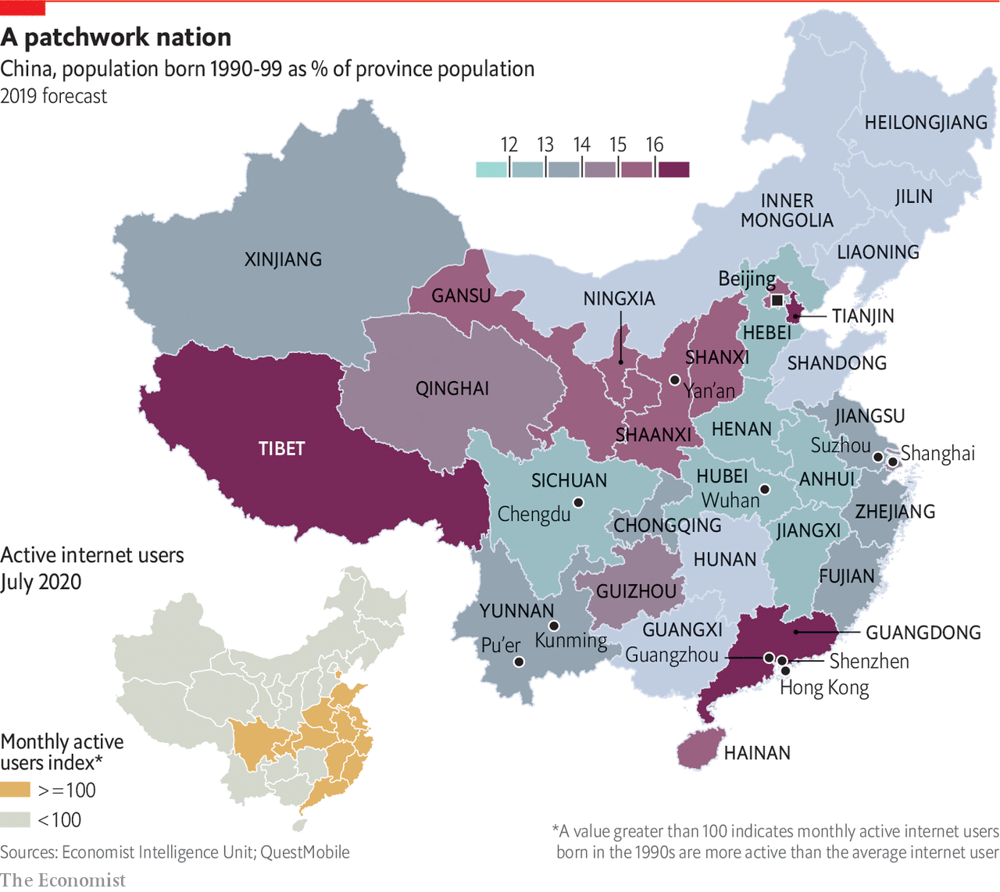

###### Chinese youth

# Generation Xi 

##### Young Chinese are both patriotic and socially progressive. That mix is already changing their country, says Stephanie Studer, our China correspondent 

 

> Jan 21st 2021 


THE DAILY flag-raising ceremony at sunrise on Tiananmen Square draws a youthful crowd, often from out of town. Queues form even in the biting Beijing winter. The show is over in minutes: China’s red flag is hoisted and an army band strikes up the national anthem. The first rays of sunlight illuminate the portrait of Mao Zedong hanging in the square. In a tribute known to all Chinese youths, Mao once said: “The world is yours as well as ours. But in the last analysis, it is yours. You young people...are like the sun at eight or nine in the morning...We put our hopes in you.”


China’s youth merit attention for the simple reason that they will one day be the people in charge. Over the next decade they will gain influential positions in China’s booming private-sector firms—or set up their own. More than half of Chinese in their 20s express a desire to start their own business. Others will climb up the ranks of the ruling Communist Party. How they understand their country’s past and what they ask of its future are essential to understand how they might one day lead China.


But China’s youngsters also deserve scrutiny for what they are now: vitally, young. Youth often stands for trendsetting and rebellion. In China, the young must navigate an authoritarian state and a bruisingly competitive education system. This is when big life decisions are made and adult identities formed. China’s young face unusual pressures. They were born under the one-child policy, a harshly enforced system that from 1980 to 2016 let most urban families have only one child (many rural families were allowed two, and ethnic minorities like Tibetans were in theory exempt). Without siblings, they shoulder alone the full weight of their parents’ (and grandparents’) expectations: to excel at school, secure a stable job, marry and have children, all before the age of 30.


This special report focuses on those in their 20s. Many have spent some time living away from home, but are not yet in the thick of parenthood themselves. In China this cohort has a generational identity: the jiulinghou, or “post-90s”, a shorthand term for those born between 1990 and 1999. They number 188m—more than the combined populations of Australia, Britain and Germany. The jiulinghou are already making their mark, in ways unimaginable to those born a decade earlier.


Many are defying social convention, often to their parents’ alarm. The jiulinghou are China’s best-educated cohort yet. Last year the country churned out a record 9m graduates. But increasing competition for good jobs means that returns to education are falling. Lots plump for stable civil-service jobs, yet some resent doing tedious work. One 27-year-old live-streamer who sells cosmetics asks why he should settle for a government job that is “bullshit and boring”? A pay cheque is no longer enough; young people want a sense of purpose. As labour-intensive manufacturing winds down, young migrants from the countryside are taking up gigs that give them more freedom in the booming informal sector.


Young Chinese are also making choices about when, whom and whether they wed. Their elders, who would once have made matches for them, have never been less involved. Newlyweds hit a ten-year low in 2019. Women in Shanghai marry on average at 29, later than Americans and a jump of six years in a decade. Even in rural areas the age is 25 and rising. Young Chinese are adept at avoiding traditional norms. Many gays and lesbians, who once felt compelled to marry straight folk, unite in “lavender” marriages thanks to matchmaking apps. (China does not allow gay marriage, and homosexuality remains taboo.) This pleases conservative parents while letting gay people choose their own partners.


The identities of the young are also shaped by the digital age. On social media they start trends, vent frustrations and circulate knowing memes. Despite pervasive censorship, they use China’s online networks to promote such causes as feminism, environmentalism and nationalism. When they feel insulted by foreign entities, be they K-pop bands or America’s National Basketball Association, millions clamour online for consumer boycotts that cow even mighty multinationals. Patriotic sentiment has long been strong. But increasingly youths do not question the regime’s claim that loving country and party are one and the same.

 


Where they now show reverence for the flag and the armed forces, young Chinese once displayed remarkable defiance. In June 1989 tanks and guns cleared student protesters from Tiananmen Square with murderous force. To many Westerners and older Chinese liberals, the young lack the qualities that made the Tiananmen generation remarkable: ideals, rebellion, even guts. The jiulinghou are seen as apolitical, except in their naive and brash patriotism; concerned with getting ahead, but only to buy the latest iPhone. Many see them as materialistic and entitled, a generation of “little emperors” doted on by their parents.


This does not always describe the jiulinghou. When police arrested a human-rights lawyer called Pu Zhiqiang in 2014 for joining a private memorial to the victims of Tiananmen, students uploaded photos of themselves to Weibo, a microblog, holding signs in his support. “We are the jiulinghou,” the message read. “We are certainly not brain-dead!...In fact, we are passionate, we are rising and we are ready to take on responsibility.”


This report argues that they are living up to these words. Yes, there has been no direct youth-led challenge to the regime. But young people speak out for social causes. Many join volunteer groups or donate to charity. No generation has been more vocal in its support of LGBT and women’s rights. Students have backed factory workers trying to unionise, and staged silent street protests about climate change. This takes guts. Under Xi Jinping, China’s president since 2013, intimidation and arrests of activists have become common.


Young people do not intend to challenge the legitimacy of the ruling Communist Party. Their social liberalism has grown even as support for the party rises. The jiulinghou are comfortable with a rising, assertive China. The party knows how to play on this. It has hammered home that China stopped the spread of covid-19 within its borders as the West bungled its response. Spin doctors have not had to exert themselves on the calamitous failings of Donald Trump’s presidency. More overseas Chinese students are returning home, disillusioned with the West. Young pride feeds off a new worldly confidence.


Yet not every young Chinese holds rosy views of the party. In Hong Kong, young protesters fighting for Western freedoms have made clear their fury at their erosion by the Beijing government. Tibetan and Uyghur youths seethe in silence as brutal state-led campaigns erase their cultures and languages. In Xinjiang more than 1m Uyghurs have been locked up without trial. Students are told their good behaviour decides if relatives get out. Ethnic Mongols in the northern province of Inner Mongolia staged rare protests last year over an order requiring more use of Mandarin in schools. Hundreds were arrested. Geriler, a young ethnic Mongol, says she feels “deeply unhappy” with the government, but also “terribly afraid”.

Jiulinghou lingo


China divides its generations by decades. The qilinghou (post-70s) are defined by childhoods after Mao’s death in 1976. The balinghou (post-80s) grew up as China reformed and opened to the world under Deng Xiaoping. It is often now argued that generations change every five years, or even every three—the talk is already of the linglinghou, most of whom are still in school. To speak of millennials, whose definition in the West is those born between 1981 and 1996, is to shoehorn four Chinese generations into one.


The gap is easy to grasp if you ask parents to recall their 20s. They mention jobs allocated by the party through their danwei, a government-controlled work unit. Only with its permission could they marry and divorce. For years women had to report their periods to the danwei to ensure they were complying with the one-child rule. The danwei provided welfare benefits such as free housing, schooling and health care. Their children’s lives, by contrast, are defined by choice, individualism and more personal freedom.


The lives of jiulinghou share two features. One is that they began after the pro-democracy protests of 1989. The state relentlessly scrubs from the internet any reference to the bloody suppression of the Tiananmen protests. Terrified parents, not wanting to put ideas into children’s heads, keep silent. Some youths know a terse official version that casts the students as rabble-rousers, and says nothing of their deaths. Some observers ask if this enforced amnesia could embolden the young to rise up again. Others argue that, because they do not know that the army gunned down students in cold blood and see only a China that has become richer and stronger under the party’s rule, they are more likely than older generations to see it as a benevolent force.


The second feature is that those born since 1991 spent their late teens with Mr Xi in power. They might be called Generation Xi. Since primary school, they have received an education with more emphasis on patriotism than at any time since Mao, following an overhaul of the syllabus after Tiananmen. Students take obligatory courses on Marxism, nationalism and the doctrines of Mao; last year “Xi Jinping Thought” was added. This affects how they see the world. A survey in 2019 by China Youth Daily, a state organ, found that three in four of those born after 1995 think China is “not perfect, but always improving”. But the first thing this report explores is a divide: between rural and urban youth.■

