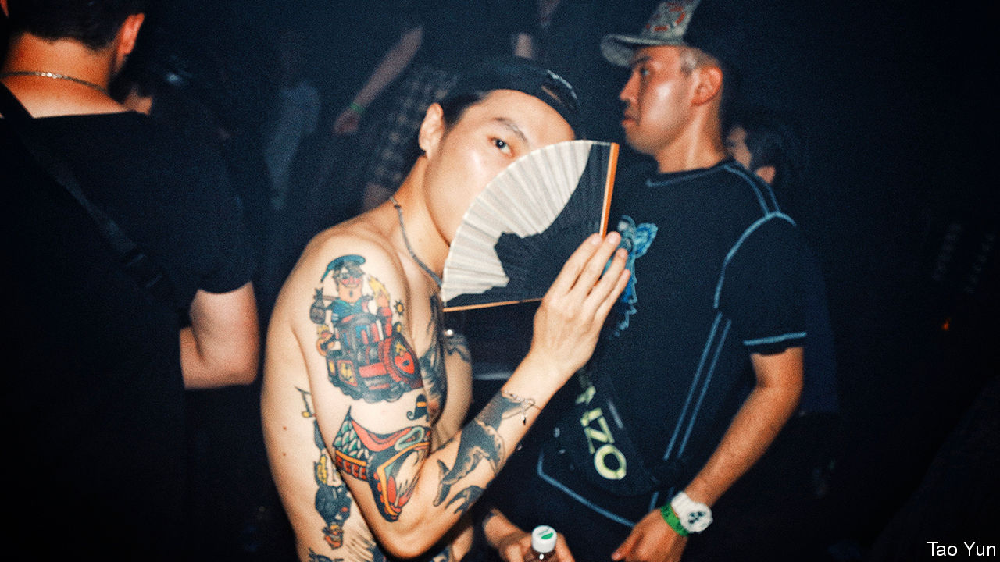

###### Subcultures

# How to rebel in China 

##### The alternatives are rave or pray 

 

> Jan 21st 2021 


A CHINESE APHORISM teaches that “the young should never go to Sichuan, and the old should never leave”. It is but the first rule broken by a wave of youthful newcomers. The ancients reasoned that Sichuan’s joie de vivre would sap adolescent ambition. But today the stressed and the free-spirited come to Chengdu, the provincial capital, to go against the grain. For many, this means rejecting China’s rigid formula for success in work and life.


The city of 16m brims with young subcultures, from rap fans and techno ravers to wearers of Hanfu, an 1,800-year-old style of dress. Its fashions are fresh and whimsical. Oxford Economics, a consultancy, predicts that by 2030 Chengdu’s cool kids will spend over $9bn a year on their clothes and shoes, as much as their counterparts in Melbourne or Miami.


No one is sure how this inland city got so edgy. Local hipsters point out that cool begets cool. Cheap rents, a culture of slow leisure—its ubiquitous teahouses serve it by the flask—and a permissive local government all help. But apparatchiks do not embrace countercultures, and that tension fuels its underground scene.


Twice they have shut down TAG, a small but beloved electronic-music club on the 21st floor of an office building. The club’s owner, Ellen Zhang, has put TAG’s “nice” techno beats on USB sticks and given them to local officials to win them over. That helped: one has taken to playing the mix in his car on the way to work.


Ms Zhang kicks out unruly clubbers and drug users (whom China punishes severely). Fans do not just come for the music. TAG is a space where many feel “comfortable” and it is “easier to feel free than outside”, she says. For long nights that stretch past dawn, ravers escape “To Another Galaxy”. Among the regulars is Shinjil, a soft-spoken teacher from Inner Mongolia, who left home on a whim because he could no longer stand his “clock-in, clock-out” job.


A few escape instead to a spiritual realm. Master Zhao, a 25-year-old Sichuanese monk, starts his day as Shinjil’s ends, by banging gongs at 5am. He once worked in Beijing’s art scene. He calls the monkhood, which he joined two years ago, “a profession of pleasure”. He had grown tired of feeling he was never satisfied in life. “Even if you have 1,000 houses, you can only rest on a single bed,” he points out sagely, sipping tea.


His path is still unusual. But a group of non-conformists in his generation call themselves “Buddhist youths”. This is meant to show that they have no desire to achieve anything; instead of dreaming big, they accept being average. To show this they may eat the same meal every day, or yield to others over decisions. They say they are happy-go-lucky. Real monks sniff that they are slackers. Their passive rebellion irks the state. People’s Daily, a government organ, warned Buddhist youths that they must not forget “the issues that we need to put our hearts into” (support for the Communist Party being presumably among them).

