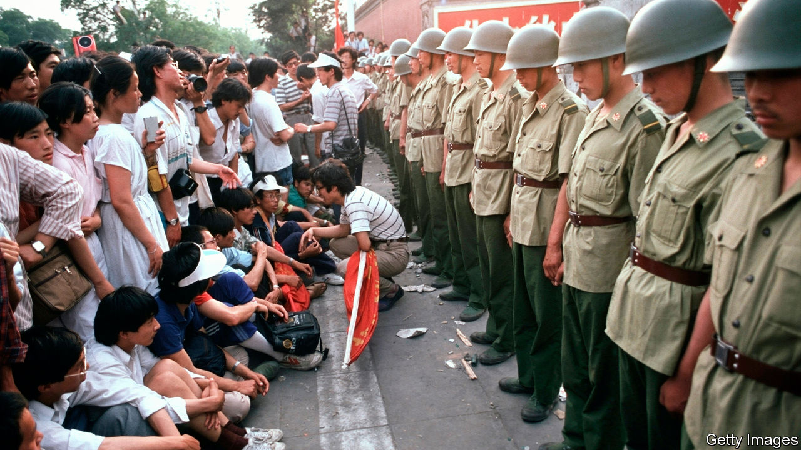

###### Children of the revolution

# Might freedom-seeking youths rise up again? 

##### Self-assured young Chinese will at some point balk at brute repression 

 

> Jan 21st 2021 


THE RED building is a half-hour stroll from Tiananmen Square, yet few sightseers venture there. This former part of Peking University is now a state museum to China’s first pro-democracy protest. In the 1910s the “new culture” movement flourished behind its walls. Members rejected old-world Confucianism for Western science, democracy, female emancipation and a global outlook. These, they reasoned, would help China stand tall.


In 1919 students marched to Tiananmen Square to decry China’s weakness in accepting the Treaty of Versailles (it gave a former German colony in China to Japan). Two years later the Communist Party was founded. Today it claims the patriotic outcry of 1919 as justification for its rule—never mind that the protesters also wanted civil liberties. The contradiction was made clear when students invoking 1919 took to the square in 1989. They asked for democratic rights, but were silenced with tanks and guns.


Why has there been no youth-led challenge since? One answer is that the bloodshed at Tiananmen showed that protest is dangerous. This served as “a message that silenced a generation”, writes Eric Fish in “China’s Millennials”, a book. Censorship has ensured that youths now know little about the 1989 uprising, so it cannot be an inspiration. Also, the 1919 protests were about China’s place in the world. Today its standing is no longer in doubt. Young Chinese are proud that their country is respected—whether out of admiration or fear. Seeing how America and much of the rich world mishandled covid-19, many even wonder if Western values, including constitutional democracy, are all they are cracked up to be. In an uncertain world, Chinese order can feel reassuring.


Students went to Tiananmen Square in 1989 partly to protest against corruption and rampant inflation. Inspired by Mikhail Gorbachev’s reforms in the Soviet Union, they hoped that conservatives in China would give way to a new group of liberals. Since then a long economic boom has lifted millions out of poverty. In the three decades since 1990, China saw an 11-fold rise in real incomes per head and a 15-fold increase in university enrolment. This has been the basis for the party’s unspoken deal with its people: economic and social freedoms in return for political quiescence. When Xi Jinping came to power, disaffection over corruption was creeping back up. He waged a war on graft. Surveys find that young Chinese think it has been a success.


And what of democratic demands? Elsewhere, rising affluence and restiveness have gone hand-in-hand. South Koreans were living through an economic “miracle” when they toppled their dictatorship in 1987, only seven years after it had bloodily quelled an uprising. In China, political repression has reached new heights under Mr Xi, who has freely punished liberal academics and tycoons. Students who stood beside unionising factory workers in 2018 are still missing. This sends a chilling signal to dissenters.


China’s young do not have deep feelings for the Communist Party. Instead, the party’s legitimacy has rested on continued growth and the certainty that the next generation will be better educated, richer and happier. Yet graduates in cities feel enormous competition for limited jobs. They fret about unemployment or about being stuck in a dead-end job. They want more than just a 9-to-5 (or often 9-to-9) grind. Shunning monotonous factory life, youths are piling into China’s informal economy. That leaves a big portion of the workforce with low wages, no benefits and little prospect of upward mobility. More face a precarious future.


The party has made up for slower growth by ratcheting up nationalist feeling. Citizens are taught to believe that a patriot is one who stands with the party. Since the 1990s it has strengthened patriotic education from school to university. Party leaders seem satisfied: they are imposing a similar diet on rebellious youths in Hong Kong. Young mainlanders are vocal in their defence of China. But this youthful assurance can be channelled into other causes. More have learnt that they have the power to change things in society, whether by winning a legal case for LGBT rights or by volunteering as online counsellors during the pandemic. This confidence—in themselves, and in the fact that China can do better—is a powerful force.


Citizens tend to coalesce against a government when they feel it is failing them. It is possible that, as the party lets young people do good in “politically safe zones”, more will be satisfied that things are improving of their own accord, says Yan Yunxiang of the University of California, Los Angeles. Yet repression is growing. For some young mainlanders, the brutal lesson of the protests in Hong Kong is that “demonstrating does not get you results with the Communist Party”, in the words of a gay-rights campaigner in Chengdu. If the police cause no trouble for his NGO, “that is a blessing, and we cannot ask for more.”


In the face of a strong and callous state, plenty of youths will admit defeat. But when earlier generations of students left China, they gave up on it. Now a majority plan to come back, worldly confidence acquired. Many feel hopeful about China’s future—and have a desire to shape it. Once home, returnees will admit to frustrations over using technical runarounds to keep using their favourite apps. And they are stung when their posts are scrubbed from social media.


When the government whips up nationalist sentiment, it hopes young Chinese will turn away from the world. But their national pride is tied to being a proud part of it. Their experiences are formed, more than ever, by overseas travel and the internet. As global strikes inspire Ou Hongyi, the green activist, so does the #MeToo movement galvanise young Chinese feminists.


The Communist Party has shown a remarkable ability to adapt. Yet its tacit deal appears to be morphing into one that leans more heavily on brute repression and nationalism. If that is the bargain, self-assured young Chinese will at some point balk. Participants in every pro-democracy outburst in China have raised high the banner of patriotism, from 1919 to 1989. This tendency is not lost on Mr Xi, as much a manipulator of nationalism as he is afraid of it. But the party sees a useful distraction in teeth-baring patriotism. One day this may come back to bite it.■

