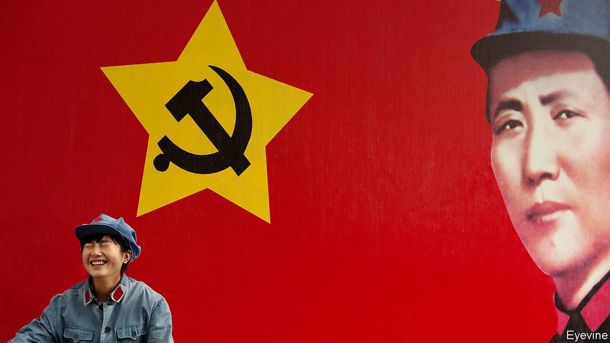

###### Patriotism and the party

# Partygoers 

##### How nationalism is shaping the young 

 

> Jan 21st 2021 


YAN’AN, A MINING town of 2m people in Shaanxi province, is not the stuff of tourism brochures. Yet 50m Chinese come here on China’s “red tourism” trail every year. The area’s historical sites are among a hundred or so that have been spruced up to celebrate the communist past. Yan’an was the wartime stronghold of the communists under Mao Zedong from 1937 until shortly before they seized power in 1949. In those years, many youths streamed to Yan’an to join Mao’s cause. Today, they flock in still.


Close to one in two red-tourism trips are made by Chinese under 30, says Ctrip, China’s biggest travel firm. Young party members go to Yan’an to tour the caves that Mao plotted in. They end with renewed communist pledges or a boisterous rendition of “The East is Red”. Students complete compulsory courses on party history and ideology that may involve a night in a cave. They cheerfully don replica pastel-blue army uniforms and red-starred caps, swinging satchels stamped with Mao’s face.


Qing Wenhui, a 23-year-old trainee guide, says many young Chinese are “deeply stirred” by their visits. They quiz her on the hardships Mao endured (she knows to ignore questions about his mistresses). A romp round the caves and a peek at Mao’s wooden bathtub inspire more than textbooks, she says. A young maths teacher says he has come to grasp “how the Communist Party rose up” from these hills. “Never forget where you started, right?” he says with a grin, quoting a mantra of Xi Jinping’s.


Mr Xi wants to bolster faith in the party’s rule among the young. They feel none of the emotional attachment to it that their elders did. They have known neither famine nor crushing poverty. The state no longer has the hold over their lives that it did for their parents, when jobs, schooling, housing and health care were dispensed by danwei (work units) that would monitor them for signs of political waywardness. Four in five students are members of the Communist Youth League, which can be joined at 14 and be a launchpad to party membership at 18. But most see this as a mere résumé booster. Jobs in state-owned firms and the government often require it. Startup founders join the party to demonstrate political correctness (Jack Ma of Alibaba, an entrepreneur who inspires many youngsters, is a member).


In 2019 Mr Xi said the party had to “win over vast numbers of youth” to ensure its cause passes “from one generation to the next”. It has tried to do this by instilling patriotism at school, cultivating new youth appeal online and stepping up censorship. The result is a generation of youths that consumes vast amounts of foreign pop culture and fashion, yet feels more defensive than ever of China’s achievements. Plenty shell out for imported goodies. But more display their patriotism by wearing fast-improving local brands, from sportswear by Li-Ning, a brand owned by a former Olympic gymnast, to lipstick by Perfect Diary, a cosmetics firm.


This pleases Mr Xi, who has urged youths to show that national pride is “not a mere slogan”. Ask youngsters what they think of propaganda posters plastered everywhere, and many roll their eyes. Yet one line resonates: that the communists rescued China from a “century of humiliation” at the hands of foreign powers that began with the Opium war of 1839. Only by standing up to the West, the message goes, can China rise again.


Young Chinese often support boycotts against foreign brands and sports teams seen to have insulted China. Transgressions include maps of China that exclude Taiwan or show Hong Kong as a separate region. In 2019 so many fashion houses came under fire that the hashtag #LuxuryBrandsApologyDay went viral on Weibo. Anger erupted when Daryl Morey, manager of the Houston Rockets, a National Basketball Association (NBA) team, tweeted support for Hong Kong’s pro-democracy protesters. The backlash cost the NBA $400m in lost revenue. State television did not air its games for a full year.


Almost all Chinese oppose independence for Taiwan and Hong Kong. Still, the NBA’s 500m Chinese fans were torn: wanting to defend their country’s sovereignty, yet upset at missing the games. It is often hard to tell if pressure for boycotts comes from netizens or party mouthpieces. In October a state-media offensive against BTS, a popular K-pop band, for a perceived insult to China’s role in the Korean war, fizzled out as outlets quietly deleted BTS-bashing articles. This suggests that party-run media are keen to show they are in touch with youngsters, too.


Another tactic is to seem more hip. “Socialism is Kind of Cool” is a game show about Mr Xi’s life. Rap videos sing the party’s praises. It also adopts teen lingo. To elders, China is the “motherland”; to their children it is a zhong gege, or “big brother China”—the implication being it must be loved without question. The relationship between party and netizen is framed as one of idol and fan, fostering a new emotional connection to young people, says Liu Shih-Diing of the University of Macau.

The East is pink


Such appeals are also accompanied by more sinister methods. Soon after Mr Xi’s rise to power, officials were summoned to secret briefings about a party circular called “Document Number Nine”. The directive banned schools from teaching seven Western concepts, such as constitutional democracy, universal values, civil society and a free press. This had a big impact on universities as centres of student activism and political debate.


Consider the gap in experience between students born in the 1990s and those born in the 1980s. When Weibo was launched in 2009, many saw free expression flourish. But after uproar over a deadly train crash in 2011, censors clamped down. Fang Kecheng, a former journalist who studied at Peking University in 2004-10, says his “generational memory” is of swapping forbidden clips of the Tiananmen protests of 1989. Others recall experiences surfing Google, watching foreign documentaries on YouTube and chatting on Facebook. By 2010 those websites could no longer be accessed on China’s internet. Nobody born after 1992 could use Google, which left China after refusing to filter its search engine—though many young people interviewed for this report said they use virtual private networks to get on Instagram, Facebook or Twitter. Since 2015 many universities have set up departments to oversee teachers’ political thinking. First-year students at three-dozen of them now take a new mandatory course on Xi Jinping Thought, alongside long-standing compulsory ones on Marx and Mao.


By the time they get to university, students have already been primed by years of patriotic education at school. It was ramped up after Tiananmen, which party leaders saw as a failure of indoctrination. Greater emphasis was placed on China’s past humiliation by foreigners. In 2004 new politics textbooks at secondary schools aimed to form a “correct worldview”. A paper published in the Journal of Political Economy in 2017 duly found that students began to hold more favourable opinions of the regime, and less positive ones of democracy and free markets.


Another party tactic is to shape online discussion. Jennifer Pan of Stanford University finds that government-run social-media accounts post as much clickbait as do those of celebrities. Censors allow talk about topics on which they think most netizens will side with the government, finds Yiqing Xu, also at Stanford, and put a stop to heated arguments that could rile people. This defter touch is giving many youngsters the false impression that China’s cyberspace is growing less, not more, restrictive.


The state also applauds influential bloggers who spew the party line (those who “write works of positive energy”). Among those it praises are a tribe called the xiao fenhong, or “little pink”, who appear to be mainly young women. One early attention-grabbing stunt was bombarding the Facebook page of Tsai Ing-wen, a China sceptic, with negative comments after Taiwan elected her president in 2016. Netizen-led pressure campaigns on Weibo to shut down accounts that post dissenting views are multiplying.


Netizens still find ways to express dissent. After the central government imposed a national-security law on Hong Kong in June 2020, books about it received a small flurry of one-star ratings on Douban, a review site. Last year a contestant on “Rap for Youth”, a popular reality show, posted an acrostic on Weibo that accused China’s media watchdog of censoring lyrics that denounced sexual harassment. But as jingoistic voices grow louder, it is harder to find thoughtful political discussions online. Netizens self-censor, or do not post. Yaqiu Wang at Human Rights Watch, born in the 1980s, says young people no longer hear from Chinese public intellectuals such as the lawyers and activists who inspired her. Many have been silenced or punished.


Much of what youth display is performative patriotism, because it is easier and safer to side with the loudest voice. In a 2015 study, Huang Haifeng of the University of California, Merced, argued that propaganda can deter dissent by demonstrating the power of the state. In a patriotic-education test, he found that students who did best were not only the most critical of the regime in private, but also the least likely to voice dissent publicly. Yet patriotism is motivated by more than party devotion. A sense of community, a need to let off steam and a desire to protest are part of the mix. But as the next part of this report shows, a coarsening of views of the outside world among young Chinese is unmistakable.■

