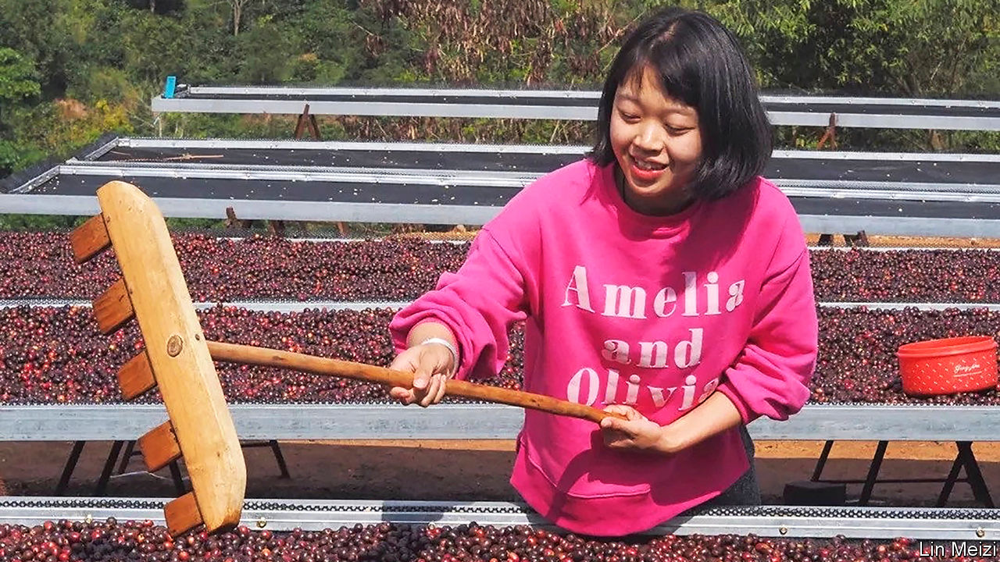
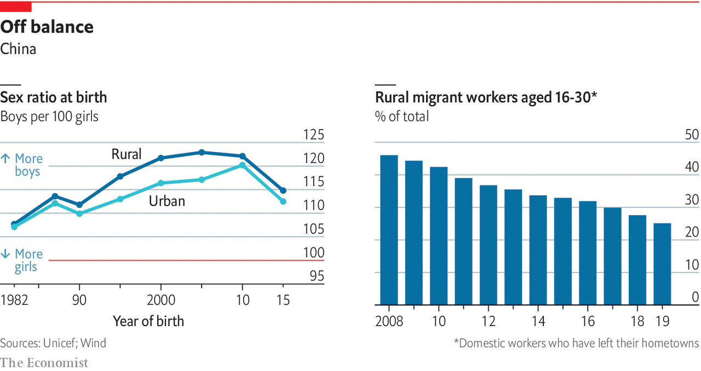

###### The rural-urban divide

# The gap between China’s rural and urban youth is closing 

##### But it remains large, even as more youngsters return home to the countryside 

 

> Jan 21st 2021 


NONE OF THE universities to which Lin Meizi, a farmer’s daughter, applied was in her province of Yunnan, one of China’s poorest regions. Young people often flee to join millions of other rural migrants seeking work in booming coastal cities. Few look back. Ms Lin got her break when she was accepted to study in a big Chinese city 1,400km away, then clinched a job straight out of university. But she turned down the offer—to return home to run her family’s coffee farm.


Ms Lin, now 27, works in the mountains near Pu’er, the heartland of China’s small home-grown coffee industry, among papaya trees and chickens. Until recently it was rare for a rural youngster to forgo an urban life. China’s countryside has been drained of able-bodied villagers, leaving only the infirm, the very young and the elderly who care for them while their parents toil far away as cooks and cleaners, or in the factory towns of the east. Now a small but growing counterflow of migrants has begun to go home. They are known as fanxiang qingnian, or returning youth.


One reason for their return is that provincial China is more inviting. Quality of life has improved. New roads and high-speed railways make for easy travel to big cities from county seats that have themselves been transformed. Nicer apartment blocks, hotels and shops have sprung up, fuelled by growing disposable incomes. Nominal rural wages are rising rapidly, as labour shortages give workers more bargaining power, helping to close the chasm between rural and urban incomes.


More than anything, the internet has brought big-city life to provincial backwaters. The rural young shop on their phones like the urban young, spending hours on the same social media and video apps. With a few taps, they can get almost anything delivered thanks to the sprawling logistics industry underpinning Chinese e-commerce. Returning youth often find jobs selling stuff from premium tea to tofu. Since mid-2019, over 100,000 livestreamers have tuned in from farms to shift goods on Alibaba, a giant e-shop.


The internet has also brought country living to the town, fostering a new urban romance with rural China. The feeling is encapsulated in xiangchou, longing for one’s hometown—a Chinese form of “cottagecore”. As young tourists increasingly shun big resorts for rustic retreats, rural youths see urban enthusiasm for their lifestyle. Dong Jianfa, a 29-year-old Yunnanese potter, left the provincial capital of Kunming to return to his family home, where he is reviving the old ceramics trade.

Where the grass is greener


Coffee once held no interest for Ms Lin (pictured). Her family was the first to plant coffee trees in modern China, under a poverty-relief initiative financed by the World Bank in the 1980s. The beans were a way of making ends meet. But her time in the city, where she trained as a barista, showed her that coffee was a mark of urbanity. “My old city friends all envy my job in the mountains,” she says. Live-streaming from the countryside, part of the urban xiangchou trend, is wildly popular. It has made celebrities of some. The most famous is Li Ziqi, who posts videos of herself foraging for wild herbs, picking cucumbers and cooking hearty dishes in Sichuan. Live-streamers capitalise on this spiritual need among China’s middle class. Ms Li’s personal food brand makes millions.


Attitudes to work are changing, too. Rural youths are no longer prepared to spend hours toiling on production lines as their parents did. Instead they pick up gigs as couriers or ride-hailing drivers, allowing them to stay closer to home and choose their working hours. The allure of “BeiShangGuangShen”, as the rich cities of Beijing, Shanghai, Guangzhou and Shenzhen are known, is fading. “Initially everyone thought that if you wanted to make it, you had to go there,” says Linda Qian of Oxford University, who studies rural nostalgia. Returning to one’s township meant failure.


Now rural and urban youth speak of chengshibing, or “city disease”: sky-high rents for small digs, bad air and long workdays. All prefer nicer working environments. To persuade more migrants to stay, some factories have gone so far as to set up day-care centres and stage matchmaking events for singles. In the decade to 2019, the proportion of rural migrants under the age of 30 living away from their hometowns almost halved, according to official statistics (though this does not include those moving from villages to thriving local county seats).


Young people can be fussier partly because parents are better able to support them. Few compete with siblings for household savings, built up over decades of economic boom. After attending vocational school until 17, Mr Dong lived at home for two years before he went to Kunming for his first full-time job. Not long ago his family would have sent him out to earn an extra wage after compulsory schooling, which ends at 15 in China.

 


State support helps. Rural revitalisation is a pet project of Xi Jinping, who has urged young teachers to go to backwaters. The Communist Youth League is helping 100,000 migrant youths return home to work by 2022. Netizens mock this as a revival of the brutal “sending-down” of urban youth to the countryside under Mao. The parallel is instructive. When the party praises rural life, it wants to create an outlet for millions of young dissatisfied migrants. Their retreat from big cities is an indictment of rampant inequality, and a sign of how hard it is to be upwardly mobile.


In China the urban-rural gap is codified through the hukou system of household registration. Some 60% of the population are urban, but only 44% hold an urban hukou. Those registered to live in villages are effectively barred from settling full-time in cities and sidelined at school. So rural and urban youth take distinct educational paths. In 2015 over 80% of all 15- to 17-year-olds were in school, up from half a decade earlier. But in rural areas many attend low-quality vocational schools, note Scott Rozelle and Natalie Hell of Stanford University in a book, “Invisible China”. Mr Dong is not looking for better-paid work because he feels unqualified, despite studying architecture at a vocational school.


Young people are newly aware of rural-urban divides. Ms Lin was struck that her father earned less for 1kg of beans than the cost of a single cup of coffee in the city. “I thought, that’s just not fair,” she says. In 2020 she helped set up the Yunnan Speciality Coffee Community, a trade association to give young farmers more clout. Ferrying packages and food around town, working-class youths are more visible to city kids. When they strike to demand unpaid wages, sympathetic urban peers support them online.


One gap that gained nationwide attention last year was period poverty. An image was circulated on social media of 100 sanitary towels being sold online for under $3. Two crowdfunding campaigns to send safe pads to rural teens raised over $300,000. After a rural school placed these pads in a box outside the girls’ toilets, students in better-off places began to do the same. In the process, many learnt that poor sex education and the stigma around menstruation are not inherently rural issues.


Another is domestic abuse. Last autumn Lhamo, a young Tibetan live-streamer, died from burns after being attacked by her husband during a broadcast. Fans tuned in to her videos because they showed the unglamorous yet sunny sides of a life of scarcity. Hundreds of thousands took to Weibo to back a “Lhamo Act” to give victims of domestic violence better legal protection. It was another example of a scourge that crosses the urban-rural divide, but disproportionately hurts rural women.


Other inequalities go unnoticed. Graduates from rural families are twice as likely to be unemployed as city dwellers. The government reserves slots for graduates in the civil service and the army. But rural youths without a degree fare worst. They bore the brunt of covid-19 when villages were sealed off. The informal economy to which so many flock gives no job security or benefits. Urbanites rely on personal connections far more than their rural counterparts do. Mr Dong felt forced to settle for a job in Kunming delivering bottles of baijiu, a Chinese firewater, for 14 hours a day. Having gone to the city with high hopes, he left it feeling bitter.


The deepest divide has arisen because a preference for sons means that many baby girls were aborted under the one-child policy, skewing sex ratios. They are most unequal in the countryside: among those born in the 1990s, there are 117 boys for every 100 girls—the largest this gap has been for Chinese of marriageable age. As many as 40m young men have no chance of finding a mate, reckons Mr Rozelle. They are known as guanggun, or “bare branches” on the family tree. Unmarried and unemployed, these young men could one day be a destabilising social force.


For now, polls find that China’s working class is not disaffected. Eileen Yuk-ha Tsang of City University of Hong Kong says that guanggun seek an outlet in brothels, often spending three-quarters of their wages on sex (as a temporary bartender in Guangdong, Ms Tsang interviewed 100 of them). Other studies suggest that populations with a large male surplus end up with greater rates of violence, crime and rape than the norm. Yet stiff punishment may deter many from such a path, Mr Rozelle thinks.


The Communist Party also offers a potent distraction: a heightened sense of national solidarity, encouraging people to grin and bear things, as they did under lockdown. As this report will explain, the party is hoping to co-opt restless youth by pandering to such patriotism.■


Correction (January 29th 2021): A previous version of this article stated that Eileen Yuk-ha Tsang worked at the Chinese University of Hong Kong 

