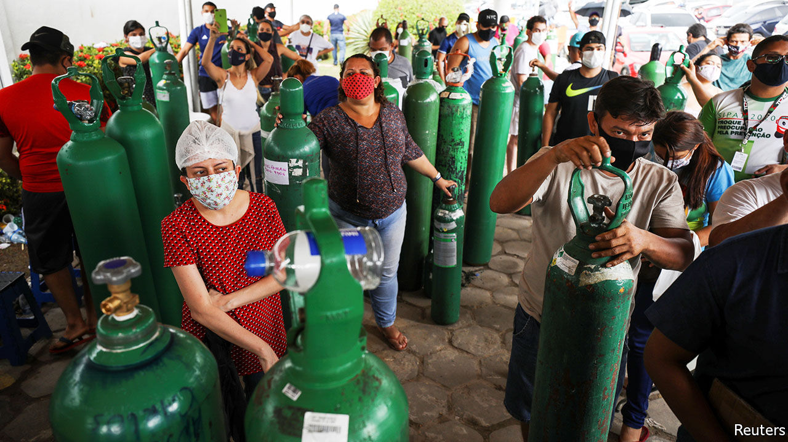

###### Misery in Manaus

# A Brazilian city thought it had herd immunity. It was wrong 

##### A second wave of covid-19 has overwhelmed the biggest city in the Amazon 

 

> Jan 23rd 2021 


IN SEPTEMBER A preprint appeared online with the startling results from a study of covid-19 antibodies in blood-bank samples from Manaus, a city of 2m people in the Brazilian Amazon: 66% of residents may have been infected, it said. The paper, which would later appear in Science, estimating an infection rate of 76%, seemed to confirm local rumours that Manaus had reached “herd immunity”. In April it was the first Brazilian city to dig mass graves. By June burials were back to pre-pandemic levels.


“Herd immunity played a significant role” in controlling the virus, argued the preprint, entitled “Covid-19 herd immunity in the Brazilian Amazon”. One of its authors, Ester Sabino of the University of São Paulo, now regrets the title. “We didn’t think there would be a second wave,” she says.


There is. On January 15th hospitals in Manaus ran out of oxygen. At least 51 patients died before army jets brought more. People who could bought oxygen to treat relatives at home. A hospital stationed police to turn patients away.


The reasons for the spike in Manaus are unclear. Perhaps a new variant—identified in 42% of samples collected in December—is more contagious. It could be that existing antibodies offer less protection against the variant, and that some cases are reinfections.


It could be that the study’s methodology is flawed and that 76% was an overestimate. Blood donors are more likely to leave the house, and therefore to get infected, than most people, says Pedro Hallal, an epidemiologist at the Federal University of Pelotas. A nationwide study he co-ordinated, with population samples picked at random, found that just 15% of Manaus residents had antibodies in June. He thinks the preprint’s authors were “not cautious enough” in interpreting their findings.


The title of the version in Science does not mention herd immunity. It has a more cautious conclusion: despite the high prevalence of antibodies, herd immunity may not have been achieved.


The earlier finding contributed to “a sensation that the pandemic was over”, says Silvio Romano, ex-head of Hospital João Lúcio in Manaus. Beaches on the Amazon filled up. “Everybody started testing the limits,” says Denis Minev, the CEO of Bemol, a department store. In December, as cases spiked, the governor ordered a lockdown, but revoked it after protests. Allies of Jair Bolsonaro, Brazil’s anti-lockdown president, cheered. Manaus need not worry, tweeted an ex-minister; it has herd immunity.


Manaus will get worse before it gets better. Oxygen supplies remain low and Amazonas will get only 70,000 of the 6m doses secured for Brazil’s vaccine roll-out (see Science section). Herd immunity is coming slowly and painfully.


Editor’s note: Some of our covid-19 coverage is free for readers of The Economist Today, our daily . For more stories and our pandemic tracker, see our 

