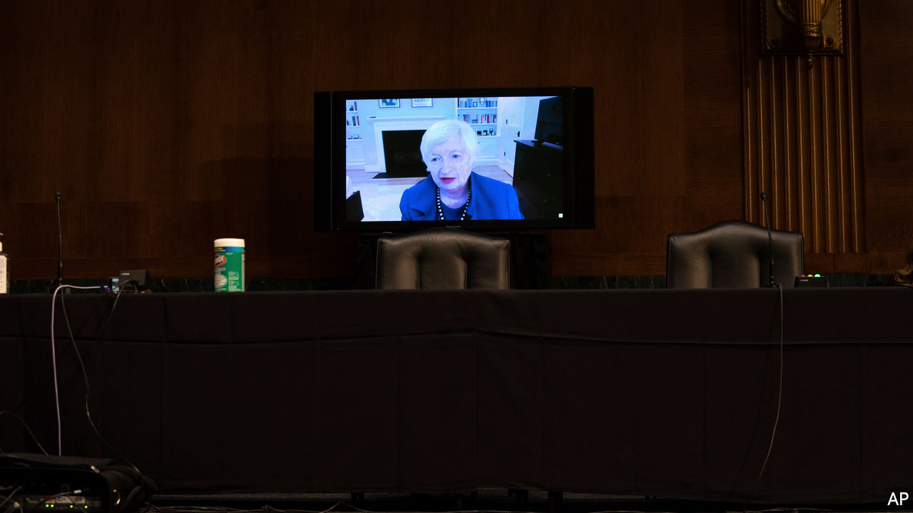
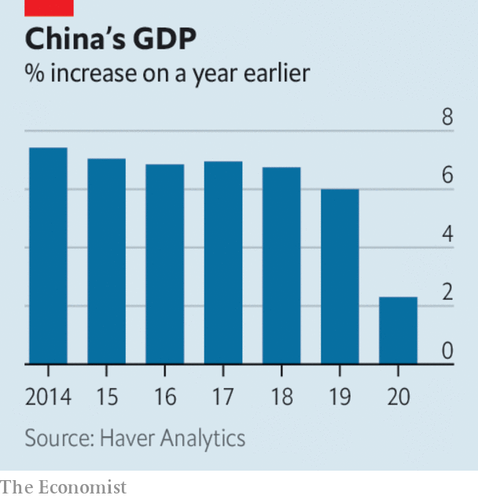

###### 

# Business this week 

#####  

 

> Jan 21st 2021 


Janet Yellen, Joe Biden’s pick as treasury secretary, urged senators to pass the new president’s $1.9trn stimulus package, saying there should be no compromise in helping people who are struggling through the pandemic. The measures have run into stiff opposition from Republicans, even among moderates, who balk at adding more stimulus to December’s $935bn package. Mr Biden’s plan should easily clear the House. The Democrats also control the Senate, but may have to deploy a legislative tactic to get the bill through. See .


Filling out his nominees to head America’s regulatory agencies, Mr Biden chose Rohit Chopra to be director of the Consumer Financial Protection Bureau. Mr Chopra is a staunch ally of Senator Elizabeth Warren, who helped set up the CFPB in the wake of the financial crisis a decade ago. Along with other Biden appointments, the nomination of Mr Chopra suggests that Wall Street will face tougher scrutiny in the new administration.


One of Mr Biden’s first orders as president was to kill the Keystone XL oil pipeline, a project to carry crude from Canada to Nebraska that has been delayed for years because of opposition from greens and Native Americans. The decision is a blow to Alberta’s oil industry, which will lose thousands of jobs as a result.


Seemingly unfazed by the pandemic, America’s big banks reported another solid round of earnings. JPMorgan Chase posted its highest ever quarterly net profit, $12.1bn. Like its peers, the bank benefited from trading in booming stockmarkets. Morgan Stanley’s fourth-quarter profit of $3.4bn was a record for the bank. Profit at Goldman Sachs for the quarter came in at $4.5bn, up 135% year on year. See .


Lee Jae-yong, the boss of Samsung, was sent back to prison following his retrial for bribery. Mr Lee’s incarceration complicates the South Korean conglomerate’s plan to reorganise its business, which is expected to include selling off non-core divisions to raise cash so that the Lee family can pay a $10bn tax bill.

 


China’s economy roared back in the last three months of 2020, growing by 6.5% compared with the same quarter of 2019. For the year as a whole, GDP expanded by 2.3%. Few other economies are expected to register positive growth. The fourth-quarter revival was helped by a surge in exports and state-backed industrial production. China recorded its biggest-ever trade surplus in December.


Supported by a group of British business leaders, Eurostar reiterated its request to the British government for a bail-out. Operating trains through the tunnel linking Britain and France, Eurostar’s passenger numbers have plummeted by 95% since March. The British government sold its stake in 2015. Eurostar is majority owned by SNCF, the French state-owned railway company.

Cash-strapped, not cashless


London’s transport authority, TfL, abandoned plans to make payments on the network completely cashless, after an experiment prompted by covid concerns last summer was criticised by the official watchdog. Covid is causing problems in other ways. TfL’s finances are floundering as passengers avoid travel, and the mayor is reluctant to increase fares. Despite securing a £1.8bn ($2.5bn) bail-out last year, TfL’s financial plans recently submitted to the government forecast more than £3bn in shortfalls in each of the next two years.


United Airlines said it would need to make further cost-cutting measures, after the rate at which it was burning cash to keep flying during the pandemic rose sharply. Its annual loss last year was $7.1bn.


General Motors announced a partnership with Microsoft in which vehicles being developed by Cruise, its autonomous-car startup, will be plugged in to Microsoft’s Azure cloud-computing platform.


Netflix added another 8.5m subscribers in the final months of last year, taking the total to almost 204m. The video-streaming service said it no longer required external financing to fund day-to-day operations and was looking at buying back stock. Its share price soared by 17%.

After a period of reflection…


Jack Ma surfaced in public for the first time since Chinese regulators scotched the IPO of his Ant Group and announced an antitrust investigation that in effect targets his business interests. According to state-backed TV, the founder of Alibaba said that after “studying and thinking” he and his colleagues are “more determined to devote ourselves to education and public welfare”.


After a failed attempt last May, Virgin Orbit at last put its first satellites in space. The company launched the payload on a rocket that is carried under the wing of an old Virgin Atlantic 747 plane, making it theoretically possible to send satellites into space from anywhere in the world.

