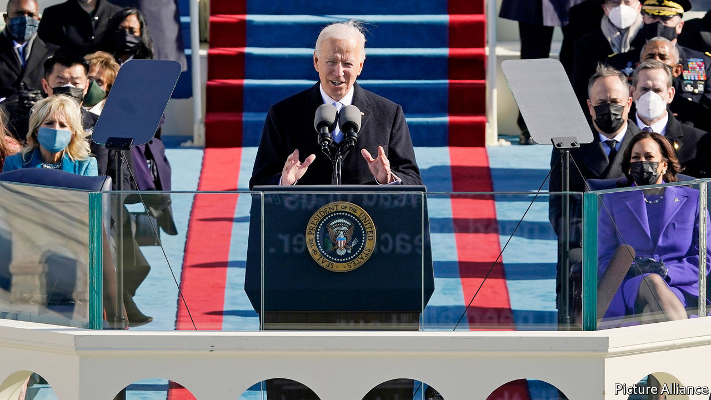
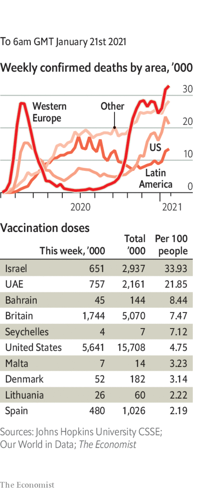

###### 

# Politics this week 

#####  

 

> Jan 21st 2021 


Joe Biden was inaugurated as the 46th president of the United States. Despite the small crowds, limited in size because of covid-19, the event marked a sea change in political tone. Mr Biden stressed “unity” in his speech, a stark contrast to Donald Trump’s “America First” theme four years ago. Mr Biden’s first official orders overturned many of his predecessor’s edicts, such as the ban on travel from some Muslim countries, and committed America to rejoin the Paris accord on climate change. See .


In his final hours as president Donald Trump issued a flurry of pardons. Among those on the list were Steve Bannon, a nationalist former adviser, and Anthony Levandowski, who had been convicted of stealing trade secrets from Google’s self-driving car project. Mitch McConnell, the top Republican in the Senate, shifted his earlier position and said that Mr Trump had “provoked” the mob that stormed Congress recently, leaving five people dead. Mr Trump still faces an impeachment trial in the Senate. If convicted, he may be barred from running for president again.


The National Rifle Association, America’s powerful pro-gun group, declared bankruptcy and said it would move its non-profit base from New York to Texas. At an initial bankruptcy-court hearing, New York state’s attorney-general said the NRA was trying to derail a fraud investigation. See .


The outgoing secretary of state, Mike Pompeo, said China was committing “genocide” against the ethnic-Uyghur population in Xinjiang. It is highly unusual for the State Department to use that word about atrocities that do not involve mass killing. China dismissed his “outrageous lies” and called on the new administration to be “cool-minded”. Mr Pompeo’s successor, Antony Blinken, said he agreed with Mr Pompeo’s assessment. See .


Alexei Navalny, Russia’s most prominent opposition leader, returned to Moscow after spending five months in Germany recovering from an attempt on his life using Novichok, a nerve agent. He was immediately arrested and jailed. His team released a video showing viewers around a vast secret palace that he says President Vladimir Putin acquired with the “world’s largest bribe”. Mr Navalny called for countrywide protests on January 23rd. See .


Armin Laschet, the premier of North Rhine-Westphalia, the most populous German state, was chosen by a party congress to become the new leader of Germany’s Christian Democrats. This puts him in pole position to succeed Angela Merkel as chancellor later this year, though there are many obstacles ahead. See .


Italy’s government was cast into confusion after the prime minister, Giuseppe Conte, narrowly won a key vote that demonstrated he no longer has a majority in the Senate. He will hope to avoid an election, and will try to carry on leading a minority government.


The Palestinian president, Mahmoud Abbas, announced that parliamentary and presidential elections would be held in May and July. It has been 15 years since the Palestinians voted in a national election. Some see the move as an effort by Mr Abbas to lift his standing with the Biden administration.


Police and protesters clashed in several Tunisian cities, as frustration over a poor economy boiled over. The unrest came amid a four-day national lockdown to stop the spread of covid-19. Some of those involved threw petrol bombs and looted shops. More than 600 people were arrested. See .


Yoweri Museveni was declared the winner of a presidential election in Uganda. He has been president since 1986. Bobi Wine, the main opposition candidate, is under house arrest. Security forces shot and killed scores of people after protests in November. See .


Aid workers warned of mass starvation in Ethiopia’s northern region of Tigray. Little food has been allowed in since fighting broke out in November between the federal government and forces loyal to a regional party. Some say the government is trying to starve the rebels into submission. See .


A former civil servant in Thailand was sentenced to 43 years in prison for sharing material critical of the monarchy online. The sentence would have been 87 years, but was halved because she pleaded guilty.


An earthquake struck the island of Sulawesi in Indonesia. More than 80 people were killed and 40,000 displaced.


In Guatemala soldiers and police blocked 7,000 people trying to head from Honduras to America. Security forces used tear gas and truncheons to stop the caravan, the first large one to form since January last year. A few migrants managed to reach Guatemala’s border with Mexico.


Mexico’s government dropped its investigation of Salvador Cienfuegos, a former defence minister. America arrested Mr Cienfuegos in Los Angeles in October but sent him home on the understanding that Mexico would investigate allegations that he had links to a drug-trafficking gang. Mexico’s president, Andrés Manuel López Obrador, claimed that the American government had “fabricated” the case. America’s Department of Justice said it was “deeply disappointed”.

Coronavirus briefs

 


The global death toll from covid-19 passed 2m, three months after it hit 1m.


The Indian government launched a vaccination drive with the aim of giving 300m people an injection by August. Most Indians are hesitant about getting the jab. See .


The Netherlands sought to introduce a curfew, its first since the second world war. It was complicated by the resignation of the entire cabinet over a scandal involving parents falsely accused of welfare fraud.


Joe Biden decided to keep a travel ban on most countries in the EU and Britain in place, after Donald Trump tried to loosen the rules as one of his last acts as president.


Britain was one of several countries to tighten border restrictions, suspending all travel corridors with countries with which it had reciprocal entry arrangements. See .

