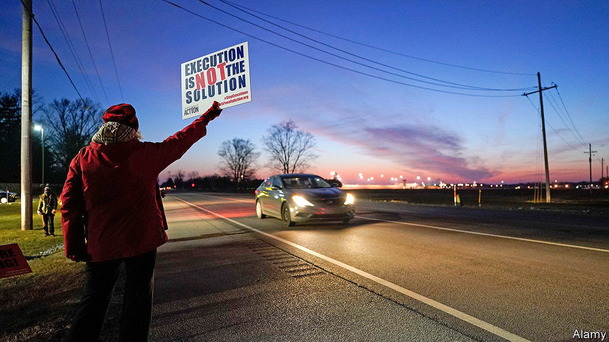
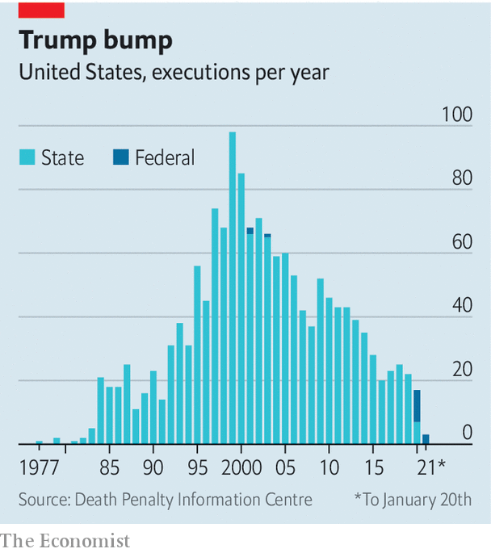

###### Final throes

# Use of the death penalty in America may be ending 

##### A recent spate of federal executions has obscured a more powerful trend 

 

> Jan 23rd 2021 


IT WAS A Trump bump that was years in the making. Since July, after a 17-year hiatus, 13 prisoners on federal death row have been put to death. Dustin Higgs, who was convicted for his part in the murder of three women in 1996, could turn out to be the last for a long time, though. He died by lethal injection on January 16th, a day after the Supreme Court ruled that his execution could go ahead. In a cross dissent, Justice Sonia Sotomayor noted an “unprecedented rush of federal executions” in the past six months: three times as many inmates were put to death in that period as in the preceding six decades.


States usually account for the lion’s share of executions, but their number has been falling for years after many banned the practice or introduced moratoriums. Even states that continue now use it rarely. In 2020 only five—Alabama, Georgia, Missouri, Tennessee and Texas—put to death a total of just seven prisoners, the smallest tally in nearly four decades (see chart). For the first time there were more federal executions.

 


The return of executions was a goal of Donald Trump. In 2015 he called for the death penalty to be “brought back strong” in order to punish criminals. His first attorney-general, Jeff Sessions, explored how to revive the federal practice which had been stopped because of concerns over the lethal-injection protocol. Companies, pressed by activists opposed to the death penalty, had grown increasingly unwilling to supply the drugs frequently used in the injections. Hospira (now part of Pfizer), the only American maker of sodium thiopental, a barbiturate once commonly used in three-drug lethal cocktails, stopped producing it in 2011. As a result the federal Bureau of Prisons launched a review of its execution procedures.


The review took long enough that, in 2014, a death-row inmate won an indefinite stay of execution: courts said the government must tell death-row prisoners how they would die. This question was not resolved until July 2019, when a new lethal method and source of drugs for federal execution chambers were found. William Barr, then the attorney-general, ordered executions to be resumed using pentobarbital, a powerful barbiturate that some states also use.


Some medical experts have argued that those who are given pentobarbital can experience sensations similar to drowning. In 2014 the drug was used to execute an inmate whose last words were “I feel my whole body burning”. Government lawyers have argued that use of the drug is not inhumane.


Were the killings of Mr Higgs and others rushed to take place while Mr Trump remained in office? On the face of it, yes. President Joe Biden has said he will end the federal death penalty, even as states execute ever fewer people. For some cash-strapped ones, the high cost of the death penalty is now prohibitive. Meanwhile, a growing share (though still a minority) of the public now says executions are immoral. As a result, and despite the events of recent months, America’s use of the death penalty could soon grind to a halt entirely.

