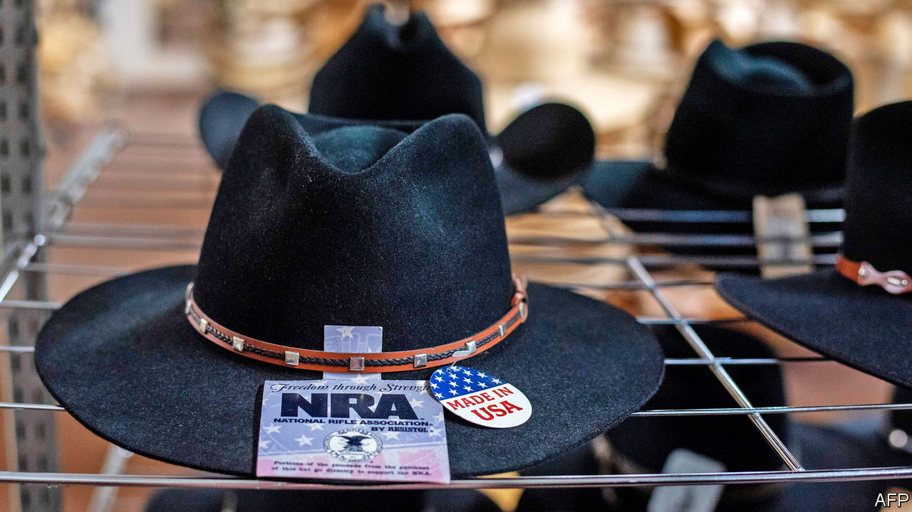

###### In the line of fire

# What next for the bankrupt NRA? 

##### It seems the organisation will only be prised from Wayne LaPierre’s cold, dead hands 

 

> Jan 23rd 2021 


AMERICA’S GUN lobby, the National Rifle Association (NRA), which enjoys non-profit status, is besieged by allegations of lavish spending and extravagance by its leadership, including its boss, Wayne LaPierre. According to a lawsuit filed last August by New York’s attorney-general, Letitia James, the NRA diverted millions of dollars in donor funds for executives’ personal use, including chartered jets for holidays and use by family members, luxurious clothing, gifts, private security, and more. The attorney-general of Washington, DC, has also filed a lawsuit against the NRA for misusing charitable funds. But the NRA is not one to bring a knife to a gunfight. On January 15th the group announced it was leaving New York, where it is incorporated, in order to file for bankruptcy and reincorporate in Texas.


Its headquarters, for the time being, remain in Fairfax, Virginia. The move appears to be an attempt to slow-walk the New York attorney-general’s litigation and set up shop in a friendlier, pro-gun state. The NRA itself has said it is leaving the “corrupt political and regulatory environment in New York”, calling its new plan “Project Freedom”. When news of the NRA’s bankruptcy and reincorporation broke, Texas’s governor, Greg Abbott, tweeted, “Welcome to Texas—a state that safeguards the 2nd Amendment.” It is true that Texan leaders are keener on cosying up to the NRA than New York’s have been. Pro-gun rhetoric sits well with Republican primary voters there, and the state attorney-general, Ken Paxton, is unlikely to point the finger at a non-profit for financial mismanagement, considering his own indictments for federal securities fraud (which he denies), says Mark Jones of Rice University.


Yet it is not certain that Texan courts will be as hospitable as the NRA hopes. For one thing, New York may try to get the bankruptcy dismissed as a bad-faith filing. The NRA is filing in Texas because a subsidiary, which it incorporated only a few months ago, is based there. It is not possible to claim New York has no jurisdiction simply because the NRA does not want New York to have jurisdiction, according to Adam Winkler, a professor at the University of California, Los Angeles School of Law, who says that it is only “aspirational” that the NRA is abandoning New York.


The NRA, a close ally of Donald Trump, is one of the most powerful lobbying groups in the country and describes itself as America’s “longest-standing civil-rights organisation”. In 1871 the group was founded in New York by former Union soldiers who had fought in the civil war and believed that northerners needed better firearms training. For much of its early history the organisation focused on marksmanship, but in the 1970s it started taking a harder-line stance on policy issues, and now it fights any form of gun control as a step towards government confiscation of people’s weapons. This has resulted in the group staking out more extreme positions than many of its gun-owner members believe in, says Joseph Sakran, a surgeon and activist against gun violence.


The crossfire is only just starting. Tax authorities are said to be investigating Mr LaPierre for fraud relating to his personal taxes. Last year the NRA disclosed in a tax filing that executives had received at least $1.4m in improper or excessive benefits. Mr LaPierre paid back $300,000 in travel expenses that the group had covered. Some dealers in historic guns also grumble that the NRA has sold guns to board members that its members’ estates had bequeathed to the organisation, doing deals at friendly, below-market prices and depriving the non-profit outfit of maximum value for the sales. The NRA declined to comment.


Mr LaPierre has managed to stay at the helm, despite bad publicity, whistle-blowers, feuds with former executives and legal tussles, including one with a former public-relations agency, Ackerman McQueen, through which the NRA allegedly funnelled large, improper expenses (such as $39,000 for a single day’s shopping at a clothing boutique in Beverly Hills). Mr LaPierre’s survival at the top may itself be evidence of the organisation’s cosy governance and board capture. Having remade American gun policy with its effective and widespread lobbying, the NRA seems disinclined to remake itself.■

