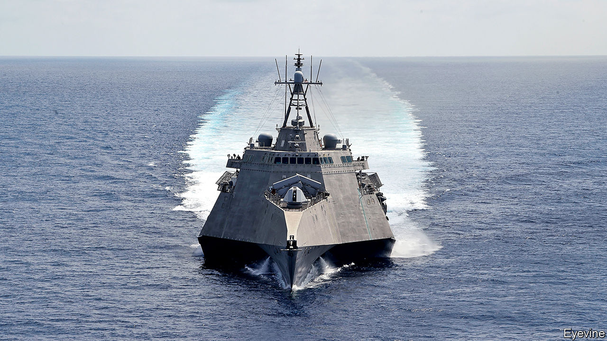

###### Relief tinged with scepticism

# Asia is hungry for reassurance from Joe Biden 

##### It worries that a distracted America will pay it too little attention 

 

> Jan 30th 2021 


“WE ARE ALL heaving a sigh of relief,” says a South-East Asian diplomat, about the exit of President Donald Trump. Never has America’s ability to underpin Asia’s stability and prosperity been so doubted by the region’s leaders and policymakers as over the past four years. Unfortunately for America’s standing in the region, the diplomat adds glumly, “The damage has been done.”


The damage was inflicted in part by Mr Trump’s scorn for the kind of open, multilateral trading regimes that have buoyed Asia’s economic success. He demonised the WTO and took America out of the Trans-Pacific Partnership, a 12-country free-trade deal. In effect, the United States abdicated economic leadership in the region for the first time since the second world war.


As for regional security, Mr Trump asked not what America could do for its friends and allies, but what they could do for it. By threatening to rupture military alliances with South Korea and Japan if their governments did not cough up more, he unsettled those two countries while implying to all that America’s commitment to Asia was impermanent and conditional.


Mr Trump’s secretary of state, Mike Pompeo, also alarmed governments in South-East Asia by pressing them to join in the administration’s loud and often ideological demonisation of China. True, nearly all Asian countries are troubled by China’s growing assertiveness, including towards Taiwan and over bogus maritime claims in the South China Sea. But the Chinese presence is too large, close and, in economic terms, largely beneficial for demonisation to be an option.


Hence widespread relief at Joe Biden’s incoming administration. Whereas Mr Trump disdained the policy wonks who typically flit from think-tanks to government (and vice versa), the new president has recruited squads of them. Several of his Asia hands are well-known in the region’s capitals, notably Kurt Campbell, who helped engineer Barack Obama’s proclaimed “pivot” to Asia in 2012. He will be Mr Biden’s new tsar for “Indo-Pacific” strategy. “Washington”, says Miyake Kunihiko, a foreign-policy adviser to the Japanese cabinet, “is back.”


But the relief is tempered by scepticism. It is not as if American policy will return to a “prelapsarian state of grace”, says Bilahari Kausikan, formerly Singapore’s top diplomat. And it would be troubling if Mr Biden’s approach resembled Mr Obama’s second term, Mr Kausikan argues. It was marked by a reluctance to exercise power. He set red lines for Xi Jinping in the South China Sea but did nothing when the Chinese president crossed them. He urged “strategic patience” with North Korea while it built nuclear weapons. At least Mr Trump’s team, for all its chaos, understood power. Few South-East Asian policymakers publicly praise the American navy’s heightened “freedom of navigation” exercises in the South China Sea; yet none, in private, will criticise them.


Doubts about the Biden administration are probably strongest in Japan, whose leaders see the current Chinese regime as an existential threat and tend to prefer working with Republicans. Yet the administration’s early utterances about Asia have impressed Mr Miyake and others. The similarity to the Trumpian analysis in terms of the challenges that America and Asia face is striking. The chief difference between the two administrations lies in the Biden team’s proposed response.


Competition with China remains “a defining feature of the 21st century”, Mr Biden’s chief spokeswoman, Jen Psaki, asserted this week. China, she added, “is engaged in conduct that hurts American workers, blunts our technological edge and threatens our alliances and our influence in international organisations.” The new defence secretary, Lloyd Austin, went further, defining China as the biggest threat to the United States—and by implication its friends in Asia. He has since reassured his Japanese counterpart that America’s security treaty with Japan, a cornerstone of Japan’s defence, covers the remote Senkaku islands, which China claims and around which hostile vessels from the Chinese coast guard often prowl.


Mr Biden’s team talks of holding China “accountable” for economic abuses, forced technology transfers and bullying at global organisations—pure Trump-era talk. It seems comfortable with Mr Pompeo’s last-minute abolition of long-standing constraints in contacts with Taiwan, despite the potential for friction with China. Meanwhile, Taiwan’s de facto ambassador in Washington, Hsiao Bi-khim, was conspicuously invited to Mr Biden’s inauguration. Arms sales to the island will continue.


But incoming American officials stress differences with their predecessors. One is greater economic and diplomatic engagement. Ms Psaki and others refer repeatedly to working with coalitions, partners and allies—a page missing from Mr Trump’s playbook. They plan to consult with others in Asia before speaking to China. They want to engage much more with ASEAN, a ten-country South-East Asian club that Mr Trump neglected. To counter Chinese expansion, America will look not only to the “Quad” of America, Australia, India and Japan but also try to strengthen the military capabilities of allies in South-East Asia.


The administration’s determination to reassure is a mark of how far it thinks America’s standing in the region has fallen. Despite its efforts, one question keeps being asked in Asia’s capitals: will the scale of the pandemic in America, the resulting economic dislocation and the torture of its democratic institutions leave it self-absorbed for years to come? The old Washington hands may be back, as Mr Miyake notes, but is America? ■


