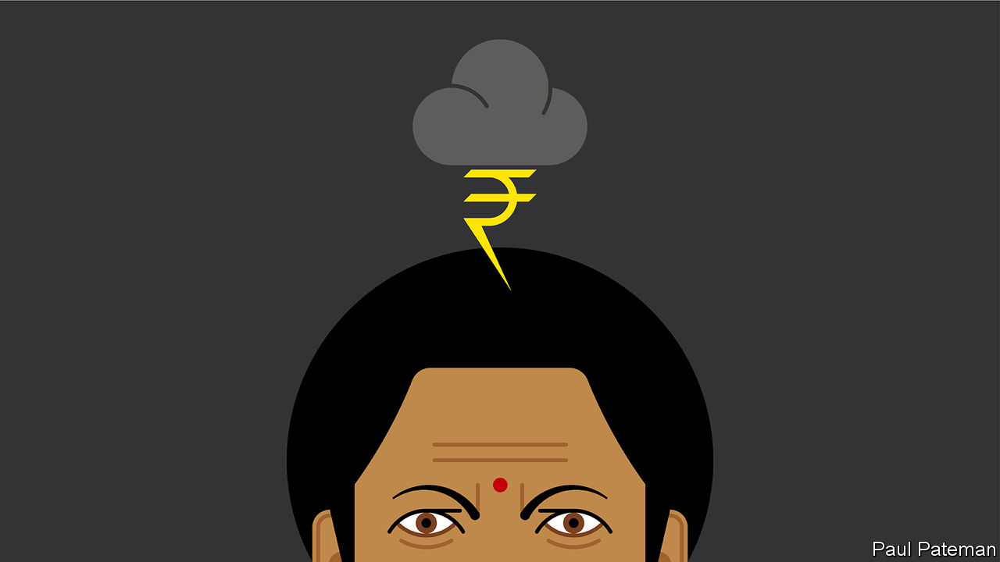

###### Banyan

# India’s budgets are becoming ever less reformist 

##### The one to be unveiled on February 1st poses particular challenges 

 

> Jan 28th 2021 


AMID THE clamour of Indian politics, the yearly presentation of the national budget is an oddly solemn rite. By tradition the finance minister serves sweets to staff when the tome is printed. After the descent from Delhi’s Raisina Hill, the seat of government, to the circular parliament building at its foot comes the stock photo on the steps of the legislature, proudly gripping the ministerial briefcase—at least, until Nirmala Sitharaman, the current minister, pointedly dropped this “colonial” relic for a homely cloth-bound folder.


The ministerial speech itself follows worn protocol, too, with the minister’s sweeping overview followed by an itemised account of planned spending. The delivery can be gruelling. After a record-breaking address of 161 minutes last year, Ms Sitharaman felt faint and had to stop without concluding. Her dogged enumeration of government projects and programmes prompted one journalist to quip that at least her budget was stimulating demand for coffee.


Yet the stately tedium of the occasion disguises toil, anguish and considerable suspense. The stakes for Ms Sitharaman this year are particularly high. Scheduled for February 1st, her budget speech falls in the midst not just of a pandemic, but also the deepest economic slump on record and, more immediately, a siege of the capital by angry farmers. Indeed the farmers, having briefly occupied the city’s Red Fort on January 26th before being shooed away by police, had also threatened to mark Budget Day with a march on parliament. (They called off the march this week in response to the storm of criticism and the massing of security services prompted by the assault on the Red Fort.) Their interest in the budget itself is minimal; the invading farmers simply want the government to scrap a trio of agricultural reforms that would increase their exposure to market forces.


There is keen interest in the actual numbers from other quarters, of course. As quarrelsome as the buzzards, crows and parakeets in Delhi parks, India’s economists are wrangling more noisily than usual about what the finance minister should do. Spend more and damn the deficit, say some. No, stay the prudent course, say those who reckon it a good thing that this government, despite big talk of boosting the economy as it began to falter last year, has in fact largely kept its powder dry. There is ammunition for every argument. Side-by-side on the same page of a newspaper, one story carries upbeat news that the IMF expects India’s economy to grow by 11.5% this year, while another states that a leading business lobby predicts a contraction of 8% in the current financial year, ending in March. Yes, poverty, joblessness and malnutrition have surged, but so have corporate profits and stock prices, to record heights.


This year marks the 30th anniversary of a reforming budget that yanked a socialist India onto a faster growth track. Since then the momentum of change has slowed and even, in some respects, reversed as the government of Narendra Modi reverts to older ideas of protectionism and state control. Many would like to see the reforms accelerate again. With revenues down, spending sorely needed and asset prices high, one obvious way to achieve this would be to stop dithering over privatisation. The government could raise some $50bn, enough to fund two to three years of spending on health and education at current levels, simply by shrinking its holdings in a handful of state-owned firms to around 25%, reckon Shashwat Alok, Aditya Kuvalekar and Akhil Agarwal, a trio of economists.


But then again, this year also marks the 161st anniversary of India’s first-ever budget speech. It was delivered in 1860 in Calcutta, as Kolkata was then known, by James Wilson, a Scottish businessman, banker and politician who, 17 years earlier in London, happened to have founded The Economist. The British colonial authorities had appointed him to restore order to their shambolic finances. The hard work took a toll. Just eight months after arriving he died, as his tombstone in Kolkata explains, “from the combined effects of climate, anxiety and labour”.


Before he succumbed, Wilson expressed withering criticism of the administrative ineptitude and vacillation of the British regime: “The sacrificing consequences of procrastination and shirking responsibility and the tendency to get rid of difficulties by compromise or delays are fatal elements in the character of the Government of India.” Even though India has long since rid itself of imperious colonialists, it seems not to have expunged all their vices.

