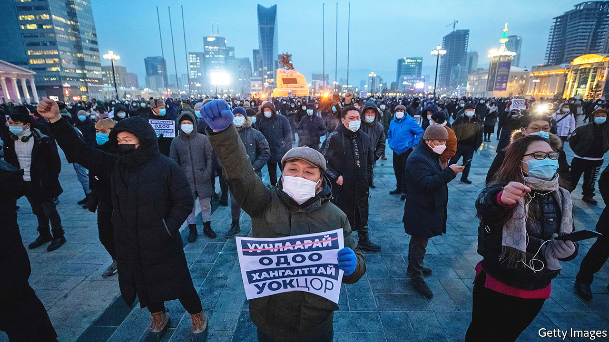

###### Snowflake surrender

# Mongolia’s government resigns after a small protest 

##### Ukhnaagiin Khurelsukh, the prime minister, may have quit to prepare a run for president 

 

> Jan 28th 2021 


IT IS RARE for anti-government demonstrators to see their demands met after a single day of protest. Yet the crowds of Mongolians who braved the biting cold of their capital, Ulaanbaatar, calling for heads to roll because of the mistreatment of a hospital patient got what they wanted—and more. Ukhnaagiin Khurelsukh, the prime minister, announced the resignation of his entire government.


“The joke all over Ulaanbaatar is that the prime minister’s resignation shocked even the protesters,” says a bigwig of the ruling Mongolian People’s Party (MPP). But far from a joking matter, this episode, along with other recent goings-on, shows that Mongolia is bogged in the same old mire that has held back the country since it threw off Russia’s domination more than three decades ago and took up democracy. Politics has been turbulent, sometimes clownish. Corruption is widespread. And the mining industry, which dominates the economy, is still woefully mismanaged.


Though Mr Khurelsukh ostentatiously portrayed his resignation as a gesture of accountability, many see it as a cynical ploy to polish his image in the run-up to presidential elections scheduled for June. The protest’s immediate cause was a relatively minor matter: the apparent mistreatment of a woman who, after giving birth, was diagnosed with covid-19 and then brusquely transferred to a hospital for infectious diseases. A widely aired video, showing her in a dressing gown and slippers being moved outdoors with her baby in the bitter cold and into an ambulance, sparked the angry demonstrations.


Mr Khurelsukh remains chairman of the MPP and is likely to keep pulling the strings. His replacement as prime minister is a close ally. Observers in Ulanbaatar are comparing the resignation to political manoeuvres in neighbouring Russia and nearby Kazakhstan. They note that Russia’s president, Vladimir Putin, once swapped jobs for four years with his prime minister without letting go of the reins. The long-serving ruler of Kazakhstan, Nursultan Nazarbayev, has retained great influence over his handpicked successor since resigning in 2019.


Mr Khurelsukh is thought to be planning a run for president, and may want to distance himself from unpopular policies that could be a liability in the campaign. The demonstrators complained not only about the treatment of the new mother but also about the mishandling of the pandemic by the government. It has tried to suppress transmission through an economically ruinous lockdown. Unemployment is high and frustration with public-health restrictions is growing.


The incumbent president, Khaltmaagiin Battulga, who first earned fame as a wrestler, may find himself pinned down by a new constitutional amendment that limits presidents to a single six-year term instead of two four-year stints. He has been in office for four years. The courts will have to decide whether he can stand again.


Whoever wins the election will face some familiar problems. Politicians are again bickering over the terms of a deal with Rio Tinto, a mining firm that is the manager of and a big shareholder in the Oyu Tolgoi gold-and-copper mine, Mongolia’s biggest mining project. Successive Mongolian governments have tinkered endlessly with the ownership, taxation and financing of the mine, in which it currently owns a one-third stake, to secure a better deal for the country.


Camped outside parliament as it voted to approve the new prime minister was Sainkhuu Ganbaatar, an MP who ran for president last time around. He is on a hunger strike to press the new government to assert itself against Rio Tinto. He narrowly missed qualifying for the run-off in 2017, with more than 30% of the vote. His message remains the same: corrupt individuals have taken their cut while selling the country short. Other bigwigs have come under fire for owning fancy homes in Hong Kong, London and New York.


The mining controversy and corruption seem certain to dominate the campaign. And disgruntled demonstrators are sure to have plenty to protest against. ■

