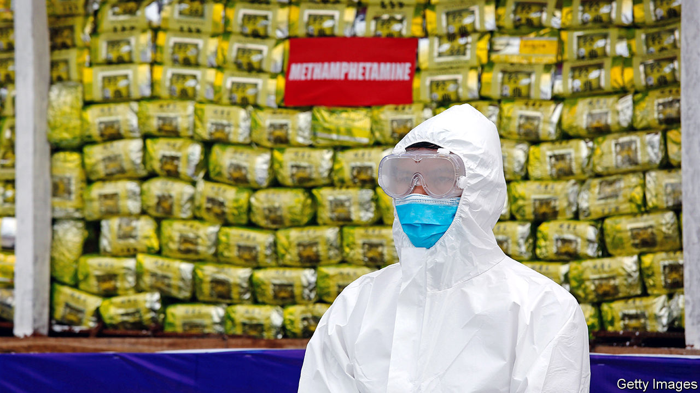

###### Ice lord

# One of Asia’s biggest crime bosses is arrested 

##### Tse Chi Lop’s drug-trafficking syndicate has spread across the world 

 

> Jan 28th 2021 


AMONG THE strangest by-products of the Cultural Revolution was the creation of one of the world’s most lethal organised-crime syndicates. When Mao Zedong at last turned against the Red Guards, he sent many of them to be re-educated in Guangdong, the province abutting Hong Kong. Either to avoid prison or after their release, many escaped to the British enclave, as Hong Kong was then, where some banded together as the Dai Huen Jai—the Big Circle Boys. Since then the group has expanded operations to other parts of Asia as well as to Europe and North America.


On January 22nd police at Schiphol airport in Amsterdam arrested the man law-enforcement agencies say became the biggest Big Circle Boy of all: Tse Chi Lop. Though he is too young, at 57, to have been a Red Guard, he is accused of assuming the mantle of the organisation’s founders and of taking its activities to a far higher level, as boss of a narcotics-trafficking super-syndicate known to members as “the Company”. Law-enforcement agents call it Sam Gor, Cantonese for “Brother Three”, one of Mr Tse’s many sobriquets.


It is the Company, they claim, that has been chiefly responsible for flooding the Asia-Pacific region with methamphetamines and other synthetic drugs. The UN’s Office on Drugs and Crime put the syndicate’s turnover in 2018 at between $8bn and $18bn. That would mean Brother Three is in the same league, as an underworld kingpin, as Joaquín Guzmán, a Mexican cartel boss nicknamed El Chapo.


Yet until Reuters, a news agency, published a report on him in 2019, he was virtually unknown to the wider public. A search on Baidu, a Chinese internet service, reveals not a single mention of him in Chinese-language sources before his arrest. Even though he is said to have been protected by a squad of Thai kickboxers, he kept a remarkably low profile.


Mr Tse was arrested as a result of an investigation codenamed Operation Kungur which involved some 20 law-enforcement agencies, led by the Australian Federal Police. It is not his first brush with the law: in 1998 he was convicted in New York of conspiracy to import heroin. By 2006 he was out of jail and soon, say law-enforcement agents, returned to trafficking.


The Company is said to make its methamphetamines in big production facilities in the Golden Triangle, where Laos, Myanmar and Thailand meet, and especially in Shan state in eastern Myanmar. From there they are smuggled into Thailand, Bangladesh and farther afield. The syndicate was thought to have been the source of 1.2 tonnes of methamphetamines found at Geraldton on the west coast of Australia in 2017—the biggest-ever seizure of the drug in Australia. The Company distributes the drug both as tablets known as ya ba (“mad medicine” in Thai) and as crystal meth, which is usually smoked. Such is their mark-up (as much as 30,000% in Japan) that traffickers can afford to lose several consignments and still make vast profits. Mr Tse himself is said to have become so rich that he once blithely walked away from the gambling tables at a casino in Macau after losing $66m in a single night. ■

