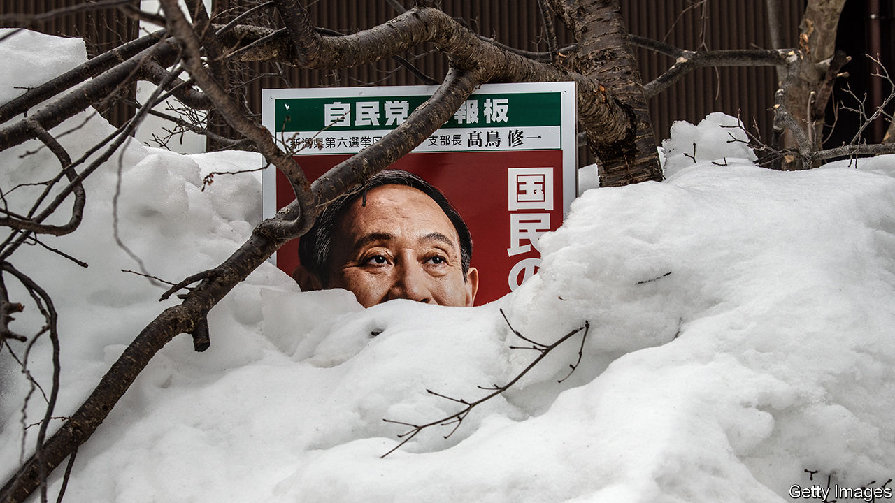

###### Can dullness be a virtue?

# Suga Yoshihide is failing to connect with the Japanese people 

##### Nowadays the job of prime minister is a poisoned chalice 

 

> Jan 28th 2021 


DURING HIS time as chief cabinet secretary, Suga Yoshihide flummoxed Japanese comedians. “He never had any distinctive characteristics,” says Yamamoto Tenshin, who impersonates Mr Suga for “The Newspaper”, a comedy troupe. Voters projected their hopes on that blank slate when Mr Suga became prime minister in September: he entered office with approval ratings as high as 74%. Yet the longer he has spent under the spotlight, the less satisfied Japanese have become. More disapprove than approve of his performance (see chart). Some polls show as few as 33% of voters praising Mr Suga’s administration. He even looks the worse for wear recently, with a cough and hoarse voice. “He’s visibly weaker,” says Mr Yamamoto.


A fresh wave of covid-19 precipitated Mr Suga’s slide. Most Japanese want the government to put virus prevention above economic recovery, whereas Mr Suga has focused more on the latter. As cases spiked late last year, the government stuck by a campaign to promote domestic tourism, claiming that it had no impact on the virus’s spread. (Researchers at Kyoto University recently published a study showing otherwise.) Critics lambasted Mr Suga for attending a dinner with eight guests in a posh steakhouse just when the government was calling for citizens to avoid dining in big groups. After suspending the travel campaign, Mr Suga dithered over whether to declare a state of emergency, ultimately doing so in early January in piecemeal fashion, adding seven prefectures to the original list of four after regional leaders complained. Some 80% of Japanese believed the declaration came too late.


Mr Suga’s personality has only compounded his problems. As chief cabinet secretary, his curt, at times combative style served him well in dealing with the press. But he has failed to change his tone when addressing the broader public. “Even after becoming prime minister, he is playing the role of chief cabinet secretary,” says Sone Yasunori of Keio University. One opposition MP counted Mr Suga’s responses to questioning in the Diet and claimed that in a special session last year he uttered the phrase “I refrain from answering” 113 times.

 


Mr Suga’s talk of “self-help” and “self-reliance” grates on some who want more help from the government amid the pandemic. “He’s paying the price for being who he is,” says Nakano Koichi of Sophia University. “Now is not the time to be a neoliberal reformist.” Nor has Mr Suga explained clearly the goal of his reforms. While Abe Shinzo, his predecessor, had big-picture “bird eyes”, Mr Suga has detailed-focused “ant eyes”, quips Toshikawa Takao, editor of Insideline, a political newsletter: “He has no national vision, he is clearly a number-two man, not a national leader type.”


Mr Suga’s allies hope that once the pandemic clouds clear, voters will come to appreciate his longer-term policy ideas, such as efforts to reduce Japan’s carbon emissions, to digitise government services and to fund R&amp;D and infrastructure. “Once covid-19 calms down, people will see the work he is doing for Japan’s future,” says Adachi Masashi, one of his advisers. Mr Suga has recently been trying to communicate better, holding more of his own press conferences on covid-19, rather than sending out lieutenants. He is taking advice on how to perk up his Twitter game.


Yet his path is treacherous. A string of tricky by-elections looms. The ratings of his Liberal Democratic Party (LDP) have dipped, though not as low as his own, making the contests a test of its broader support. The roll-out of the covid-19 vaccine, which the government plans to begin only in late February, presents further hurdles. So does a decision on whether to press on with the Olympics this summer, which it and the International Olympic Committee will probably take by late March.


These tasks are so daunting that they might actually help Mr Suga keep his job, at least in the short run, by scaring off potential challengers. “Every rival knows this is a bad time to become prime minister,” says Iio Jun of the National Graduate Institute for Policy Studies in Tokyo. Yet many in the LDP have begun to wonder whether Mr Suga has the star power to lead them into the general election that must be held by October. This is fuelling talk of an open race for the LDP presidency in the party elections scheduled for September. Mr Yamamoto may need to learn a new satirical impression sooner than he expected. ■

