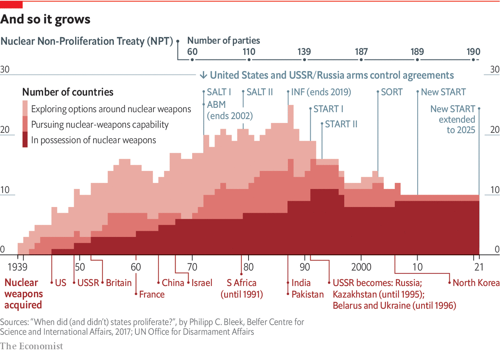

###### Who’s next?

# Nuclear proliferation is not fast, but it is frightening 

##### Experts worry about East Asia and the Middle East 

 

> Jan 30th 2021 


IN MARCH 1963 President John Kennedy lamented his failure to negotiate a ban on nuclear tests. “Personally,” he warned, “I am haunted by the feeling that by 1970, unless we are successful, there may be ten nuclear powers instead of four—and by 1975, 15 or 20.”


Kennedy was wrong. While many countries explored the idea of nuclear weapons from the 1950s to the 1990s, comparatively few took the next step of actually trying to develop the ability to build them (see chart). Of those few some stopped because the country itself dissolved (Yugoslavia), some because of changes to domestic politics (Brazil), some because of pressure from allies (South Korea) and some through force of arms (Iraq).


The parties to the Nuclear Non-Proliferation Treaty (NPT) now include 185 countries which have renounced the nuclear path, as well as five nuclear-weapon states that the treaty recognises as such—America, Britain, China, France and Russia. The four nuclear states outside the treaty either never signed it (India, Israel and Pakistan) or withdrew from it (North Korea).

 


Nine nuclear-weapon states is a long way from Kennedy’s nightmare. What is more, recent years have seen increasing interest in moving beyond the NPT’s preservation of the status quo and pushing for a world in which nuclear weapons are illegitimate. This is the goal of the Treaty on the Prohibition of Nuclear Weapons, which commits its parties to not making, using or hosting nuclear weapons. Having been ratified by 52 of its 86 signatories, it entered into force on January 22nd.


But this “nuclear ban” is born as much from frustration as from hope. The NPT was a deal in which non-nuclear-weapon states got both access to civilian nuclear technology and a commitment that the nuclear-weapon states would seek to negotiate disarmament. Though the American, Russian, French and British arsenals did shrink after the end of the cold war, there has been little progress since. Indeed there has been some backsliding. America left the Anti-Ballistic Missile Treaty in 2002 and the Intermediate Nuclear Forces Treaty (which Russia was breaking) in 2019.


The New START treaty, a ten-year-old cap on American and Russian nuclear forces to which Presidents Joe Biden and Vladimir Putin agreed a five-year extension on January 26th, is now the only bilateral arms-control agreement that binds the two countries. A grim panoply of new American and Russian weapons has been announced in recent years, from American miniature warheads to Russian underwater drones designed to drench coastal areas in radioactive fallout. China, for its part, has been upgrading its initially modest nuclear forces into considerably more than the bare-bones deterrent they once were.


Listen on:  |  |  |  | 


As major nuclear powers have added to their nuclear capabilities some proliferators have paid little price for acquiring them. Gaukhar Mukhatzhanova of the Vienna Center for Disarmament and Non-Proliferation points out that in the late 1990s America’s policy was to “cap, roll back and eliminate” the embryonic Indian and Pakistani arsenals through sanctions and censure. But as it became clearer that India would serve as a bulwark against Chinese power, America bent its own rules to allow civilian nuclear co-operation and helped ease India into international regimes governing nuclear exports.


Great-power sabre rattling, a sense that some countries get to bend the rules and a reassessment of America’s role as a steadfast ally during the presidency of Donald Trump may all have provoked interest in proliferation. What is more, though the bomb’s spread has slowed, it has never stopped—and proliferation begets proliferation, whatever speed it unrolls at. Iran’s nuclear programme spooks Saudi Arabia. North Korea’s arsenal casts a darkening shadow over South Korea and Japan.

They could if they wanted to


Despite a dalliance with the idea of following China into the nuclear club in the 1960s, Japan is for obvious reasons generally seen as making a case for nuclear caution. At the same time it is the only non-nuclear-armed state which operates major facilities for enriching uranium and reprocessing plutonium from spent reactor fuel, both potential routes to fissile material for a bomb. And in 2017 North Korea tested some of its nuclear-capable missiles by flying them over the archipelago to splash down in the Pacific beyond.


Such experiences change perspectives. Japanese conversations about nuclear weapons were once “sotto voce” and confined to a small cluster of “very conservative thinkers”, says Richard Samuels of MIT. Now, he writes in an article with his colleague Eric Heginbotham, “What once had been nearly taboo...has a conspicuous presence in Japan’s security discourse.”


The idea is still deeply unpopular. Mark Fitzpatrick, who used to oversee non-proliferation policy at the State Department, reckons that Japanese scientists would only comply with an order to produce nuclear weapons “in the event of a sharp deterioration in Japan’s security situation”. But his examples of such deteriorations are hardly outlandish. “In the imaginings of Japanese policymakers,” he says, “the most likely scenarios would be if South Korea goes nuclear or if the Koreas unify and keep Pyongyang’s existing arsenal.”


South Korea lacks enrichment and reprocessing capabilities, and is thus rather less well-placed than Japan to develop nuclear weapons. But it is closer to North Korea, and more worried. “Politicians are trying to normalise and remove the stigma of discussing nuclear weapons in public discourse,” according to Toby Dalton of the Carnegie Endowment, a think-tank, and Ain Han of Seoul National University.


On a technical level, the country has sought to acquire submarines powered by nuclear reactors, the fuel for which is closer to weapons-grade than that for power stations. And on January 13th it announced tests of a submarine-launched ballistic missile. No other non-nuclear state has ever seen a need for such a capability.


Polls show that a majority supports either the development of nuclear weapons or the return of the American ones stationed there during the cold war. But extending American deterrence is harder today. For America to use nuclear weapons on the Korean peninsula would always have been a momentous decision, but in the past it would not have put millions of Americans on the frontline. Now that North Korean missiles can apparently reach North America, attacking Pyongyang puts New York at risk. Strategic calculations are sensitive to such things, and both South Korea and Japan know it.


Taiwan has similar worries; China’s increased ability to strike half way round the world could affect America’s willingness to come to the island’s aid in extremis. But though the country explored nuclear options as recently as 1988, the fact that, today, such efforts would furnish a much more powerful China with a pretext for pre-emptive strikes and possibly invasion makes rekindling them unappealing.


Mr Biden has not said how he plans to address North Korea’s increasing nuclear prowess and its impacts. He will be keen to avoid doing anything which encourages proliferation elsewhere. American promises, blandishments and threats have often checked nuclear ambitions among its allies. A real sense of what American and international displeasure could mean economically might well change what South Koreans say about nuclear weapons.


But North Korea is not going to give up its nuclear weapons. And any deal with America which legitimised North Korea’s arsenal in an effort to stop its growth would increase South Korea’s incentive for at least keeping the nuclear option available—a posture known in the nuclear trade as hedging. So would a resumption of North Korean missile tests. Jeffrey Lewis and David Schmerler of the Middlebury Institute of International Studies (MIIS) in California recently published evidence that North Korea was preparing to test a new long-range submarine-launched missile.


The fear generated by North Korea’s growing arsenal and the fact that Japan, South Korea and Taiwan could all “produce nuclear weapons in perhaps two years—or less in Japan’s case”, according to Mr Fitzpatrick, makes East Asia a hot spot. But it is not the only one. George Perkovich of the Carnegie Endowment divides potential proliferators into two categories: those with ample means but less ambition, and those with greater ambition but fewer means. The East Asians fall into the first category; for the second, look to the Middle East, where insecurity is more violently manifest than in Asia and neither the fetters of liberal democracy nor the pull of alliances as strong.


According to a recent study by the Centre for Strategic and International Studies, another think-tank, “Personalist authoritarian leaders seem more inclined toward the bomb, [and] their hold on power can in some ways make it easier for them to carry out their plans.” The study notes that Recep Tayyip Erdogan, Turkey’s increasingly autocratic president, has begun to talk like a case in point. In September 2019 he complained to members of his ruling AK party that “some countries have missiles with nuclear warheads...But [we are told] we can’t have them. This, I cannot accept.”


Sinan Ülgen, a former diplomat who leads EDAM, an Istanbul-based think-tank, doubts that Mr Erdogan would act on this rhetoric. “At first the public may like the idea of having nuclear weapons,” he says. “But the cost for an open economy like Turkey would be too big and long-term. No government can sustain it under conditions of democratic elections.”


Not all leaders in the region toil under such constraints. “In discussions in Saudi Arabia, there’s a lot more willingness to talk openly about the possibility of proliferation,” says Gregory Gause of Texas A&amp;M University. The obvious cause is Iran’s nuclear programme. The JCPOA, a deal struck in 2015 between Iran, the five nuclear powers recognised by the NPT, Germany and the EU, saw Iran agree to reduce its uranium stocks and enrichment capability and to have them stringently monitored by the International Atomic Energy Agency (IAEA), the NPT’s watchdog, in return for relief from sanctions. But after Mr Trump pulled America out of the deal in 2018 Iran ceased respecting its constraints. On January 4th it started enriching uranium to 20% purity—nine-tenths of the way to weapons-grade—and nine days later began work on uranium metals, which can be used to fashion the core of a bomb.


Mr Biden says he will rejoin the JCPOA, in which case Iran has said it will return to compliance. Israel and Iran’s Arab rivals oppose such a revival, just as they opposed the deal in the first place. They see it as legitimising Iran’s nuclear infrastructure while placing only temporary limits on what it can do with it. In 2018 Muhammad bin Salman, Saudi Arabia’s crown prince, told CBS, an American broadcaster, that the kingdom “does not want to acquire any nuclear bomb, but without a doubt, if Iran developed a nuclear bomb, we will follow suit as soon as possible”. Mr Fitzpatrick reckons that “Saudi Arabia is the proliferation concern number one around the world.”


Despite its announced intention of building 16 nuclear-power stations, Saudi Arabia’s nuclear technology remains far behind that of Japan or South Korea. That need not, in itself, thwart any nuclear ambitions it has or develops. In the past, Western intelligence officials were concerned that Pakistan—which is thought to have had its bomb programme financed by Saudi Arabia in the 1980s and 1990s—might supply a complete nuclear device or know-how to the kingdom.


Alternatively, Saudi Arabia could rely on less-direct outside help. In a forthcoming paper, Nicholas Miller of Dartmouth College and Tristan Volpe of the Naval Postgraduate School describe the growth of an “autocratic nuclear marketplace”. The “gold standard” for deals in which countries buy civilian nuclear-power plants has been that their enriched fuel has to be imported and the used fuel sent out of the country for disposal, thus providing no domestic route to fissile material. Russia and China do not always abide by this standard; and the authors point out that 19 of the 33 reactors exported since 2000 came from those two countries. Last year the Wall Street Journal reported that China was helping Saudi Arabia build a facility for processing uranium ore. That is not the same as enriching it. But it worries Western officials.


China has also armed the kingdom with ballistic missiles. In 2019 researchers at MIIS discovered that a suspected rocket-engine plant south-west of Riyadh bore a resemblance to a Chinese-built facility. This does not necessarily mean it wants nuclear weapons; their perceived utility as conventional weapons is seeing ever more countries build up ballistic-missile forces. But an already established missile capability is definitely a useful thing for a potential proliferator to have.


Wider-spread ballistic-missile capabilities and laxer deals on nuclear fuel are not the only current developments that could be of help to proliferators. America’s National Nuclear Security Administration warns that technological advances like 3D printing and powerful computer-aided design “may create new and worrisome pathways to nuclear weapons”.

 


But proliferators face new challenges, too. “The world’s capability to know what somebody is doing is much greater than it was at the time that Saddam Hussein was pursuing weapons and that gives a lot more time to react,” says Tom Countryman, America’s under-secretary of state for non-proliferation from 2011 to 2017. Non-governmental organisations regularly unearth and publicise secret facilities using “open” sources—most notably images taken by satellites like those which researchers at MIIS used to spot North Korea’s looming missile test and Saudi Arabia’s rocket plant.


The IAEA has honed its remote monitoring capabilities in Iran in recent years, using tamper-proof cameras and radiation detectors that send back a steady stream of data. And Mr Volpe points out that ever more manufacturing technology is likely to be monitored from afar by its creators. Such capabilities could be used for more than scheduling maintenance. He envisages an “Internet of Nuclear Things” in which suppliers can scrutinise the tasks for which the machines they sell are used.


This all offers hope that the covert pursuit of nuclear weapons has become harder. But what of overt pursuit? For a country to leave the NPT would undoubtedly provoke a crisis. But India’s experience shows that a country with real heft can weather such disapproval. As Ms Mukhatzhanova puts it, “Countries that are important, economically and politically, might count on being accepted into the system if they break out.” To try to cut a frankly proliferating South Korea out of the world economy in order to bring it back into the NPT stable would be a huge undertaking.

No way back


Most nuclear-curious states, Iran included, are more interested in hedging than in actually building a weapons programme. Yet hedging by several rivals at once produces a situation where cascading proliferation becomes all too easy to imagine. An Israeli military strike on Iran, for instance, might persuade it of the need for a nuclear deterrent, thus triggering a response by Saudi Arabia which might in turn strengthen ambition in Ankara—or Cairo.


Once the world would have hoped that American diplomacy, engagement and suasion would have kept such risks in check, and over the coming few years they might. But America’s centrality is on the wane. As Mr Gause points out, “A pervasive sense...that the United States is leaving the region” underpins Saudi discussion of proliferation. The risks entailed in offering a nuclear umbrella are clearly increasing. And although Mr Biden has always been a staunch advocate of arms control, the same was not true of his predecessor, and may well not be true of his successor. Proliferation has not proceeded anything like as fast as once was feared. But it has not stopped, and it could well accelerate. ■

