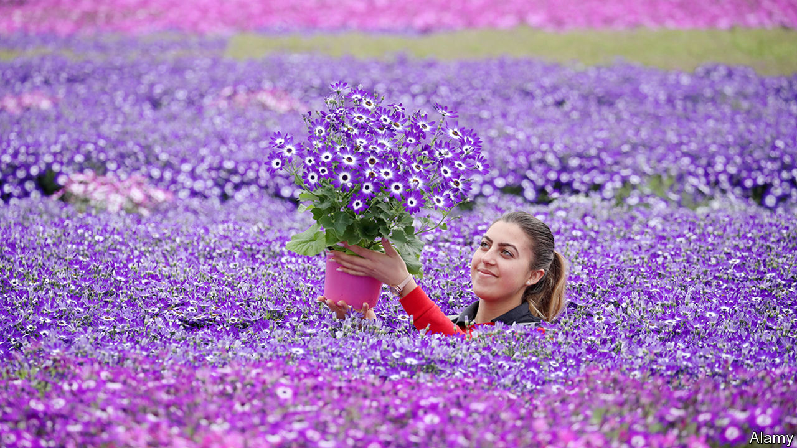

###### Great Britain and Northern Ireland

# Absurdities on the border between Great Britain and Northern Ireland 

##### Trade withers as complications multiply 

 

> Jan 30th 2021 


JOHNSONS OF WHIXLEY, a Yorkshire plant nursery, has been selling around £500,000-worth of plants each year to customers in Northern Ireland. Now it has to stop, because it grows those plants in British soil.


To avoid a hard Irish border, the UK and EU agreed that Northern Ireland remains bound by many EU regulations, which include a ban on the import of soil. Johnsons could continue to sell in Northern Ireland if it used concrete or plastic to keep plants from touching the soil but, says Jonathan Whittemore, the firm’s head of production, that would mean a “complete change” in its processes. Plants may also be sold to Northern Ireland if they are grown in peat—which encourages peat bogs to be stripped for horticulture, thus contributing to climate change. The company had grown a rare type of hedging to order for a Northern Ireland customer. With that sale now impossible, Mr Whittemore expects that some of the plants will be dumped.


In Somerset, Paul James has discovered that his firm, J&amp;K Aquatics, needs an export health certificate to sell fish food into Northern Ireland. Two or three tubs of fish food would cost about £10, he says, but the certificate—which must be completed by a specialist such as a vet—costs around £50. Customs declarations are now necessary as well. A Conservative Brexit supporter, he emailed the prime minister last week in frustration when he heard Michael Gove, the cabinet office minister, refer to some “bumpy moments” on the post-Brexit road. “We can’t even find the road,” says Mr James.


Pet owners who want to bring a cat or dog into Northern Ireland from Great Britain need a rabies injection for their animal 21 days before travelling—even though domestic animals in the British Isles are rabies-free. Northern Ireland’s agriculture minister has written to the European Commission to object to “unjustified veterinary treatments, for diseases that we do not have”.


All three problems have their origin in rules put in place to protect the EU single market from foreign threats—whether soil-borne disease, dodgy fish food, or rabid animals. Now that those rules partition the UK, the sort of absurdities which drove the anti-EU sentiment behind Brexit are multiplying. For now, these are difficulties for people in Northern Ireland, or those seeking to trade with them. But in time this will be a problem for the EU, too.


In four years’ time, the Northern Ireland Assembly, which has had no say in the arrangements so far, will vote on the Irish Sea border. Many nationalists are happy to see the division between Great Britain and Northern Ireland deepen. Unionists—more numerous in the Assembly, at six seats short of a majority—have pledged to vote down the rules at the first opportunity. Elections are due next year. If the sea border goes, the choice will be between a harder border on the island of Ireland, or no border at all—in other words, reunification.


For more coverage of matters relating to Brexit, visit our 

