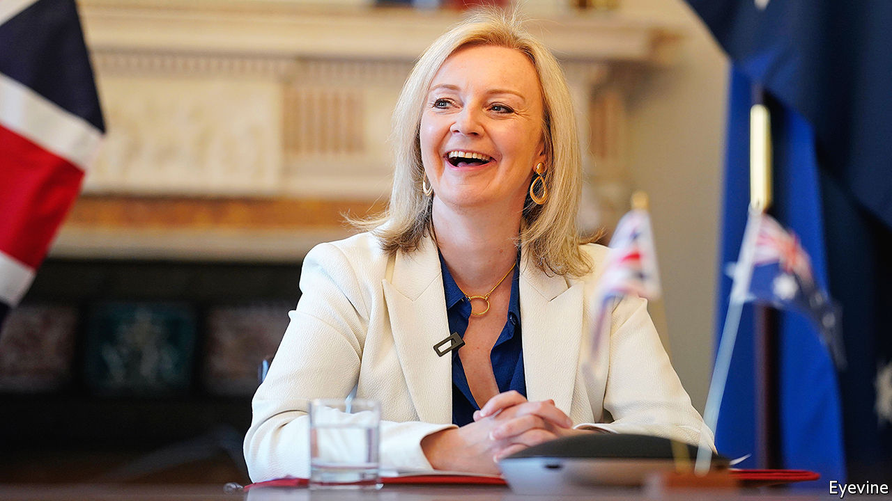

###### Trade deals

# Britain has successfully rolled over the EU’s trade deals 

##### Now it gets harder 

 

> Jan 30th 2021 


Editor's note (January 31st 2021): Since publication of this article Britain announced it would formally apply to join the Comprehensive and Progressive Agreement for Trans-Pacific Partnership, a trading bloc of 11 countries including Japan, Australia and New Zealand. Negotiations may begin later this year


LAST YEAR was a busy one for the Department for International Trade. It concluded 14 trade deals alongside the wider agreement with the 27 members of the European Union (EU). In December alone, Britain signed terms with 11 countries ranging from big fish such as Canada and Turkey to minnows such as Cameroon and North Macedonia. Altogether, 34 trade agreements have been signed since 2016; all took effect this year. But trade analysts warn that despite the burst of effort, the real challenge is only just beginning.


For all the talk of a buccaneering Global Britain signing deals to open new markets, most of the trade department’s work over the four-and-a-half years since it was created has focused on replicating deals to which Britain was already a party. As a member of the EU, Britain benefited from around 40 deals covering 70 countries signed by European negotiators. Brexiteers boasted that rolling over these arrangements would be straightforward and swift; Remainers said it would take many years.


Neither was quite right. The work proved difficult and time-consuming. By the end of March 2019, when Britain was originally scheduled to leave the European Union, only nine deals had been struck. “They’ve really made use of the extra time,” says David Henig, of the Centre for European Political Economy, a think-tank. He reckons that Britain notched up some small gains in the deal with Japan but lost out in the agreements with Switzerland, Turkey and Norway.


So far the hard work has been legal and technical, rather than political. Rolling over existing deals does not involve weighing up the sort of tricky trade-offs between, say, service exports and accepting chlorinated chicken that a deal with America could entail.


It has been a good time to be trade secretary. “You get to pop up for photo opportunities at signing ceremonies and do some fun travel but when things go wrong it’s usually too technical for the public to really notice,” says an analyst. Liz Truss, the secretary of state, is now tipped for promotion. Trade watchers give her some credit for getting the Canada and Mexico deals over the line but suspect she misjudged the mood in Washington when trying to strike a deal there.


Hopes for that deal have diminished. There are gaps between what America wants—freer access for farm products and to the health market—and what the British public is likely to accept. Donald Trump might have done one for political reasons; Joe Biden is not likely to. Prospects look brighter in the Pacific region. Britain should be able to agree new deals with Australia and New Zealand relatively quickly and analysts think it may soon be able to join the Comprehensive and Progressive Agreement for Trans-Pacific Partnership.


Future deals are likely to be more difficult to do, because they will involve more explicit domestic political trade-offs. Sam Lowe, of the Centre for European Reform, a think tank, points out that doing deals is also harder when there is no deadline. The sprint to roll over existing deals has got Britain back to the old starting line by replicating the pre-Brexit trade infrastructure. The marathon to sign new deals is only just beginning.■


For more coverage of matters relating to Brexit, visit our 

