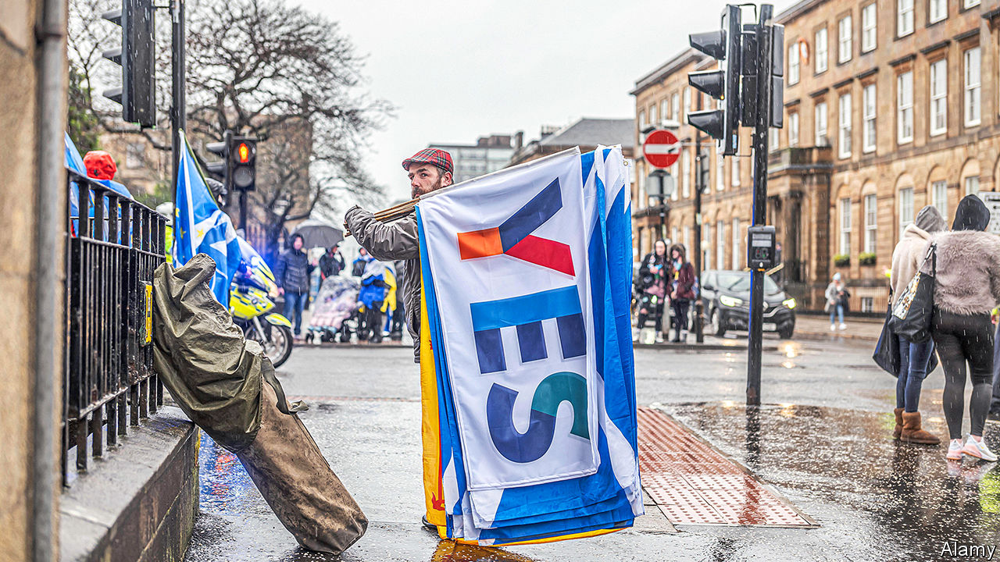

###### The United Kingdom

# Most Scots want independence, but they lack the means to get it 

##### The constitution is Westminster’s domain 

 

> Jan 30th 2021 


AS BORIS JOHNSON flew northward on January 28th to try to persuade the Scots of the value of the union, the land beneath him seemed ready to break apart. Many unionists think the United Kingdom is bound to disintegrate. Brexit has loosened the bonds between the four nations. More than twice as many Britons think Scotland will get independence in ten years than think the country will hold together (see chart). Fewer than half say they’d be upset.


The Scottish National Party (SNP) is expected to win a majority in elections to the Scottish Parliament in May, which it will use to seek a second referendum on separation. In the first ballot, held in 2014, Scots voted to remain in the UK, but a majority now consistently say they want independence. Nicola Sturgeon, the SNP leader, has strong approval ratings; Mr Johnson does not. Brexit is causing havoc with the Scottish fishing industry. Scots think independence will leave them poorer, but like Brexit the project is a triumph of constitutional ideals over economic interest.


And yet to Scottish Nationalists the United Kingdom looks vexingly robust. Despite support for independence, a mechanism to break up the UK lies frustratingly beyond reach. On January 24th, Michael Russell, the SNP minister responsible for the constitution, presented his impatient members with a new plan to force a referendum. Its chances of working are slim.

 


The reason is Britain’s constitutional law. There is no British equivalent of the EU’s Article 50, the secession clause any state can invoke. Rather, the Scotland Act, which created the Scottish Parliament, stipulates that the constitution is Westminster’s domain. David Cameron’s government granted permission for the 2014 referendum under a Section 30 order, a device which allows the Scottish Parliament to pass laws in areas normally reserved for Westminster. Mr Johnson says that he won’t grant such an order, and that the wait between Britain’s referendums on Europe in 1975 and 2016 is “a good sort of gap”—suggesting no Scottish vote until 2055.


Yet the government is alarmed at support for independence, and is drawing up a strategy to reinforce the union. Mr Johnson used his visit to praise the role of Whitehall and the British Army getting covid-19 vaccines to Scotland. He faces none of the pressure from within his party to hold a vote which Mr Cameron did on Europe. A prolonged independence rift in Scotland would allow the Tories to scoop up the votes of pro-union Scots.


Many nationalists know this. Their fears that independence will slip through their fingers if Mr Johnson holds firm were aired at an online meeting on January 22nd of All Under One Banner, a group which organises marches for independence. Some speakers called for strikes and protests outside the SNP’s headquarters; others accused the party leadership of growing too comfortable with devolution. Angus MacNeil, the SNP MP for the Western Isles, reckons Mr Johnson would be “a mug” to agree to a referendum now, and says the SNP should simply use May’s election as a ballot on independence. Joanna Cherry, a potential successor to Ms Sturgeon, argues that Irish independence was won after Sinn Fein MPs won a majority in Ireland, meaning no referendum is necessary. Some activists see precedents in how Kosovo and Lithuania split with their masters.


Such talk makes Ms Sturgeon’s team wince. She insists any referendum must be beyond legal question. If not, it is a dead end; the EU, which an independent Scotland would seek to join, would ignore the result. So would the British government, with which it would need to haggle over fishing grounds and pensions in lengthy divorce talks. “We don’t get endless shots at this,” says a party figure. The deadlock which followed Catalonia’s unsanctioned referendum in 2017 serves as a warning.


Mr Russell’s plan seeks to navigate between the frustration of his members and the constraints of the Scotland Act. If the SNP wins in May, it will ask Mr Johnson’s government again for a Section 30 order. If Mr Johnson refuses, the Scottish Parliament would pass a referendum bill anyway, and dare the British government to challenge it in the Supreme Court.


Mr Russell’s scheme will probably unite the independence movement until May’s elections, says an SNP hand, “but it doesn’t really have legs beyond that.” The British government thinks that whatever the result of the elections, the Scottish Parliament does not have the power to call a referendum; and if the Supreme Court looked likely to rule in the Scottish government’s favour, the UK Parliament could swiftly change the law to nix the vote.


Alternatively, London could call the nationalists’ bluff and dare Ms Sturgeon to push ahead with the unrecognised referendum she has sought to avoid. Douglas Ross, the leader of the Scottish Tories, said he’d boycott any “unofficial” poll. Scotland’s constitutional divisions risk becoming sharper if the two governments cannot even agree on the rules for settling them, notes Stephen Tierney, a professor of constitutional theory at Edinburgh University.


Whatever happens in May, it is a difficult moment for Ms Sturgeon’s leadership. An inquiry is probing what she knew about allegations of sexual assault against her predecessor, Alex Salmond, who was later acquitted in court. If Mr Johnson digs in, or the Supreme Court rules in his favour, demands for independence may grow, making separation only a matter of time until a future British prime minister gives in. But it is equally possible that the cause will deflate as Brexit settles, and Scots’ focus turns to the state of their schools and hospitals after 14 years of SNP government.


Far from being inevitable, the break-up of the UK would be historically remarkable. Since the SNP’s birth in 1934 more than 100 states have secured independence. Almost all were born of war, decolonisation or economic collapse. Breaking away from a prosperous democracy in peacetime is another matter. “There are plenty of examples of nationalist movements in advanced democratic countries, but none of these has led to independence,” notes Nicola McEwen, a professor of territorial politics at Edinburgh University. The SNP has set itself the unusual task of dismantling the British state within the constraints of a legal order that is stacked in its opponents’ favour. It wants revolution, without breaking so much as a window.■

