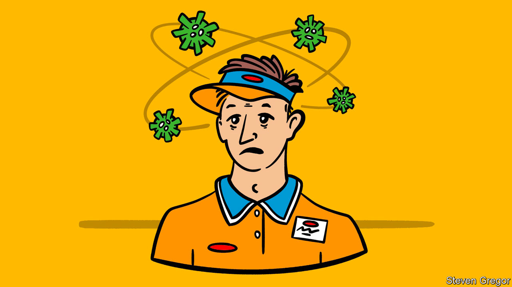

###### Isolation

# Why Britons go to work with covid-19 

##### Inadequate support payments are a false economy 

 

> Jan 30th 2021 


HE HAD LOST his sense of taste and smell, and the official advice was clear: get a covid-19 test and self-isolate. But the market trader went to work anyway. The stall didn’t offer sick pay. “It was just before Christmas, and I didn’t have many shifts either because of covid,” he explains. When he eventually got tested, the next day, the result duly came back positive.


Such behaviour is not uncommon. A lot of effort has gone into improving the performance of Britain’s test-and-trace system. Yet the bigger gaps are at either end of it: ensuring people with symptoms take a test and ensuring those who receive a positive result isolate. It is an issue to which the government is belatedly paying attention.


There is a lot of ground to make up. According to the University College London covid-19 social study, a survey of more than 70,000 self-selecting folk, just 33% of people get tested every time they have symptoms; those over 60 are particularly lax. On January 25th Dido Harding, chief executive of the test-and-trace system, said that more than 40% of those contacted by her teams failed to isolate for ten days.


That leaves a lot of people transmitting the virus. Lady Harding’s figures suggest that more than 130,000 people with a positive covid-19 test result failed to keep to themselves in the most recent week for which data are available. Many others would have been out and about because they were not tested in the first place.


Part of the problem is disdain for the rules. In theory, those who fail to isolate after a postive test risk a £1,000 ($1,400) fine; in practice, few are caught. According to the Guardian, a newspaper, the Department of Health and Social Care (DHSC) is considering plans to give police access to health data to check if people are isolating.


Even where support is available, people fall through the gaps. A supermarket worker says his employer pays the wages of anyone told to isolate. Still, colleagues come in ill. “People with fevers play it off as if it’s, ‘Oh, it’s just a cold’,” he says. “We’re getting paid in full if we’re told to [isolate]. But if we go home with symptoms, we don’t get paid up until we get a test.”


Britons are doing a better job of following less burdensome rules. The UCL study finds that 96% of people are mostly complying with covid-19 rules, and 56% are completely complying. Despite fears of “lockdown fatigue”, both figures have risen in recent months. The problem arises with rules that impose large costs, financial and social, that people are not prepared to pay.


In some cases the issue is ability, not willingness, to stick to the rules. Those in cramped housing do not have the space to isolate. Other countries have dealt with this problem by offering accommodation. In Britain the government provides a £500 payment to those who are isolating, but only if they are on benefits or face hardship, which many struggle to prove to their local council. In Europe the state often provides sick pay (at 50% of the isolater’s salary in Italy, 70% in Belgium and, for the first six weeks, at 100% in Germany).


Jeremy Hunt, a former health secretary, has argued that the British government should do likewise. When reports recently emerged that the DHSC had drawn up plans to give everyone who tests positive £500, Downing Street firmly ruled it out. Expanding support would certainly be expensive. Yet there are subtler ways to do it than one-off payments—and not doing so increasingly looks like a false economy. ■


Dig deeper


All our stories relating to the pandemic and the vaccines can be found on our . You will also find trackers showing ,  and the virus’s spread across  and .

