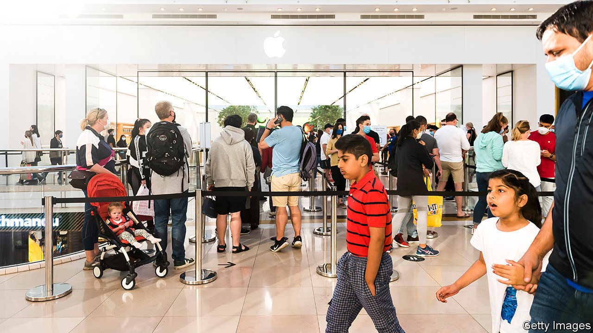
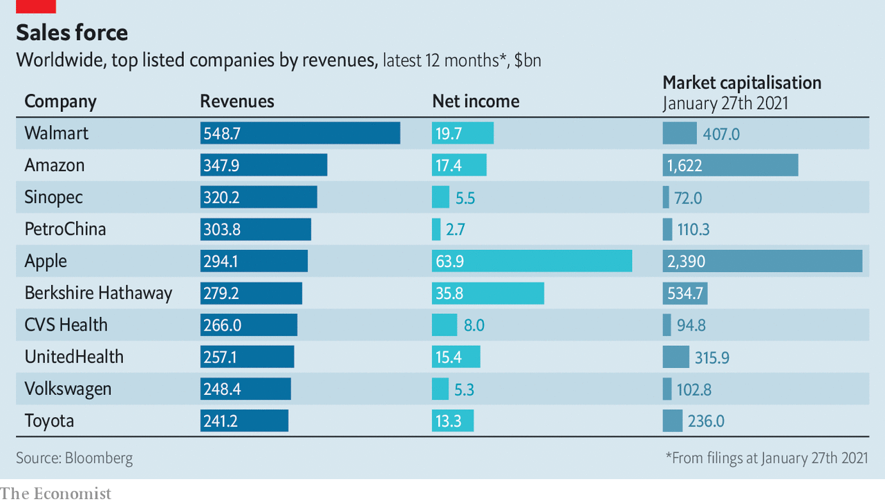

###### Big tech’s banner year

# Apple’s quarterly sales exceed $100bn for the first time 

##### The pandemic has been kind to other technology firms, too 

 

> Jan 30th 2021 

 


CHRISTMAS means rich pickings for Apple. The pandemic year was no different. The iPhone-maker’s quarterly revenue exceeded $100bn for the first time, two-and-a-half times Microsoft’s own record sales and four times Facebook’s. Among the tech giants only Amazon boasts bigger annual revenues—though much thinner margins.■


Dig deeper


All our stories relating to the pandemic and the vaccines can be found on our . You will also find trackers showing ,  and the virus’s spread across  and .

