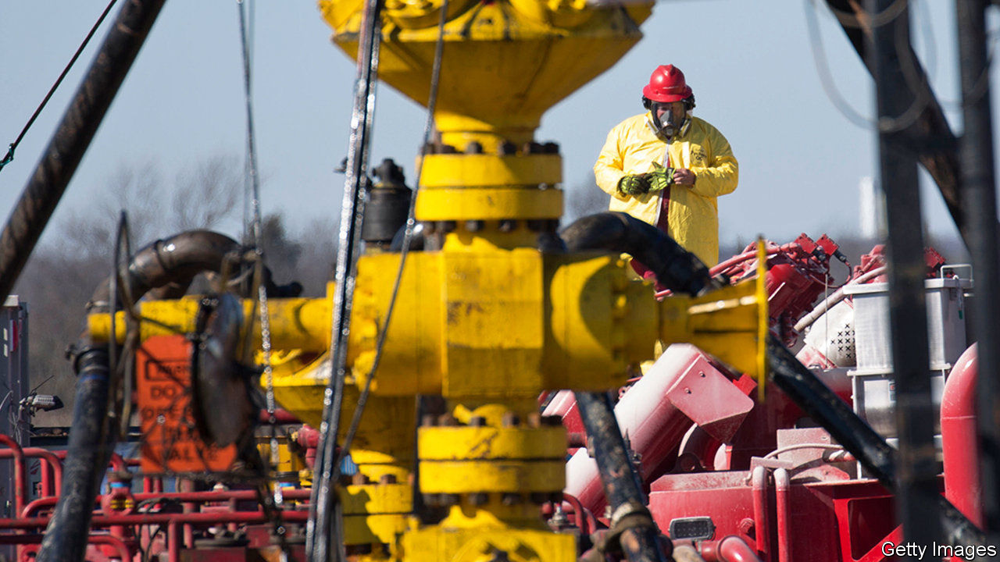
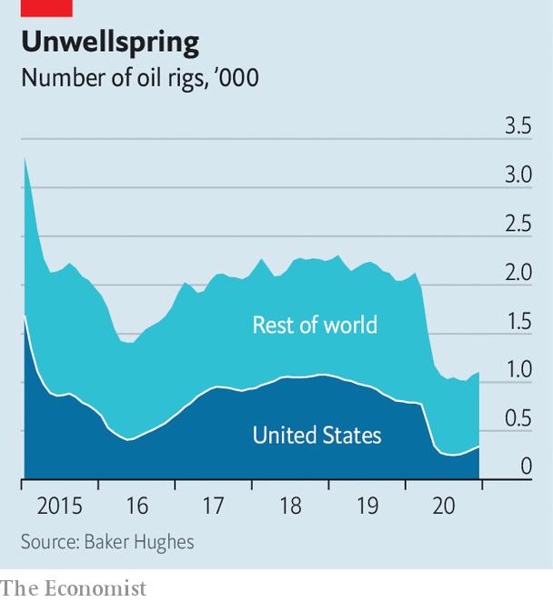

###### Will baby drill?

# Are oil-services companies doomed? 

##### Many of them are. But not all 

 

> Jan 30th 2021 


IN 2020, as demand for crude went up in smoke amid covid-19 lockdowns, so did energy firms’ budgets. That left oilmen with less money to spend on assessing reservoirs, drilling new wells and maintaining existing ones, which they typically outsource to specialist oil-services firms. Between January and June the number of active rigs worldwide fell by half, to just over 1,000. On January 19th Jeff Miller, boss of Halliburton, a service-industry giant, called last year “the worst in our history”. His firms’ revenues fell by 36%, to $14.4bn, leading to an operating loss of $2.4bn.


Still, Mr Miller insisted, the future looks brighter. He predicted “a multi-year upcycle” beginning in 2022. On January 22nd Olivier Le Peuch, chief executive of Schlumberger, a big rival, echoed this sentiment, declaring “a new growth cycle”. A day earlier executives at Baker Hughes, the third big provider, sounded a similarly chirpy note. Is this optimism misplaced?


Recent history gives grounds for scepticism. Although Halliburton’s share price has almost recovered to its pre-pandemic levels, it is less than a third what it was in 2017. Schlumberger and Baker Hughes have performed only a bit better. The trio have torched $128bn in shareholder value in the past four years, as low fossil-fuel prices have squeezed oil firms’ budgets.


At the same time newcomers piled in, particularly across America’s shale fields. The industry’s global ranks swelled, from about 100 companies in 2014 to nearly 1,000 last year, reckons Muqsit Ashraf of Accenture, a consultancy. Competition meant that most of the rewards from improved efficiency went to customers, in the form of lower prices. Returns collapsed. The sector’s gross operating profits fell by half from 2014 to 2019, according to Bernstein, a research firm. Then came covid-19.

 


The long-term risks beyond the pandemic look as daunting. Oil majors’ spending on new rigs may not keep pace with any rise in the oil price. Investors are keener on cashflow than on costly new gushers. Governments are getting serious about climate change. On January 27th President Joe Biden announced an indefinite pause to new drilling permits on America’s federal lands. Against this backdrop, the prospects for service firms can resemble those of horse farriers at the dawn of the car age.


Even a shrinking market offers an opportunity, however. The giants have spent the past year slashing costs. Schlumberger laid off 21,000 workers, a fifth of its total, cut its dividend by 75% and said that senior managers would voluntarily forgo 20% of their pay. It has enough cash (as have its two rivals) to invest in better services for traditional customers. Mr Miller boasted that his firm sealed a wellbore in the North Sea with cement in a process that was, for the first time, fully automated.


The big firms are also expanding into new, cleaner ventures. In November Baker Hughes said it would acquire a carbon-capture company. Schlumberger has set up a “new energy” business unit and on January 11th its joint venture in France to manufacture equipment for clean-hydrogen production received the EU’s blessing.


Most important, the three giants benefit from attrition. North American service firms entered the pandemic with $32bn to repay by 2024, according to Moody’s, a ratings agency. Speculative-grade companies accounted for nearly two-thirds of that. Few are attractive takeover targets; unlike an oil firm, which obtains drillable land when it buys another, an acquisitive service company gets rigs and other kit it already has in abundance. Sreedhar Kona of Moody’s sees “way too much equipment chasing way too little cashflow”. The big three hope that what cash is left will increasingly flow to them. ■


Dig deeper


All our stories relating to the pandemic and the vaccines can be found on our . You will also find trackers showing ,  and the virus’s spread across  and .

