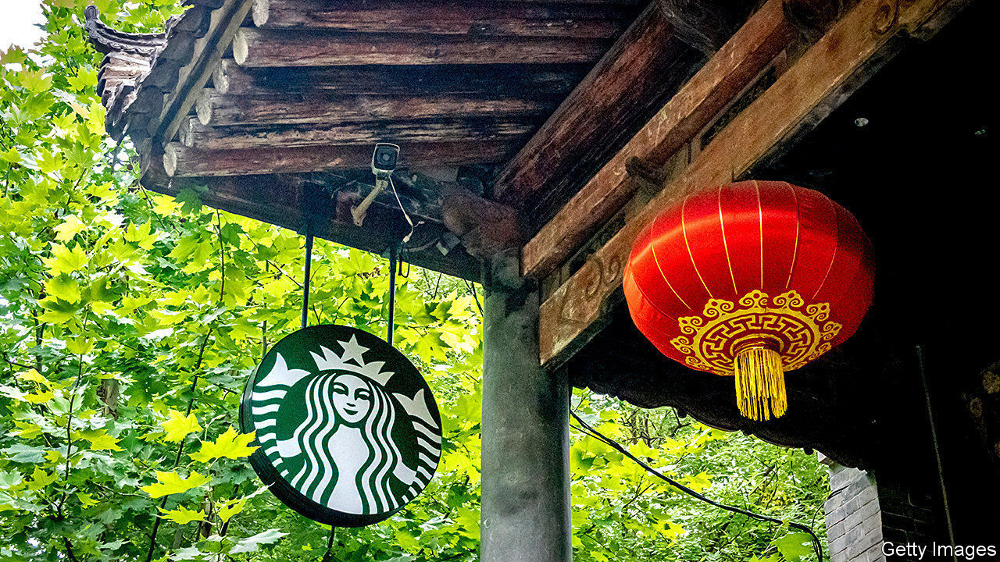

###### Espresso lane

# Starbucks bets on China, suburbia and cyberspace 

##### The world’s biggest caffeine-peddler has its best quarter of the pandemic. It could be better 

 

> Jan 30th 2021 


HOWARD SCHULTZ, former boss of Starbucks, used to imagine its coffee shops as a “third place”: a spot to hang out, as you do at home or in the office. Yet even free Wi-Fi persuaded only one in five Americans to stick around; the rest ordered to go. Then covid-19 collapsed the distinction between hearth and work. Being a two-and-a-halfth sort of place was not all bad in a plague. On January 26th Kevin Johnson, Mr Schultz’s successor, reported Starbucks’s best quarter of the pandemic so far. But global same-store sales, a benchmark metric, still fell by 5%.


Recovery is furthest along in China, the firm’s largest international market, which got the pandemic under control faster than the West. Same-store sales in China grew by 5% last quarter, year on year (possibly helped by the downfall of Luckin Coffee, a local rival embroiled in a fraud). Including the nearly 600 new outlets, too, total China revenues rose by 22%, to $911m.


The pace of new openings slowed from the previous quarter, when a new Chinese outlet opened every eight hours or so, but it remained faster than before the pandemic. In November Starbucks broke ground on a Coffee Innovation Park in the province of Jiangsu, which will roast and distribute beans to the 6,000 coffee shops the company plans to run in China by 2022.


Chinese coffee-drinkers have been lapping up its app-based loyalty programme, which now has 15m members in China, up from 10m at the start of 2020. That bodes well for future sales in a traditionally undercaffeinated market where the beverage is winning over ever more converts.


The app propped up sales in America, too. Those fell by just 5% year on year, despite two in five coffee shops facing renewed limits on in-person caffeination. Although the Starbucks app was overtaken by Apple Pay in 2019, it remains one of America’s most popular mobile-payments systems. Gamified challenges and promotions (as well as contactlessness, on which covid-19 placed a premium) tempted American coffee-drinkers out of their houses and increased the amount they bought on each visit, which rose by 19% between October and December, year on year. Drive-through lanes at suburban outlets, which are mushrooming as those in city centres once did, also helped. By 2023 Starbucks wants 45% of its American outlets to allow drive-through or curb-side pick-up.


But covid-19 continues to cloud prospects for businesses that involve human contact—as latte-peddling does. By the time the pandemic is over up to 400 Starbucks in American city centres may be shut for good, the firm says. Until recently investors did not seem to mind, perhaps concluding that not every street corner needs one. The company’s market capitalisation climbed steadily since the market crash in March to an all-time high of $126bn in late December. The disappointing results shaved 6.5% off Starbucks’s share price. Normally stock-traders are highly strung after too much coffee. Too little can evidently have the same effect. ■


Dig deeper


All our stories relating to the pandemic and the vaccines can be found on our . You will also find trackers showing ,  and the virus’s spread across  and .

