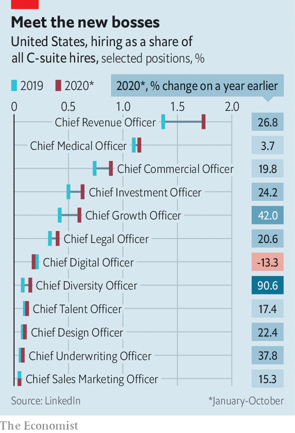

###### Hail to the “chiefs”

# The pandemic is ushering in new C-suite roles 

##### Not all corporate titles will stick 

 

> Jan 30th 2021 


WHEN MEETING big new challenges, chief executive officers often resort to a convenient tool: creating fresh executive roles. This helps channel resources to pressing problems and attract talent. It signals to staff and the wider world that bosses understand what really matters (and care about it).


Sometimes, it ends up looking farcical—remember the proliferation of “chief listening officers” a decade ago, as companies sought to react to social-media chatter? But certain newfangled C-suite roles do catch on; no self-respecting corporation can do without a chief sustainability officer these days. A few corporate positions that have gained prominence during a particularly tumultuous 2020 are almost certainly here to stay.


The most obvious example is “chief medical officer”. Long common in industries where safety is an abiding concern (mining, say), health supremos are now being recruited more widely, says Tony Lee of the Society for Human Resource Management, a trade association. The pandemic is far from over, red tape around sick leave is becoming more tangled as a result of it, and mental-health problems among employees are likely to outlive the plague.


Another emerging role is that of “chief remote officer”, responsible for designing policies and disseminating best practices for home-working. Succeeding could therefore mean making oneself redundant. Mr Lee thinks this role will eventually disappear, especially at smaller companies (though it may hang around at bigger ones with more complicated and dispersed workforces). As Bhushan Sethi of PwC, a consultancy, points out, something similar happened to chief digital officers, whom firms have recruited with gusto over the past decades. Digital honchos’ ranks are beginning to thin now that digital technology has become part of most companies’ bread and butter.


Indeed, recruitment trends show that it is bread and butter that continues to preoccupy bosses. Hiring of “chief revenue officers” and “chief growth officers”, charged with co-ordinating firms’ sales-generating activities, has accelerated as pandemic lockdowns simultaneously restrict economies’ supply and demand sides, according to a survey by LinkedIn, a professional social network (see chart). Their share of C-suite hires is now, respectively, twice and nearly three times what it was in 2017.

 


However, last year’s hottest executive recruits had nothing to do with covid-19. As protests against racial injustice rocked America last summer, companies rushed to enlist chief diversity officers, who ensure their workforce is representative of society at large.


One risk to diversity chiefs’ future job security is that most of them have not been invited to sit at the corporate top table. Most lack a direct line to the CEO. At worst, the post becomes “a ceremonial role”, with no authority, resources or structure, warns Michael Hyter of Korn Ferry, a consultancy. At best, like other modish corporate roles, it may eventually become redundant. ■


Dig deeper


All our stories relating to the pandemic and the vaccines can be found on our . You will also find trackers showing ,  and the virus’s spread across  and .

