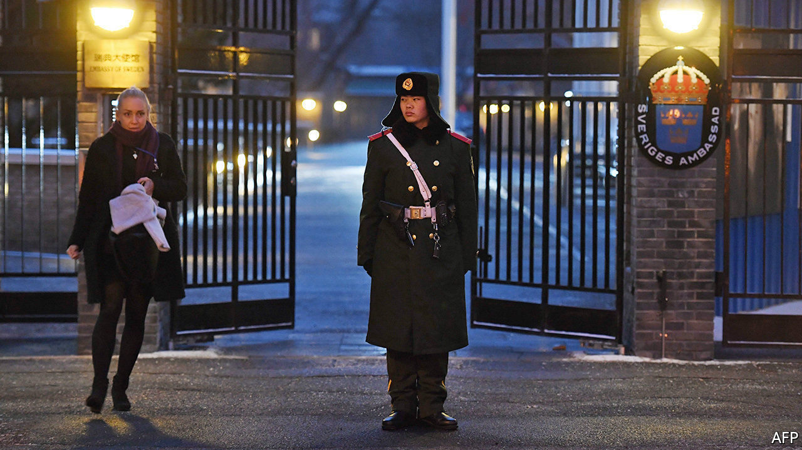

###### Stockholm syndrome

# Will Sweden’s Huawei ban harm Sino-Swedish business? 

##### The Chinese government may want to retaliate against Sverige AB. Swedish firms' fate could serve as a cautionary tale for other European countries. 

 

> Jan 30th 2021 


COMMERCIAL TIES between Ericsson and China date back to the 1890s, when the Swedish company sold 2,000 telephones to Shanghai. It has been welcome in the Chinese market ever since, most recently selling speedy 5G telecoms gear. Now, fears Borje Ekholm, Ericsson’s boss, those bonds are in jeopardy, as a result of the Swedish government’s anti-Chinese turn.


After centuries of cordial relations—from the Swedish East India Company’s ships sailing between Gothenburg and Guangzhou in the 18th century to Sweden’s early recognition of the People’s Republic in 1950 and its blessing in 2010 of the Chinese takeover of Volvo, a much-loved carmaker—the mood has changed. Last October the Swedish telecoms regulator barred Huawei, Ericsson’s Chinese rival, from the country’s speedy 5G mobile networks, citing “theft of technology” by China. This month, after an auction of Sweden’s 5G radio spectrum that forbade the winners from using kit from Huawei and ZTE, another Chinese supplier, China’s commerce ministry hinted that the ban could compromise bilateral economic ties.


That would be bad news for Ericsson, which derives 13% of its revenues from China. It is the only foreign company that provides China with certain types of 5G kit—which China is well ahead of most other countries in installing, thanks to gargantuan sums channelled into telecoms infrastructure. But Mr Ekholm’s fellow bosses are equally worried, if not quite as outspoken. Plenty of Swedish blue chips have a large exposure to the Asian giant, from ABB and Atlas Copco, two engineering groups, to Essity, a maker of nappies, and AstraZeneca, a Swedish-British pharmaceutical giant (see chart).

 


Joakim Abeleen, the Beijing representative of Business Sweden, a lobby group, observes that diplomatic ties soured after 2015. That year Chinese agents arrested Gui Minhai, a Swedish national who sold books in Hong Kong that were critical of the Communist Party. This, along with Chinese buyers’ aggressive pursuit of Swedish assets, including a port, infuriated Sweden’s government, which has since become one of Europe’s staunchest critics of China.


Even so, Mr Abeleen says, relations between the two countries’ corporate worlds remained cordial. Swedish exports to China (mainly medicines, vehicles and machinery) rose by 15% in the first ten months of 2020, year on year. It is Sweden’s fifth-biggest source of imports and sixth-largest export market. Around 600 subsidiaries of Swedish companies operate there; the 30 biggest reported an 18% increase in their Chinese sales in 2019, compared with a year earlier. A year ago a survey of Swedish businesses in China found that 34% planned to increase their investments in the country.


The 5G ruckus risks undermining this mutually beneficial state of affairs. China appears ready to use Sweden as a cautionary tale for other EU countries, showing what happens if they bar Huawei from their 5G networks, says a prominent Swedish industrialist. That would be tricky for Ericsson—which, as Mr Ekholm points out, needs China for global scale.


It could also harm Sverige AB more broadly; a well-functioning trade system is “pivotal” for a small, open country like Sweden, the industrialist warns. No wonder many bosses are quietly hoping that the country’s highest administrative court will reverse the telecoms regulator’s decision, which Huawei has appealed against. ■

