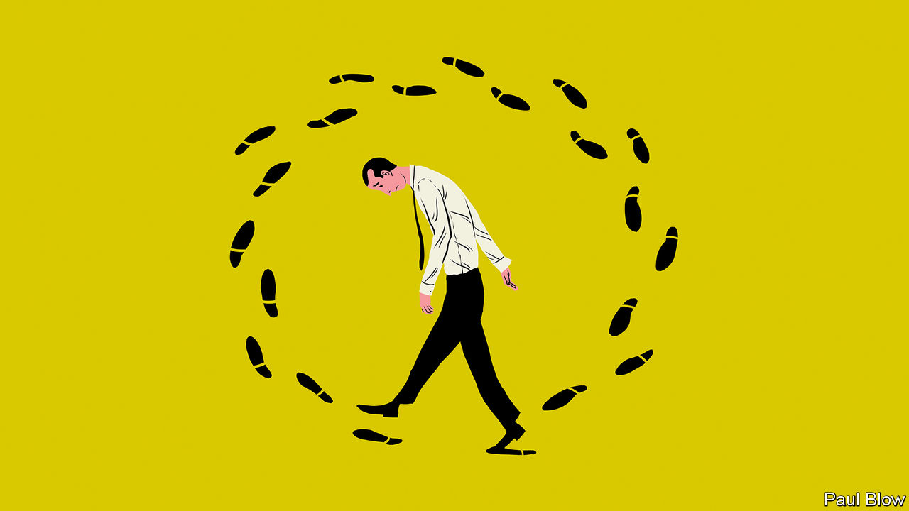

###### Bartleby

# You’ll often walk alone 

##### Loneliness is a widespread problem with complex roots 

 

> Jan 28th 2021 


THERE HAS been a quiet pandemic developing while most people’s attention has been on covid-19. The lockdown has exacerbated a problem that has been spreading in many developed nations for decades: loneliness.


It is a complex issue which covers not only social lives, but the way you work and the way you vote. Noreena Hertz, an academic, tackles the subject in an important new book, “The Lonely Century”.


Loneliness increases the risk of heart disease, strokes and dementia. Those who say they are lonely are likelier to be depressed five years later. In addition, lonely people can become more hostile towards others and more attracted to extremist politics.


Part of the problem stems from contemporary employment. Globally, two in five office workers feel lonely at work. This rises to three in five in Britain. Gig-economy jobs can leave people with insecure incomes and without the companionship of colleagues. The pandemic has made it more difficult to make, and maintain, friendships, particularly for new employees.


Even before the crisis, the hope that open-plan offices would encourage greater camaraderie proved to be false. Many people find the chatter distracting and retreat with noise-cancelling headphones; they then email colleagues who are sitting only a few desks away.


Co-working spaces, where young professionals can take advantage of communal facilities, have not been the answer either. Workers are not there long enough to invest in relationships. As Ms Hertz puts it: “Hot deskers are the workplace equivalent of the renters who’ve never met their neighbours.”


It may seem odd that loneliness can grow when people are surrounded by so many others. But this paradox was best expressed by the band Roxy Music, when they sang “Loneliness is a crowded room”. Most people will be perfectly content, for a while at least, eating on their own at home, perhaps with a good book or the telly. Sitting all alone in a restaurant or a bar, surrounded by other people chatting, is a much more isolating affair.


By the same token, big cities can be very isolating. In a survey from 2016, 55% of Londoners and 52% of New Yorkers said they sometimes felt lonely. In many cities, around half of all residents live on their own, and the average tenancy of a London renter lasts 20 months. City-dwellers are less likely to be polite, because they are unlikely to meet a passer-by again.


Perhaps this relates to human history. Mass urbanisation is a relatively recent development; if the history of human existence was squeezed into a single day, the Industrial Revolution did not occur until almost midnight. For much of that time, humans lived in small groups of hunter-gatherers; cities may just overwhelm the senses.


Ms Hertz points her finger at two more recent developments. The first is social media. The internet has led to much cyber-bullying (although it has also been a source of companionship during the lockdown). And people glued to their smartphones spend less time interacting socially. But Robert Putnam noticed a tendency towards solitary activity in his book “Bowling Alone”, published in 2000, well before the creation of Facebook, Twitter and other distractions.


The second culprit cited by Ms Hertz is “neoliberalism”, which she defines as a “minimum state, maximum markets” approach. But it is hard to believe that state retreat is as decisive a factor in the loneliness pandemic as she suggests; after all, in 1990 the government of the average advanced economy spent 42% of GDP, and the proportion is the same today, according to the IMF.


Some changes in behaviour are down to individual choice. Before the pandemic no one was stopping people going to church or taking part in sports. They simply preferred to do other things. Indeed, one reason for the decline in communal activities is that men choose to be with their families rather than head to the bar; American fathers spend three times as much time with their children as they did in the 1960s. That is surely a welcome development.


So recreating a communal society may be difficult. When the pandemic ends, people may relish the chance to be with their neighbours and colleagues for a while. But the trend is clear. Technology means that people can get their entertainment at home, and work there, too. It is convenient but it also leads to loneliness. Society will be grappling with this trade-off for decades to come.

