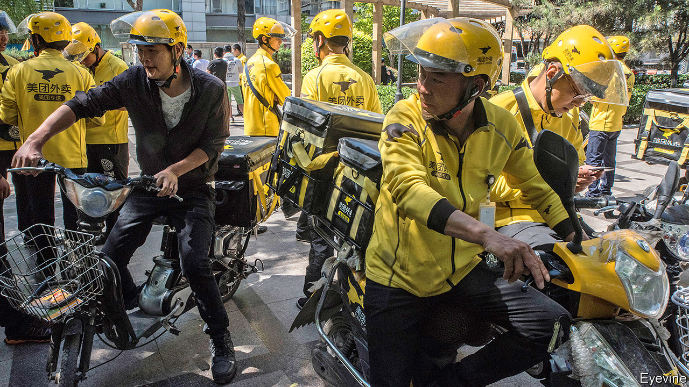

###### Precariat unite!

# The gig economy challenges China’s state-run labour unions 

##### A clampdown on civil society has made life harder for workers looking for help 

 

> Jan 27th 2021 


ON JANUARY 11TH Liu Jin, a food-delivery worker, parked his motorcycle on the side of the road in the eastern city of Taizhou. “I want my hard-earned money,” he shouted. He then set his petrol-soaked clothing alight, burning himself badly. State-owned media said Mr Liu was protesting against Ele.me, a delivery service which, he alleged, owed him money. (The company says it is paying Mr Liu’s medical bills and investigating his case.) On Weibo, a social-media platform, footage of the incident went viral.


Such grievances are common among the millions of workers in China’s fast-growing gig economy, though few cases are as dramatic. The number of protests by gig-economy workers has risen both in absolute terms and as a share of overall labour unrest according to China Labour Bulletin (CLB), an NGO in Hong Kong. In 2019 it recorded 142 protests by food-delivery, logistics and transport workers but, because so many protests are unreported, it estimates that this represents only about a tenth of the actual number.


The ruling Communist Party’s response has been to try to persuade gig workers to join a trade union. In 2015 China’s leader, Xi Jinping, launched a plan for “experimental reform” of the umbrella organisation to which all unions must belong, the AllChina Federation of Trade Unions (ACFTU). The full text was not released, but state media said the aim was to make the federation focus on concrete measures to help workers, and to reduce “instability”. It urged boosting membership among rural migrants, with apps to make it easier, hoping this would discourage protests. In 2018 the ACFTU said it would try extra hard to recruit eight groups of non-factory labourers, including food-delivery workers (around 7m people) and couriers (4m).


New unions for gig workers have struggled to make themselves appealing. The first was founded in Shanghai in 2018 with about 400 members. It offered workers instructions in traffic rules and sold them watermelons at a discount. Regardless of reforms, unions are a wing of the Communist Party, and union officials are considered civil servants, so they cannot do anything that goes against government policy, says Chris Chan of the Chinese University of Hong Kong. Sometimes, a firm’s boss is also head of the union. “The most important task of local governments isn’t to protect workers’ rights, it is to maintain social stability and ensure economic development,” he says.

Nothing to lose but your overtime


Official descriptions of the reform campaign focus on the importance of strengthening party control of the federation and of using it to boost the party’s grassroots presence. The party has been working hard in recent years to form cells in private firms, to gain a bigger say in how they are managed. It sees setting up trade unions as a useful stepping stone.


Before 2015, small labour NGOs played a role advocating for workers’ rights. They achieved some notable victories. A strike at a Citizen watch factory in Guangdong province in 2011 led to collective bargaining. Managers also agreed to cough up 70% of overtime payments that had been in arrears for five years. In 2015 workers at Guangdong’s Lide shoe factory forced the company to pay several million yuan in social-insurance contribution arrears. Then, in 2015, the Party clamped down on all civil-society groups.


Another crackdown came in 2018 when workers at Jasic, a welding factory in Shenzhen, tried to form a worker-led union and register it with the federation. The workers were fired. Weeks later, police arrested dozens of workers and students from across the country for protesting in support of the union.


So is there any chance the reforms can do more to protect workers? Union ranks have swelled. In 2015-16, 30m migrant workers joined. The ACFTU now has more than 390m members, including 6.5m from the eight priority groups. And according to CLB, some unions have devoted more resources to helping workers with legal advice. Sometimes the local union federation stands up for workers, even when the union inside the company does not. Between 2016 and early 2019 the ACFTU says it helped more than 5m migrant workers secure 53bn yuan ($8.2bn) in overdue wages.


Yet it remains distant from many workers. Of 350 delivery workers interviewed by Jenny Chan of Hong Kong Polytechnic University, not one knew what the federation does. In the decade before China’s clampdown on labour activism in 2015, the ACFTU engaged directly with workers, even experimenting with collective bargaining and running training sessions for workers in their factories. Now, says Mr Chan, as the party reasserts its dominance throughout society, union training for workers often happens at local “party-masses service centres”. It involves telling workers not to strike or protest and pointing them towards mediation or arbitration if they have gripes. Hotlines have also been set up.


“Sometimes it does work for workers,” says Eli Friedman of Cornell University. “If you look at the final decisions reached through arbitration or litigation, they tend to favour workers over employers. But there are all kinds of obstacles that prevent this course from being effective; most important, it takes a lot of time.” Most workers do not have time or money to invest in court proceedings or arbitration.


The party is keen to prevent people from banding together. “If you have a group of 50 workers from some workplace and they go and say that the boss hasn’t been paying them, the first thing the union tries to do is chop it up into 50 individual cases,” says Mr Friedman. In 2019 more than 2.1m disputes were handled through arbitration, involving 2.4m workers.


For those like Mr Liu, the rider for Ele.me, union membership offers little hope that gruelling work conditions will soon improve. Riders are often hired by subcontractors who force them to take risks to deliver on time, or risk not getting paid. In the past two years thousands of couriers across China have been injured or killed in accidents, according to CLB. Mr Friedman is “extremely pessimistic” that union reforms will help gig workers. Even if the union wanted to represent the delivery workers in collective bargaining, it would not be able to because, legally, most couriers are independent contractors, not employees. As in so many countries, the people who bike hot lunches to office workers live precariously.■

