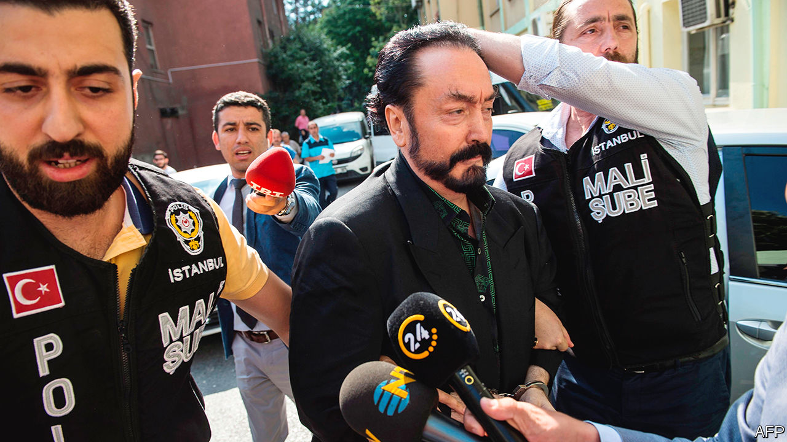

###### Turkey’s Tartuffe

# A cult leader gets 1,000 years in jail for keeping sex slaves 

##### Adnan Oktar was also found guilty of fraud and torture 

 

> Jan 28th 2021 


FOR YEARS, Adnan Oktar’s cult made for outrageously bad television. Newspapers indulged him as a crackpot, an Islamic preacher surrounded by a harem of women in heavy make-up and swimsuits. (Mr Oktar argued the bikini was a form of religious covering.) Few people took him seriously. The authorities mostly seemed to ignore him.


His luck ran out on January 11th, when a Turkish court sentenced him to over 1,000 years in jail for fraud, torture and sexual abuse. Mr Oktar was a chameleon. He embraced, then disavowed, anti-Semitism. He convinced his followers he was the messiah. He preached a conservative strand of Islam in the 1980s, dialogue betwen Christians, Muslims and Jews after 2001, and after 2011, when he launched his own TV channel, sex. On his show, Mr Oktar would appear flanked by scantily clad women, whom he called his “kittens”, and men dressed up to the nines. Between sermons on world events and Islamic doctrine, he would dance with his “kittens” to pop music.


In his spare time, he denounced Darwin. He collected fossils, campaigned against the teaching of evolution and wrote an 800-page doorstopper called the “Atlas of Creation”, copies of which he mailed to politicians and scientists. When Richard Dawkins, a biologist, called him a quack, Mr Oktar convinced a court to block his website in Turkey. Last year, his atlas made a surprise appearance on the bookshelf of Christine Lagarde, the head of the European Central Bank, during a Zoom call. Ms Lagarde had never bothered to open it, apparently.


Reports surfaced that Mr Oktar was grooming his followers as sex slaves with cocaine, video and blackmail. “Every freedom I had was gone,” says a former follower. Until recently, such allegations earned Mr Oktar only a couple of brief spells in prison, and one in a mental hospital. Few of his followers dared to speak out. Critics were sued for libel. When the police closed in, Mr Oktar resorted to conspiracy theory. He blamed the “homosexual lobby” and “the British deep state” for his legal troubles. His arrest, he claimed, was the work of Queen Elizabeth. Like so much of what he said, it wasn’t true.

