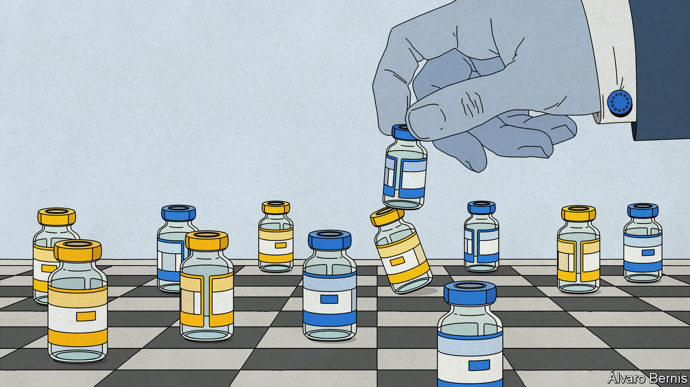

###### Shots fired

# Europe’s delays in covid-19 vaccine delivery are causing tempers to flare 

##### Britain and the EU are at loggerheads again 

 

> Jan 27th 2021 


THE START of 2021 in Europe was meant to be about jabs aimed at arms. Instead, it is fingers that are being pointed, and threats brandished. Delays to covid-19 vaccine deliveries in EU countries threaten to slow the group’s already-lethargic inoculation plans. News of production snafus has sent tempers flaring as politicians, Eurocrats and drug firms try to apportion the blame. Calls for vaccine protectionism to fix the problem—for Europe—could stop other countries securing shots.


The EU’s vaccination campaign is already among the most sluggish in the rich world: only two doses have been administered for every 100 Europeans, compared with seven in America and eleven in Britain. Things seemed to be improving, albeit slowly, as national governments stepped up efforts to distribute and administer jabs (see ). Then AstraZeneca on January 22nd discreetly advised the European Commission in Brussels that its factories in Europe were facing difficulties in producing sufficient quantities of the jab it had developed alongside the University of Oxford. That came on top of Pfizer-BioNTech, another vaccine-maker, also pushing back promised deliveries by a few weeks.


What AstraZeneca had tried to paint as a mere logistical rejigging caused an outburst of fury rarely mustered by the commission. The EU’s executive arm has been in charge of procuring jabs for the club’s 27 member states. National politicians had already groused that Eurocrats had been too slow to buy vaccines and to approve them. The news that AstraZeneca deliveries would be scaled back by two-thirds or more in the first quarter of the year compounded the perception of indolence in Brussels.


The commission responded by recycling the anger and diverting it towards the Anglo-Swedish firm. Stella Kyriakides, the EU’s health commissioner, pointed to large prepayments Europe had made to get its production lines up and running and demanded a return on its investment. Leaks suggest the commission thinks that AstraZeneca has been sending Europe to the back of the queue, perhaps to satisfy other customers. Jens Spahn, Germany’s health minister, pleaded for Europe to restrict exports of doses produced in EU facilities.


On January 26th Britain, fearful lest such a policy might cut off its imports of the Pfizer vaccine from Belgium, warned of the perils of “vaccine nationalism”. It later emerged that the EU wanted AstraZeneca to compensate for shortfalls in European factories from its British facilities; since then, Britain has not repeated its appeals for cross-border solidarity.

Waiting for Soriot


The AstraZeneca delay is particularly unwelcome in Europe. Though its vaccine was not expected to be approved by EU regulators until January 29th (and may at first be reserved for under-55s), the company had promised lots of jabs quickly. A schedule of expected deliveries in France released on January 7th suggested that fully 62% of all inoculations in February were to be with the AstraZeneca serum.


Other EU countries will be in a similar position. Given that much of Pfizer’s vaccine output now needs to be reserved for second doses for those who have already had a first Pfizer jab, some parts of Europe, such as Romania and bits of Italy, have already slowed down inoculations. Back-of-the-envelope estimates suggest far fewer first jabs could be administered than in recent weeks, at precisely the time Europe was hoping to increase them. That might mean longer lockdowns, deeper economic slumps and more irate voters (such as in the Netherlands, where riots broke out on three consecutive nights over curfews).


The delivery delays focused attention on the commission’s role as the central purchaser for the vaccine. Each country going it alone might have resulted in an unseemly free-for-all, leaving some Europeans jabbed and others not. But this left the European Commission in charge of a purchasing contract of the sort usually handled by member states. Unlike them, the Brussels bureaucracy is not well-versed in the intricacies of placing multi-billion-euro orders for the likes of fighter jets and new hospitals. Partly as a result, EU deals to secure vaccines were signed several months after those in Britain and America.


As much as it has huffed and puffed, the EU seems to have little recourse against AstraZeneca. The contract it signed is not public, but another one, thought to be similar, is. It suggests that vaccine suppliers hold all the cards in case of delays. Pascal Soriot, the boss of AstraZeneca, said the deal his firm signed with the EU was “not a commitment” to Europe, merely a promise to try to supply doses quickly. In an interview with European newspapers, he said the EU was being treated fairly—but that it should have tempered its expectations, and placed its order earlier.


Having pre-fed AstraZeneca all the carrot and left itself with no stick, Europe is left with few options. It is hardly likely to cancel its order of vaccines—a delayed jab is almost infinitely better than none at all. Any money that the commission could recoup would be insignificant, and would probably take years to arrive.


Hence the explosive idea from Mr Spahn to curb exports. Such an approach would jar with European proclamations of the importance of free trade, and of sharing vaccine supplies beyond the rich world. Others despaired. How could the EU credibly deal with protectionism by, say, India if it used export controls itself as a first resort in a scrap over vaccines, wondered one diplomat. “We feared a Singapore-on-Thames [in the shape of post-Brexit Britain]; these ideas are turning us into Cuba-on-the-Seine.” As tempers cooled, the commission seemed minded to implement a softer “transparency mechanism” designed not to block shipments but to track them. But the row is not over, and if the delays continue or worsen, the threat of export restrictions seems likely to re-emerge. In a crisis, it is often every man for himself, after all. ■


Dig deeper


All our stories relating to the pandemic and the vaccines can be found on our . You will also find trackers showing ,  and the virus’s spread across  and .

