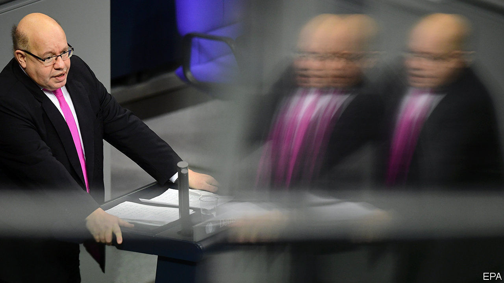
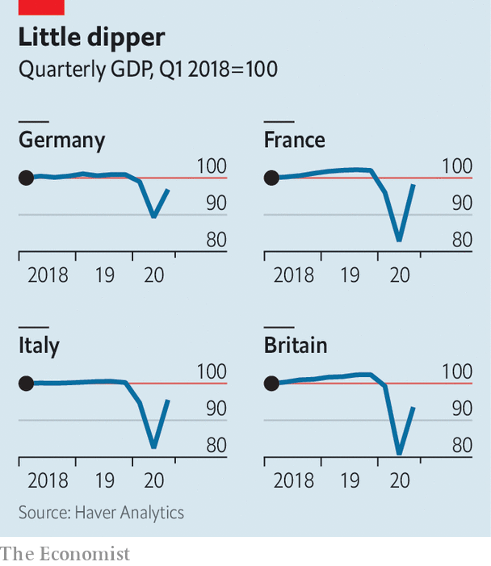

###### Clouds ahead

# Germany’s economic prospects for this year have darkened 

##### Numbers are being revised downwards 

 

> Jan 30th 2021 


IF EUROPE’S ECONOMIES were a brass band, Germany’s would be the tuba: the biggest, most reliable generator of oom-pah-pah on a continent of cornets and bugles. Last spring it coped with the sharpest recession since the second world war better than its neighbours, thanks to a shorter and looser covid-19 lockdown and a massive fiscal stimulus. This year Germany was expected to recover its mighty puff more quickly than its peers.


However, the latest statistics suggest that the tuba’s valves are stuck: the recovery might not be as robust as forecast. On January 14th Destatis, the official statistics agency, announced that the German economy shrank by 5% last year. This is painful, but not nearly as bad as the double-digit contractions expected in Spain and several other European countries. In the last quarter of the year it stagnated, Destatis said.


Germany will almost certainly find itself back in recession in the first quarter of this year. A survey of purchasing managers by IHS Markit, a provider of financial data, published on January 22nd, suggests that the economy is barely growing this month. Manufacturers are hit hard by shortages of containers for deliveries and higher prices of commodities. Florian Hense, an economist at Berenberg, Germany’s oldest private bank, predicts “a dark winter” with a contraction of 1% for the first quarter compared with the previous quarter “with the risks tilted to the downside”.


A setback in the first quarter means that the predictions of the government and economic research institutes were too optimistic. On January 27th Peter Altmaier, the German economy minister (pictured), slashed his forecast for economic growth for 2021 from 4.4% to just 3%. Leading economic research institutes, which in December predicted 4.7% growth for 2021, are also likely to cut their forecasts.

 


Though Germany was widely admired for its level-headed management of the first wave of the pandemic, it is struggling with the second. It imposed a light lockdown at the start of November that closed down restaurants and cinemas but left shops open. As infection rates kept creeping up, the lockdown was extended and toughened in mid-December with the closure of all non-essential shops and schools. On January 18th Germany’s central bank said that the economy is managing to stay afloat but could suffer a “sizeable setback” if coronavirus curbs are extended again. The following day, after hours of emotional debate with the state premiers, Angela Merkel, the chancellor, announced that the lockdown would be extended until mid-February, and also slightly toughened.


Things could get worse. The number of insolvencies last year was lower than in 2019 thanks to a ruling by the government that gave companies more time with their paperwork. That concession has now expired, and Stefan Schneider, chief German economist at Deutsche Bank, predicts a wave of bankruptcies. Even businesses that were in good health before the pandemic could be affected. The German Retail Association warns that up to 50,000 shops may go belly up in the coming months. And according to KfW, a public development bank, more than a million jobs in small and midsized businesses are at risk.


As soon as temperatures rise, and more Germans have received the covid-19 vaccine, prospects are rosier. “Germany is structurally still strong,” says Holger Schmieding, chief economist at Berenberg. Thanks to its generous furlough scheme Germany will not see mass unemployment. The second lockdown is hardly affecting manufacturing, which is humming. Machinery and carmaking, two pivotal industries, will take off again in 2021, predicts Mr Schmieding.


Even so, the structural problems that predate the pandemic, such as an ageing workforce, a delay in digitising government and businesses, creaking infrastructure and over-dependence on exports, have not gone away. Little more can now be done to tackle them in an election year, but the next chancellor will have to take a deep breath and get to work. ■

