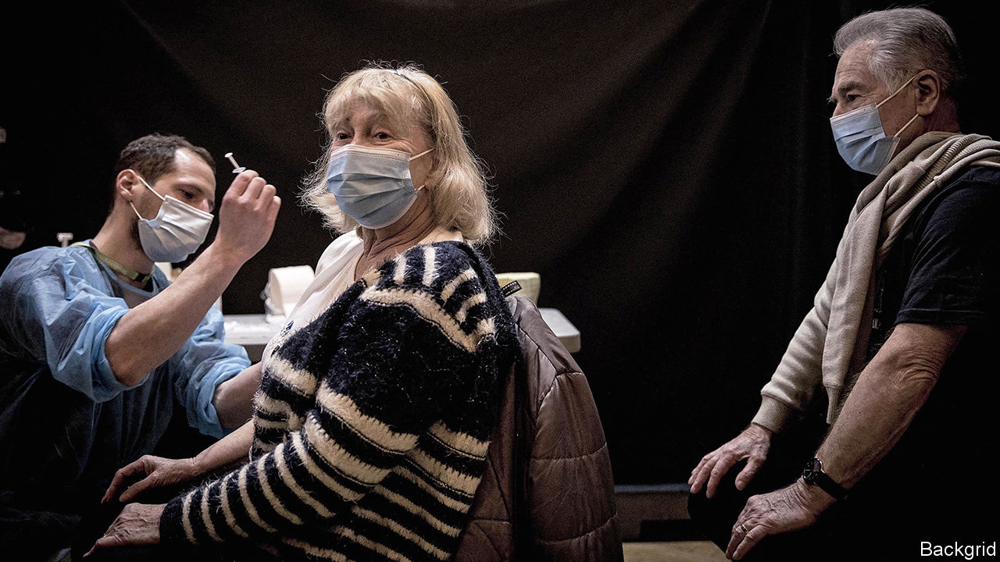
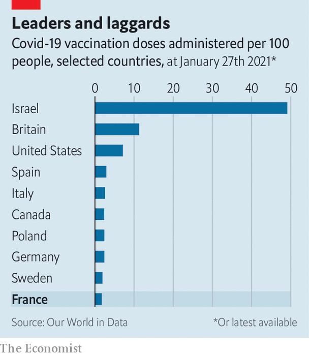

###### Pasteur’s lament

# Why France’s vaccination roll-out has been so slow 

##### The country that pioneered vaccines has struggled to get covid-19 jabs into arms 

 

> Jan 30th 2021 


THE LOGO outside the vaccination centre shows a red-caped Super Granny zapping the spiked coronavirus with one fist, while clutching a medical syringe in the other. Named “Chez Mauricette”, a nod to the first French patient vaccinated against covid-19, the place sounds more like a friendly local café than a health clinic. In the industrial town of Poissy, north-west of Paris, this is a deft antidote to grim times, and an effort to confront the peculiar scepticism of the French. “People are exhausted and anxious,” says Karl Olive, the town’s centre-right mayor, and a former football referee: “They need a bit of fun.”


On a recent weekday afternoon, patients wait calmly to be seen by a doctor before moving into a vaccination cubicle. After opening on January 7th, this centre is now jabbing over 600 arms a week. Alain and Anne-Marie Guillaume celebrated their 60th wedding anniversary there by getting an injection each. Poissy was the first centre to open outside a hospital or care home. Rather than waiting for regional health authorities to draw up a map, Mr Olive put in phone calls to the right people and told them his centre was ready to go. It was approved. “You can’t expect everything from the central state,” says Mr Olive. “Mayors in France can solve problems too.”


Poissy’s can-do defiance says much about the weaknesses of the French state, which contributed to a glacial early vaccination roll-out. This surprised many admirers of France’s well-financed and normally efficient health system. Indeed the number of daily covid-19 deaths in France is now the lowest per head among big European countries. France’s campaign has now picked up pace, overtaking Germany’s in daily doses administered per head. Yet the running total, of 1.2m doses injected by January 26th, is still lower in France than in Germany, Italy and Spain—and way behind Britain. This cannot be blamed only on delays in securing approval and delivering vaccines, which have affected all the EU (see ). Three specific, linked problems explain French dawdling.

 


The first is an inbuilt caution due to the criminal liability of elected officials in France. In 1999 Laurent Fabius, a former prime minister, was charged with manslaughter (and later acquitted) in a contaminated-blood case. Over 100 legal complaints have been filed against ministers, including Jean Castex, the prime minister, and Olivier Véran, the health minister. So health policymakers struggle to weigh risks and benefits dispassionately.


A second is the surprisingly strong anti-vaxxer sentiment in France, land of Louis Pasteur. In December just 42% told a poll they would get a jab. Part of this hesitancy stems from French health scandals, including the ongoing prosecution of a drug company over deaths of diabetics, and a massive over-ordering of vaccines against H1N1 (swine flu) in 2009. Conspiracy theories about big pharma blend with the anti-elite sentiment behind the gilets jaunes (yellow jackets) or Didier Raoult, a Marseille doctor who pushed hydroxychloroquine to treat covid-19. The French, concluded the government, needed ultra-careful handling. “It was a choice,” says a government source; “If we’d said ‘let’s just go for it’, people would have said they don’t trust us.”


Far from colliding with the administration’s instincts, deliberate prudence matched them. This is a third factor: a centralised French system that tends to prefer elegantly polished design over pragmatic local initiative. “It’s an énarque tendency,” says one, referring to the Ecole Nationale d’Administration, which trains the elite. In some bureaucracies, such as finance, clear command chains have nonetheless enabled political decisions to be put in place rapidly. But the health system is a many-tentacled beast, linking the ministry, national agencies, 18 regional authorities and departmental préfectures. “We have a central state that wants to decide and control everything, but lacks clear hierarchical lines,” says Nicolas Bauquet of the Institut Montaigne, a think-tank: “On the ground everybody is expected to wait for the plan.”


The upshot was a complex plan that wasted precious time. Before jabbing care-home residents, for instance, the health ministry produced a 45-page vaccination guide, including six pages on how to obtain residents’ consent. As the delays this caused became clear, rules limiting vaccines to care-home residents were shelved, and health workers over 50 included.


Back in Poissy, the mayor thinks President Emmanuel Macron needs to give the “ants’ nest” of the “techno-structure” a “big kick”. Paradoxically, for all the self-administered caution and rules, vaccine supply is now more likely to hold things up. For the slow roll-out has inadvertently turned the distrustful French into impatient enthusiasts: 56% now say they want a jab. ■


Dig deeper


All our stories relating to the pandemic and the vaccines can be found on our . You will also find trackers showing ,  and the virus’s spread across  and .

