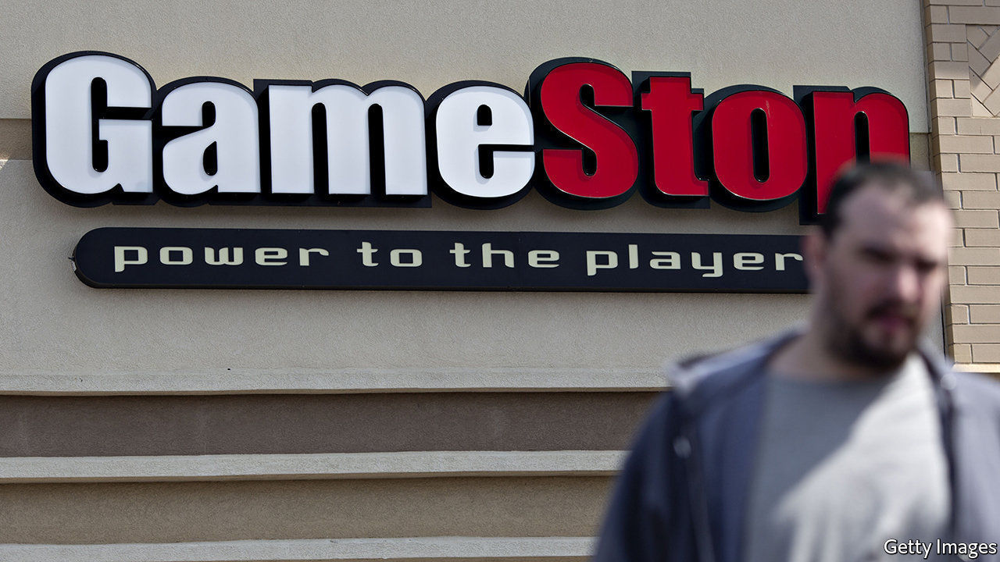

###### UnStoppable

# The frenzied rise of GameStop 

##### Retail punters 1, short-sellers 0 

 

> Jan 30th 2021 


A WEEK AGO few people had probably heard of GameStop, the beleaguered brick-and-mortar purveyor of video games. Millennials might recall visiting a store in their youth; their parents, perhaps, taking them. None can claim ignorance now. The firm’s share price has spiked from a few dollars in 2020 to a peak of more than $350 on January 27th, transforming a firm that was valued at less than $200m in April 2020 into a $24bn middleweight. This meteoric rise has been chronicled on every front page, pored over on financial television and even discussed in the halls of power. Jerome Powell, the chairman of the Federal Reserve, was peppered with questions about the firm’s dizzying ascent at a press conference. Jen Psaki, the White House press secretary, said that Janet Yellen, the treasury secretary, was keeping a close watch on events.


Why such a fuss? Perhaps because the story itself is staggering. There is a tiny nugget of sense in GameStop being worth more now than it was last year. In August Ryan Cohen, the former boss of Chewy, an online pet-food store, began amassing a large stake. In November he turned activist, writing to the board to urge it to invest in e-commerce. The board liked his plan and offered him and his former colleagues seats. Investors liked it too. By January 11th, his first day as board member, the 12.9% stake that he had paid about $76m for had doubled in value.


The rest—which has turned him into an overnight billionaire—is fuzzier. The frenzy has been fuelled, seemingly, by users of r/wallstreetbets, a forum on Reddit that now has more than 4m followers. These retail investors have hoovered up shares and placed leveraged bets that GameStop’s price will rise. Some forum-dwellers point to fundamental reasons, such as Mr Cohen’s involvement, to justify their bets. But most express a vigilante-style desire to stick it to establishment investors, who had spurned GameStop. The retailer had become a target of short-sellers, who borrow shares, sell them, and later buy them back, ideally at a cheaper price. It was a popular trade: the total value of short positions in GameStop was more than the company’s market capitalisation in late January. Retail investors wanted the shorts to lose money.


And they did. Bullish retail traders were ginned up when the marketmakers who sold them their bets were forced to hedge against rising prices by buying shares. Short-sellers were also forced to buy shares after incurring losses worth several billion dollars. The wall-to-wall coverage of the stock has prompted yet more investors to pile in. GameStop was the single most traded stock in America on January 26th; volumes matched that in the five biggest tech giants combined (see chart). The share price more than doubled the next day. The masses are coming for other heavily shorted stocks too. Share prices for AMC, a chain of cinemas, and Nokia and Blackberry, which once made popular mobile phones, have also spiked.

 


In many ways the furore seems almost as remarkable as the move itself. For the shorts that lost their shirts the spike in GameStop is hugely important. But most investors’ portfolios are probably unaffected by the price action. Instead the reaction—a wave of bafflement, even panic, that has washed over Wall Street and drawn in those running the country—speaks to a larger disquiet about American stocks.


For months investors have fretted about a potential stockmarket bubble, their concerns reflected in the fat valuations of tech stocks and the dizzying heights to which shares in Tesla, an electric-vehicle maker, have soared. The exuberance displayed by retail investors is yet another reason to fret. In an op-ed for Bloomberg, Mohamed El-Erian, the former boss of PIMCO, a bond fund, warned that the GameStop frenzy is a prelude to possible “large-scale financial volatility and market dysfunction”. Mr Powell was calmer, noting that financial-stability vulnerabilities overall were moderate. But stocks were jittery on January 27th. The S&amp;P 500, an index of American shares, fell by 2.6%.


Jumpy professional investors will now have to keep one eye on the mob—and the other on the more conventional risks of an inflation scare or faltering corporate earnings. Apple fared well in 2020, helped by pandemic spending on electronics (see ). But high supply-chain costs dented profits at Tesla and Facebook warned of headwinds to its ad business. Slowing profits from the giants of America’s stockmarket would really give investors something to panic about. ■

