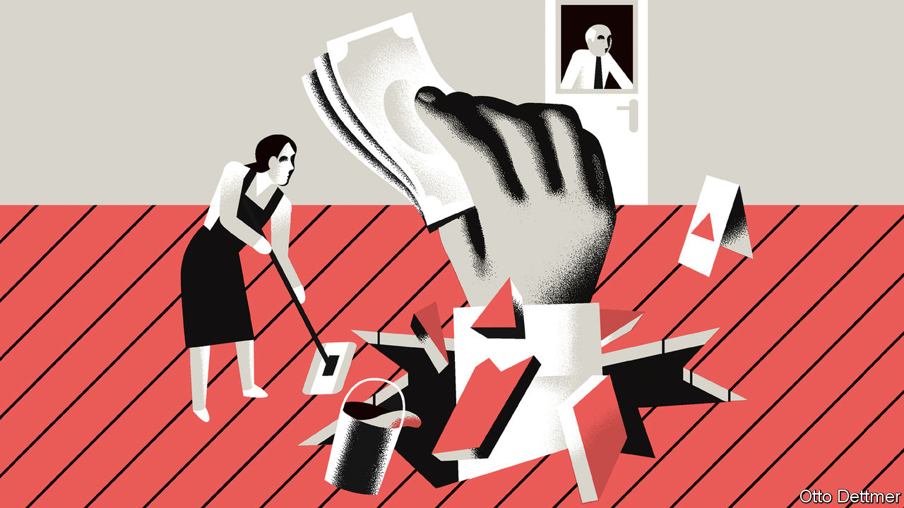

###### Free exchange

# What would a $15 minimum wage mean for America’s economy? 

##### The large increase carries risks for jobs. But history suggests it could bring large rewards 

 

> Jan 28th 2021 


MOST AMERICANS share President Joe Biden’s enthusiasm for increasing the federal minimum wage to $15 an hour from $7.25. Two-thirds of them—and more than 40% of Republicans—favour such a rise, according to Pew Research Centre, a polling firm. Economists, however, are more divided. When a panel of eminent scholars was asked in 2015 whether a $15 minimum would deal a substantial blow to employment, 40% of respondents were undecided, and the rest were split evenly for and against. There is an explanation for the indecision: the world has little experience of large minimum-wage rises, and they could cost an economy jobs. Yet history also suggests that such increases, implemented with care, may nonetheless have beneficial longer-term effects.


Economists no longer reflexively oppose minimum wages, as most once did. Empirical work assembled over the past three decades has demonstrated that modest increases in the minimum wage typically have, at most, small negative effects on employment. In an overview of research conducted for the British government in 2019, Arindrajit Dube of the University of Massachusetts at Amherst concluded that minimum wages of up to 60% of the median wage, or 80% of the median in low-wage regions, have negligible employment effects. Firms have more scope to absorb the cost than economists once supposed. A match between a job and a worker creates a surplus to be divided between employee and employer, in a manner that is largely determined by the bargaining power each side wields. Minimum-wage rules may help workers capture more of this surplus. Higher pay comes out of companies’ profits with little associated employment cost.


The scope for firms to adjust is not infinite, though, and in some parts of America a $15 minimum, which is more than what at least 30% of workers nationwide were paid in 2019, could be more than employers can handle. Many state and local governments have adopted minimums above the current federal level, in some cases even exceeding $15. But others observe the $7.25 minimum. In 21 states, a $15 wage would more than double the minimum; in 28, it would push the pay floor above 80% of the state-level median (rising to a full 100% of the median wage in Mississippi). The Democrats’ proposal would phase in the new minimum over four years, in which time median pay would rise, too. Even so, the increase might in some cases outstrip firms’ capacity to absorb higher labour costs or raise prices without sacking workers.


What happens after that, though? This is harder to predict, because there have been few comparably large increases before. Perhaps more spending by the workers who receive rises rather than pink slips would support the creation of better paying jobs, offsetting some employment losses. Perhaps interstate migration—which has fallen steadily since the 1980s—would rise as displaced workers sought out opportunities in higher-productivity cities. Or perhaps a political backlash would prompt repeal.


America’s own experience suggests that a difficult adjustment could be followed by better times. Gavin Wright, an economic historian at Stanford University, reckons that something of the sort occurred in the American South as a result of the New Deal. Before the 1930s the southern economy looked very different from the rest of America, which led the world in productivity and income per person. Factories and farms in the South favoured low-productivity, labour-intensive production over the more capital-intensive techniques common elsewhere. Southern governments neglected investment in education, aware that residents who obtained schooling were very likely to migrate. Whereas the rest of America benefited from a virtuous cycle of accumulation of human and physical capital, rapid productivity growth and rising incomes, the South remained stuck in a nasty low-wage rut.


Franklin Roosevelt’s imposition of national wage and labour standards broke this equilibrium. Southern producers found themselves with little choice but to adopt labour-saving technologies; low-wage workers, short of employment opportunities, migrated out of the South in droves. Fearing mass unemployment and the loss of political clout that depopulation would bring, southern governments abandoned their attitude of insularity and instead sought to become more attractive to investors from outside the region. Between 1930 and 1980, incomes per head in the South as a percentage of the national average rose by roughly 30 percentage points, and southern cities built around knowledge industries became magnets for migrants from elsewhere.

Here’s the new deal


Convergence in incomes between poor states and rich ones, so rapid before 1980, has slowed dramatically since, and the productivity gap between superstar cities and others has yawned. It is perhaps not a complete coincidence that the federal minimum wage, adjusted for inflation, rose steadily between the 1930s and the 1960s, but has alternately stagnated and declined thereafter. Today’s economy is very different from that in the mid-20th century, but a low minimum wage may have once again enabled some firms to rely on pockets of low-skilled labour, rather than investing in modern equipment and processes. A higher minimum wage could press them to change course, eventually yielding benefits to the economy at large.


Workers are unlikely to thank politicians who blithely create unemployment in pursuit of economic transformation. For that reason, it may be wise to allow low-wage states more time to phase in a $15 minimum, giving them an opportunity to invest in education and infrastructure, and to incentivise the private sector to boost productivity, rather than shut up shop or leave town. The alternative would be high unemployment and perhaps a population exodus. It is a risky path. But with the right economic management, higher minimum wages could play a role in lifting up left-behind people and places. ■

